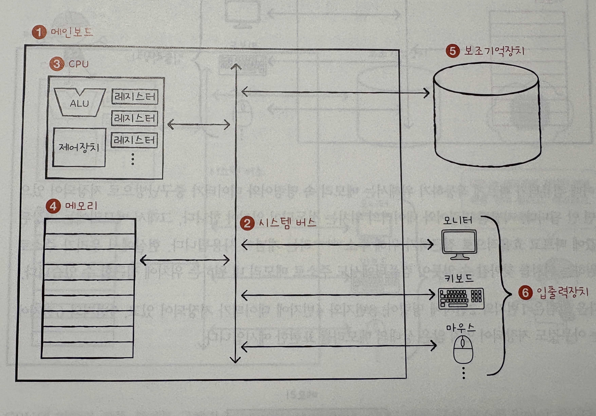
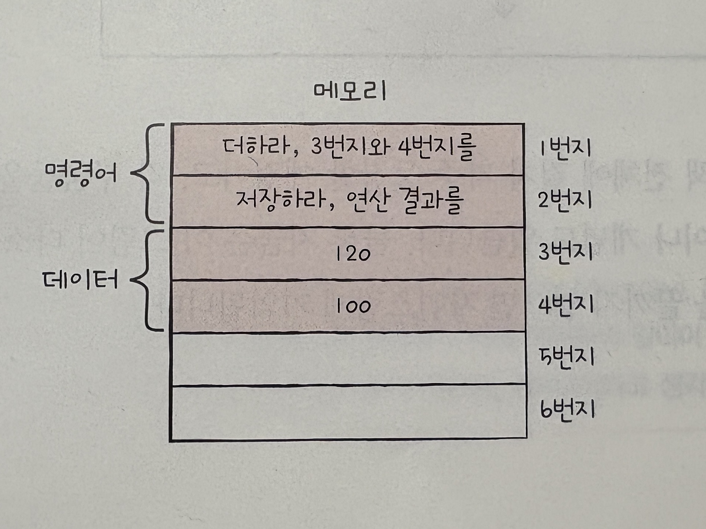

# 1-1 컴퓨터 구조를 알아야 하는 이유

- 컴퓨터 구조를 이해하면 입력과 출력에만 집중하는 개발을 넘어 성능, 용량, 비용까지 고려하며 개발할 수 있음.

# 1-2 컴퓨터 구조의 큰 그림

- 컴퓨터 구조 = 컴퓨터가 이해하는 정보 + 컴퓨터의 네 가지 핵심 부품

## 컴퓨터가 이해하는 정보

- 컴퓨터는 0과 1로 이루어진 정보만 이해할 수 있음.
  - 0과 1로 표현되는 정보
    - 데이터 : 숫자, 문자, 이미지, 동영상 같은 정적인 정보
    - 명령어 : 데이터를 움직이고 컴퓨터를 작동시키는 정보

## 컴퓨터의 네 가지 핵심 부품

- 중앙처리장치(CPU)
- 주기억장치(메모리)
- 보조기억장치
- 입출력장치

  

### 주기억장치 (메모리)

- 프로그램이 실행되려면 반드시 메모리에 저장되어 있어야함.
- 메모리는 현재 실행되는 프로그램의 명령어와 데이터를 저장하는 부품.

  - 저장된 명령어와 데이터의 위치는 정돈되어 있어야함 -> '주소'를 사용해 위치를 지정
  - 주소로 메모리 내 원하는 위치에 접근 가능

  

### 중앙처리장치 (CPU)

- 메모리에 저장된 명령어를 읽어 들이고, 읽어 들인 명렁어를 해석하고, 실행하는 부품.
- 구성요소

  - 산술논리연산장치(ALU)
    - 쉽게 말해 계산기임.
  - 레지스터
    - CPU 내부에 있는 작은 임시 저장 장치.
  - 제어장치
    - 제어 신호라는 전기 신호를 내보내고 명령어를 해석하는 장치.
    - 제어 신호 : 컴퓨터 부품을 관리하고 작동시키기 위한 전기 신호
      - CPU가 메모리에 저장된 값을 일고 싶을 때 -> 메모리 읽기 제어 신호를 내보냄.
      - CPU가 메모리에 값을 저장하고 싶을 때 -> 메모리 쓰기 제어 신호를 내보냄.
  - CPU가 명령어를 실행하는 과정

  

  1. 제어장치는 1번지에 저장된 명령어를 읽어 들임 by 메모리 읽기 제어 신호
  2. 메모리는 명령어를 CPU에 건네주고, 명령어는 레지스터에 저장됨. 제어장치는 읽어 들인 명령어를 해석한 뒤, 3번지와 4번지에 저장된 데이터가 필요하다고 판단. 3번지와 4번지에 저장된 데이터를 메모리에 요청함 by 메모리 읽기 제어 신호
  3. 메모리는 3번지와 4번지에 저장된 데이터를 CPU에 건네주고, 이 데이터들은 서로 다른 레지스터에 저장됨. ALU는 읽어 들인 데이터로 연산 수행. 계산의 결괏값은 레지스터에 저장. 계산이 끝나면 첫번째 명령어 실행 끝남.
  4. 제어장치는 2번지에 저장된 다음 명령어를 읽어 들임 by 메모리 읽기 제어 신호. 메모리는 2번지에 저장된 명령어를 CPU에 건네주고, 이 명령어는 레지스터에 저장됨. 제어장치는 이 명령어를 해석한 두 메모리에 계산 결과를 저장해야한다고 판단함. 제어장치는 계산 결과를 메모리에 저장하라는 명령을 내림 by 메모리 쓰기 제어 신호. 이때 계산 결과인 220도 보냄. 메모리에 계산결과를 저장하면 두번째 명령어 실행이 끝남.

### 보조기억장치

- 메모리는 가격이 비싸고, 전원이 꺼지면 저장된 데이터가 사라짐.
- 전원이 꺼져도 저장된 내용을 잃지 않는 장치 필요 -> 보조기억장치
- 보조기억장치는 데이터를 저장하는 장치로, 전원이 꺼져도 데이터가 사라지지 않음.

  - 하드디스크
  - SSD
  - USB 메모리
  - ...

- 메모리가 현재 실행되는 프로그램을 저장한다면, 보조기억장치는 보관할 프로그램을 저장.

### 입출력장치

- 컴퓨터 외부에 연결되어 컴퓨터 내부와 정보를 교환하는 장치.
  - 키보드, 마우스, 모니터, 프린터, 스캐너, 카메라, 스피커, ...
- 보조기억장치도 입출력장치의 일종.

### 메인보드와 시스템 버스

- 컴퓨터의 핵심 부품들은 모두 메인보드라는 판에 연결됨.
- 메인보드에 연결된 부품은 메인보드 내부에 버스라는 통로로 정보를 주고 받음.

  - 컴퓨터의 핵심 부품을 연결하는 가장 중요한 버스는 시스템 버스.

- 시스템 버스
  - 주소 버스, 데이터 버스, 제어 버스로 구성
  - 주소 버스 : 메모리 주소를 주고받는 통로
  - 데이터 버스 : 명령어와 데이터를 주고받는 통로
  - 제어 버스 : 제어 신호를 주고받는 통로
- 메모리 읽기 과정
  1. CPU가 제어버스로 메모리 읽기 제어 신호를 보냄.
  2. CPU가 주소 버스로 읽고자 하는 주소를 보냄
  3. 메모리는 데이터 버스로 CPU가 요청한 주소에 있는 내용을 보냄
- 메모리 쓰기 과정
  1. CPU가 데이터 버스를 통해 메모리에 저장할 값을 보냄
  2. CPU가 주소 버스를 통해 저장할 주소를 보냄
  3. CPU가 제어 버스로 메모리 쓰기 제어 신호를 보냄
