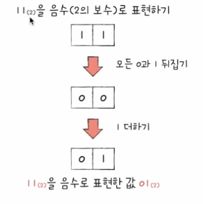

# 2-1 0과 1로 숫자를 표현하는 방법

# 정보 단위

### 비트(bit): 0과 1을 표현하는 가장 작은 정보 단위

- 1비트로는 2개, 2비트로는 4개, 3비트로는 8개의 정보를 표현할 수 있음.
- n비트로는 2^n가지의 정보 표현 가능
- 프로그램은 수많은 비트로 이루어져 있음
- 다만, 평소 "이 파일은 8,920,120 비트야" 라고 표현하진 않음
- 비트보다 더 큰 단위를 사용
  * 바이트, 킬로바이트, 메가바이트, 기가바이트, 테라바이트...

| 크기 | 변환 값 |
|------|------------------------------|
| 1바이트 (1byte) | 8비트 (8bit) |
| 1킬로바이트 (1kB) | 1,000바이트 (1,000byte) |
| 1메가바이트 (1MB) | 1,000킬로바이트 (1,000kB) |
| 1기가바이트 (1GB) | 1,000메가바이트 (1,000MB) |
| 1테라바이트 (1TB) | 1,000기가바이트 (1,000GB) |  

- c.f.) 이전 단위를 1024개씩 묶은 단위는 kiB, MiB, GiB, ...

### 워드(work)
- CPU가 한 번에 처리할 수 있는 정보의 크기 단위 ex: CPU가 32비트씩 처리 가능하다 -> 1워드 = 32비트
- 하프 워드(half word): 워드의 절반 크기
- 풀 워드(full word): 워드 크기
- 더블 워드(double word): 워드의 두 배 크기

# 이진법(binary)

- 0과 1로 수를 표현하는 방법
- 숫자가 1을 넘어가는 시점에 자리올림
- 우리가 일상적으로 사용하는 진법은 숫자가 9를 넘어갈 때 자리올림하는 십진법(decimal)

| 십진수 | 이진수 | 비고  |
|--------|--------|-------|
| 1      | 1      |    ↓   |
| 2      | 10     | 자리 올림 |
| 3      | 11     |    ↓   |
| 4      | 100    | 자리 올림 |
| 5      | 101    |    ↓   |
| 6      | 110    | 자리 올림 |
| 7      | 111    |     ↓  |
| 8      | 1000   | 자리 올림 |

### 이진수 표기법

이진수 8 표기   
       ┌── 1000(₂)  ⟵ 수학적 표기 방식   
       │   
       └── ob1000    ⟵ 코드상 표기 방식   

### 이진수로 음수 표현하기

- 0과 1로 음수를 표현하기: 2의 보수
  1. 어떤 수를 그보다 큰 2^n에서 뺀 값

  2. 모든 0과 1을 뒤집고 1을 더한 값

  

- 1011(₂)을 음수(2의 보수)로 표현하기
  1. 모든 0과 1 뒤집기 -> 0100
  2. 1더하기 = 0101 -> 1011(₂)을 음수로 표현한 값 0101(₂)

- 0101(₂)을 음수(2의 보수)로 표현하기
  1. 모든 0과 1 뒤집기 -> 1010
  2. 1더하기 = 1011 -> 0101(₂)을 음수로 표현한 값 1011(₂)

- -1011(₂)를 표현하기 위한 0101(₂)과 십진수 5를 표현하기 위한 0101(₂)은 똑같이 생겼는데 어떻게 구분하죠?
- 이것을 구분하기 위해 CPU 내부에 플래그(Flag) 레지스터가 있는데, 양수 및 음수를 표현해줌

# 16진법

- 이진법으로는 숫자의 길이가 너무 길어진다
  - 십진수 32 == 이진수 100000

- 그래서 컴퓨터의 데이터를 표현할 때 십육진법도 많이 사용
  - 수가 15를 넘어가는 시점에 자리 올림

| 십진수  | 0  | 1  | 2  | 3  | 4  | 5  | 6  | 7  | 8  | 9  | 10 | 11 | 12 | 13 | 14 | 15 | 16  | 17  | ... |
|---------|----|----|----|----|----|----|----|----|----|----|----|----|----|----|----|----|----|----|----|
| 십육진수 | 0  | 1  | 2  | 3  | 4  | 5  | 6  | 7  | 8  | 9  | A  | B  | C  | D  | E  | F  | 10  | 11  | ... |

- 간단하게 16진법 표현
  - 손가락 하나도 안폈으면 10 -> A
  - 손가락 하나 폈으면 11 -> B
  - 손가락 두 개 12 -> C
  - 손가락 세 개 13 -> D
  - 손가락 네 개 14 -> E
  - 손가락 다섯 개 15 -> F

### 16진수 표현 법

십육진수 15 표기   
       ┌── 15(₁₆)  ⟵ 수학적 표기 방식   
       │   
       └── 0x15    ⟵ 코드상 표기 방식   

### 직접 코드에 써넣는 사례도 많다 

- offset = __mem_to_opcode_arm(*(u32 *)loc);
- offset = (offset & **0x00ffffff**) << 2;
- if (offset & **0x02000000**)
-     offset -= **0x04000000**;
- offset += sym->st_value - loc;

### 이진수 <-> 16진수 변환

16진법 사용하는 이유: 이진수와 16진수 사이의 변환이 쉬워서

1. 이진수 -> 십육진수 

- 1A2B(₁₆) 
- 1 -> 0001(₂)
- A -> 1010(₂)
- 2 -> 0010(₂)
- B -> 1011(₂)
- -> 0001101000101011(₂)

2. 십육진수 -> 이진수

- 10100101(₂)
- 1010 -> D(₁₆)
- 0101 -> 5(₁₆)
- -> D5(₁₆)

# 2-2 0과 1로 문자를 표현하는 방법

# 문자 집합과 인코딩

- 문자 집합(character set)
  - 컴퓨터가 이해할 수 있는 문자의 모음

- 인코딩(encoding)
  - 코드화하는 과정
  - 문자를 0과 1로 이루어진 문자

- 디코딩(decoding)
  - 코드를 해석하는 과정
  - 0과 1로 표현된 문자 코드로 문자로 변환하는 과정

# 아스키 코드

- 초창기 문자 집합 중 하나
- 알파벳, 아라비아 숫자, 일부 특수 문자 및 제어 문자
- 7비트로 하나의 문자 표현
  - 8비트 중 1비트는 오류 검출을 위해 사용되는 패리티 비트(parity bit)

- A는 65로 인코딩
- a는 97로 인코딩
- ...
- c.f.) 코드 포인트(code point)
  == 문자 하나하나에 부여된 값 ex) A에 부여된 코드포인트는 65

### 아스키 코드의 특징

- 간단한 인코딩
- But 한글을 포함한 다른 언어 문자, 다양한 특수 문자 표현 불가
  - 아스키 코드는 7비트로 하나의 문자를 표현하기에
  - 128개보다 많은 문자를 표현할 수 없음
  - 8비트 확장 아스키 (extended ASCII)의 등장, 여전히 부족

### 한글 인코딩 : 완성형 vs 조합형 인코딩

- 한글을 위한 인코딩이 필요
  - 한글의 특징
  - 알파벳을 이어 쓰면 단어가 되는 영어
  - 초성, 중성, 종성의 조합으로 이루어진 한글
  - 완성형 인코딩 방식과 조합형 인코딩 방식이 존재

- 예시) 한글 문자 **"강"** 

1. 완성형 (Precomposed Form): 완성된 글자를 하나의 코드로 표현하는 방식.
- 강 : 11101010 10110000 10010101 
- 민 : 11101011 10101111 10111100 
- 철 : 11110100 10110110 10100000

2. 조합형 (Composition Form): 자음과 모음을 분리하여 각각 코드로 표현하는 방식.
- ㄱ + ㅏ + ㅇ :  0010 0011 0001 00011

### EUC-KR

- KS X 1001 KS X 1003 문자집합 기반의 한글 인코딩 방식
- 완성형 인코딩
- 글자 하나 하나에 2바이트 크기의 코드 부여 
  -> 2바이트 == 16비트 == 4자리 십육진수로 표현

- https://dencode.com/ 해당 WEBSITE에서 인코딩 가능
- 2300여개의 한글 표현 가능
- 여전히 모든 한글을 표현하기에는 부족한 수
- 쀏, 뙠, 휔 같은 한글은 표현 불가능
- 언어별 인코딩을 국가마다 하게되면 다국어를 지원하는 프로그램을 개발할 때에 언어별 인코딩 방식을 모두 이해해야함
- 모든 언어, 특수문자까지 통일된 문자 집합을 사용하면 어떨까? 통일된 문자 집합 & 인코딩 방식이 있다면?

### 유니코드 문자 집합과 utf-8

- 유니코드
  - 통일된 문자 집합
  - 한글, 영어, 화살표와 같은 특수 문자, 심지어 이모티콘까지
  - 현대 문자 표현에 있어 매우 중요한 위치

- 유니코드의 인코딩 방식
  - utf-8, utf-16, utf-32 ...

- 유니코드 문자 집합
  - https://symbl.cc/en/unicode/blocks/ 해당 웹사이트에서 확인 가능
  - ↘ : U+2198, 2198(₁₆)  -> 유니코드의 코드포인트
  - 2198, 이 16진수를 그대로 인코딩값으로 삼지 않고, 다양한 방식으로 0과 1로 변환 
  - 이러한 방식을 유니코드 인코딩 방식이라 하며, 유니코드 인코딩 방식은 다양함.

### utf-8 인코딩

- UTF (Unicode Transformation Format) == 유니코드 인코딩 방법
- 가변 길이 인코딩: 인코딩 결과가 1바이트~4바이트
- 인코딩 결과가 몇 바이트가 될지는 유니코드에 부여된 값(유니코드 코드 포인트)에 따라 다름

- 한: D55C (== 1101 0101 0101 1100)
- 글: AE00 (== 1010 1110 0000 0000)

- 한: U+D55C는 3바이트로 표현, (UTF-8에서 U+0800~U+FFFF는 3바이트 사용)

