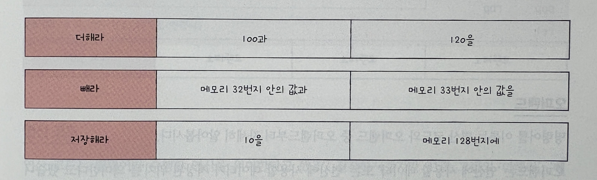
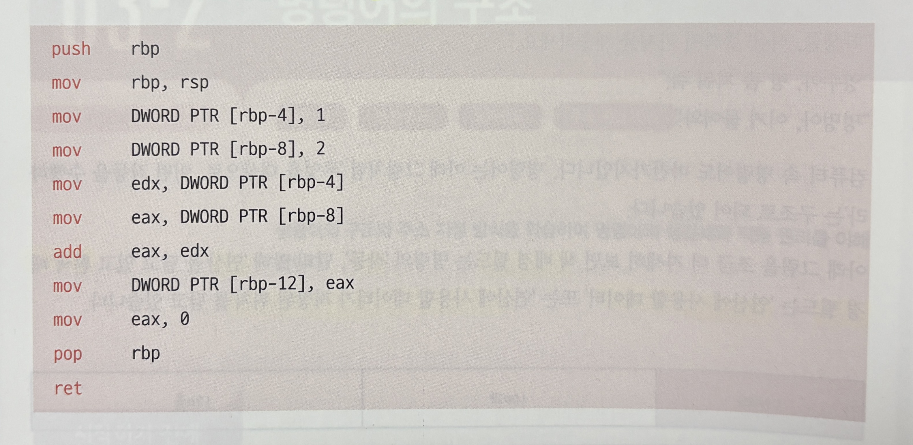

# 3-1 소스 코드와 명령어

## 고급 언어와 저급 언어

- 고급 언어 : 사람을 위한 언어
  - C, C++, Java, Python
- 저급 언어 : 컴퓨터를 위한 언어. 즉, 명령어
  - 기계어
    - 0과 1로 이루어진 명령어
  - 어셈블리어
    - 기계어를 사람이 이해하기 쉽도록 만든 언어
    - 실제 소스코드에서 사용되기도 함
    - 컴퓨터가 프로그램을 어떤 과정으로 실행하는지 알 수 있음

## 컴파일 언어와 인터프리터 언어

- 고급언어가 저급언어로 변환되는 2가지 방식
  - 컴파일 방식 (컴파일 언어)
  - 인터프리트 방식 (인터프리터 언어)

### 컴파일 언어

- 코드 전체가 저급 언어로 변환되는 과정, 즉 컴파일 과정을 거침
- 컴파일을 수행하는 도구를 컴파일러라 함.
- 소스 코드에 오류가 있으면 컴파일이 되지 않음.
- 컴파일러를 통해 저급 언어로 변환된 코드를 목적 코드라 함.
- ex) C, C++

## 인터프리터 언어

- 소스 코드를 한 줄씩 차례로 실행함.
- 소스 코드를 한 줄씩 저급 언어로 변환하는 도구를 인터프리터라고 함.
- 인터프리터 언어는 컴퓨터와 대화하듯 소스 코드를 한 줄씩 실행하기 때문에 소스코드 전체를 저급 언어로 변환하는 시간을 기다릴 필요가 없음.
- 한 줄씩 실행하기 때문에, 소스 중간에 문법 오류가 있더라도 그 전까지는 올바르게 실행됨.
- 일반적으로 인터프리터 언어가 컴파일 언어보다 느림
  - 컴파일을 통해 나온 결과물은 저급 언어인 반면, 인터프리터 언어는 소스 코드 마지막까지 저급 언어로 해석하여 실행하기 때문
- ex) Python

## 목적 파일 vs 실행 파일

- 목적 파일 : 목적 코드로 이루어진 파일
- 실행 파일 : 실행 코드로 이루어진 파일
  - 윈도우의 .exe 확장자를 가진 파일이 대표적
- 폭적 코드가 실행 파일이 되기 위해서는 링킹을 거쳐야함.
  - 링킹 : 여러 목적 파일을 하나로 합치는 과정
  - ex) main.o, sum.o, sub.o 파일이 있다면, 이들을 연결하는 과정임. (변수를 참조하는 함수가 다른 파일에 있을 수 있기 때문에 이들을 연결해야함)

# 3-2 명령어의 구조

## 연산 코드와 오퍼랜드

- 명령어는 '무엇을 대상으로, 어떤 작동을 수행하라' 라는 구조로 이루어짐.

  

  - 연산 코드
    - 명령어가 수행할 연산 (첫번째 필드)
    - 즉, 연산자
    - 연산 코드가 담긴 영역을 연산 코드 필드라고 함.
  - 오퍼랜드
    - 연산에 사용할 데이터 혹은 그 위치 (두번째, 세번째 필드)
    - 즉, 피연산자
    - 오퍼랜드가 담긴 영역을 오퍼랜드 필드라고 함.
  - 어셈블리어 예시. 붉은 글씨가 연산 코드, 검은 글씨가 오퍼랜드

    

### 오퍼랜드

- 오퍼랜드 필드에는 숫자와 문자등의 데이터나 메모리 혹은 레지스터 주소가 올 수 있음
- 다만, 많은 경우에 메모리 주소나 레지스터 이름이 담김.
- 그래서 오퍼랜드 필드를 주소 필드라고 부르기도 함.
- 오퍼랜드는 0개 이상 있을 수 있음.
  - 오퍼랜드가 0개인 명령어 -> 0-주소 명령어
  - 오퍼랜드가 1개인 명령어 -> 1-주소 명령어
  - 오퍼랜드가 2개인 명령어 -> 2-주소 명령어
  - 오퍼랜드가 3개인 명령어 -> 3-주소 명령어

### 연산 코드

- 연산코드의 대표적인 4가지 종류
  - 데이터 전송
  - 산술/논리 연산
  - 제어 흐름 변경
  - 입출력 제어
- 명령어의 종류와 생김새는 CPU마다 다름. 위 내용은 대부분의 CPU가 공통으로 이해하는 대표적인 연산 코드의 종류

#### 데이터 전송

- MOVE : 데이터를 옮겨라
- STORE : 메모리에 저장하라
- LOAD(FETCH) : 메모리에서 CPU로 데이터를 가져와라
- PUSH : 스택에 데이터를 저장하라
- POP : 스택의 최상단 데이터를 가져와라

#### 산술/논리 연산

- ADD / SUBTRACT / MULTIPLY / DIVIDE : 더하기, 빼기, 곱하기, 나누기를 수행하라
- INCREMENT / DECREMENT : 오퍼랜드에 1을 더하라 / 오퍼랜드에 1을 빼라
- AND / OR / NOT : 논리 연산을 수행하라
- COMPARE : 두 개의 숫자 또는 TRUE / FALSE를 비교하라

#### 제어 흐름 변경

- JUMP : 특정 주소로 실행 순서를 옮겨라
- CONDITIONAL JUMP : 조건에 따라 특정 주소로 실행 순서를 옮겨라
- HALT : 프로그램의 실행을 멈춰라
- CALL : 되돌아올 주소를 저장한 채 특정 주소로 실행 순서를 옮겨라
- RETURN : CALL 명령어로 저장한 주소로 돌아가라

#### 입출력 제어

- READ(INPUT) : 특정 입출력 장치로부터 데이터를 읽어라
- WRITE(OUTPUT) : 특정 입출력 장치로 데이터를 출력하라
- START IO : 입출력 장치를 시작하라
- TEST IO : 입출력 장치의 상태를 확인하라

## 주소 지정 방식

- 오퍼랜드 필드에 데이터가 아닌 메모리나 레지스터 주소를 담는 이유?
  - 명령어의 길이 때문임
  - 명령어가 N비트이고, 연산 코드 필드가 M비트라면, 오퍼랜드 필드는 N-M비트가 됨.
  - 따라서 오퍼랜드 필드에 데이터를 담으면 데이터의 크기가 제한됨.
    - 하나의 오퍼랜드가 담을 수 있는 데이터 크기는 2^4으로 제한되어있음.
    - 따라서 주소를 사용 -> 데이터의 크기 제한을 메모리와 레지스터 크기로 확장할 수 있음.
- 연산의 대상이 되는 데이터가 저장된 위치를 유효 주소라고 함.
- 주소 지정 방식은 유효 주소를 찾는 방법.
  - 즉시 주소 지정 방식
  - 직접 주소 지정 방식
  - 간접 주소 지정 방식
  - 레지스터 주소 지정 방식
  - 레지스터 간접 주소 지정 방식

### 즉시 주소 지정 방식

- 사용할 데이터를 오퍼랜드 필드에 직접 명시하는 방법
- 빠르다

### 직접 주소 지정 방식

- 유효 주소를 오퍼랜드 필드에 직접 명시하는 방법
- 표현할 수 있는 유효 주소에 제한이 생길 수 있음

## 간접 주소 지정 방식

- 유효 주소의 주소를 오퍼랜드 필드에 명시하는 방법
- 표현 할 수 있는 유효 주소의 범위가 더 넓어짐
- 메모리 접근이 두번 필요하기 때문에 일반적으로 느림.

## 레지스터 주소 지정 방식

- 연산에 사용할 데이터를 저장한 레지스터를 오퍼랜드 필드에 명시하는 방법
- 레지스터는 CPU 내부에 있기 때문에 빠르게 접근 가능
- 표현할 수 있는 레지스터 크기에 제한이 생길 수 있음.

## 레지스터 간접 주소 지정 방식

- 연산에 사용할 데이터를 메모리에 저장하고, 해당 메모리의 주소(유효 주소)를 저장한 레지스터를 오퍼랜드 필드에 명시하는 방법
- 간접 주소 지정 방식과 비슷하지만, 메모리 접근 횟수가 1번으로 줄어듬.
- 따라서, 간접 주소 지정 방식보다 빠름.
