# 4-1 ALU와 제어장치

### 들어가기 전

- CPU의 구성 요소
  - ALU: 계산하는 장치
  - 제어장치: 제어 신호를 발생시키고 명령어를 해석하는 장치
  - 레지스터: CPU 내부의 작은 임시저장장치

## ALU

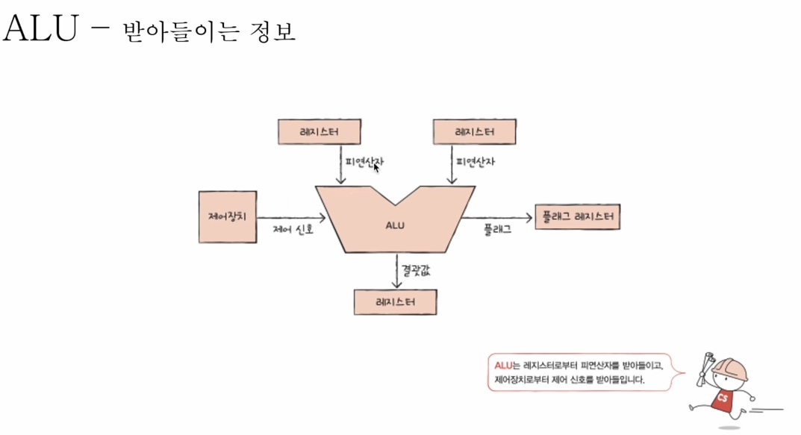

- 계산을 하기 위해서는 피연산자와 수행할 연산이 필요.
- 피연산자: 레지스터로부터 받음
- 수행할 연산: 제어장치에서 제어 신호로 받음.
- 이 정보들을 바탕으로 연산을 수행하고 그 결괏값을 레지스터에 저장
- 플래그(Flag): 연산 결과에 대한 부가 정보.
  - 이진법에서 양수와 음수를 구분할 때, CPU 내부의 플래그로 구분.
  - 해당 결과는 플래그 레지스터에 저장
  - ex: 연산 결과가 음수가 나오면, 연산 결과가 음수라는 플래그 값이 플래그 레지스터에 저장
  - 오버플로우: 연산결과가 연산을 담을 수 있는 레지스터에 비해 커지면 플래그에 담기는 것
   
| 플래그 종류       | 의미                                          | 사용 예시 |
|-----------------|-------------------------------------------|---------|
| 부호 플래그       | 연산한 결과의 부호를 나타낸다.                     | 부호 플래그가 1일 경우 계산 결과는 음수, 0일 경우 계산 결과는 양수를 의미한다. |
| 제로 플래그       | 연산 결과가 0인지 여부를 나타낸다.                 | 제로 플래그가 1일 경우 연산 결과는 0, 0일 경우 연산 결과는 0이 아님을 의미한다. |
| 캐리 플래그       | 연산 결과 올림수나 빌림수가 발생했는지를 나타낸다.     | 캐리 플래그가 1일 경우 올림수/빌림수가 발생했음을 의미하고, 0일 경우 발생하지 않았음을 의미한다. |
| 오버플로우 플래그   | 오버플로우가 발생했는지를 나타낸다.                 | 오버플로우 플래그가 1일 경우 오버플로우가 발생했음을 의미하고, 0일 경우 발생하지 않았음을 의미한다. |
| 인터럽트 플래그     | 인터럽트가 가능한지를 나타낸다. 인터럽트는 04-3장에서 설명한다. | 인터럽트 플래그가 1일 경우 인터럽트가 가능함을 의미하고, 0일 경우 인터럽트가 불가능함을 의미한다. |
| 슈퍼바이저 플래그   | 커널 모드로 실행 중인지, 사용자 모드로 실행 중인지를 나타낸다. 커널 모드와 사용자 모드는 09장에서 설명한다. | 슈퍼바이저 플래그가 1일 경우 커널 모드로 실행 중임을 의미하고, 0일 경우 사용자 모드로 실행 중임을 의미한다. |

## 제어장치

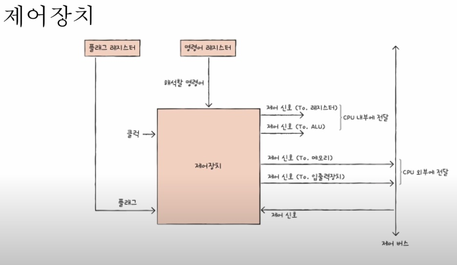

- 클럭: 컴퓨터의 모든 부품을 일사분란하게 움직일 수 잇게 하는 시간 단위
- 해석할 명령어: 명령어 레지스터라는 특수한 레지스터에 저장되어 있음
- 플래그: 연산 결과에 대한 부가 정보
- 제어 신호: 입출력 장치 및 주변 신호도 제어 신호를 발생시킴, 이 신호들을 받아들임.
- 내보내는 정보: CPU 내부에 전달하는 제어 신호, CPU 외부에 전달하는 제어 신호로 구분
  - CPU 내부에 전달하는 제어 신호(레지스터): 레지스터를 움직이게 하는 제어 신호
  - CPU 내부에 전달하는 제어 신호(ALU): 수행할 연산을 지시하는 제어 신호
  - CPU 외부에 전달하는 제어 신호(메모리): 메모리를 지시하는 제어 신호
  - CPU 외부에 전달하는 제어 신호(입출력장치): 입출력장치의 동작을 지시하는 제어 신호

# 4-2 레지스터

### 들어가기 전

- 레지스터: CPU 내부의 작은 임시저장장치, 프로그램 속 명령어 & 데이터는 실행 전후로 레지스터에 저장
- ALU와 제어장치를 프로그래머가 직접 다룰 일은 적지만 레지스터 안의 값을 관찰하는 일은 조금 더 있음
- CPU 내부에는 다양한 레지스터들이 있고, 각기 다른 역할을 가짐

### 반드시 알아야 할 레지스터

- CPU 종류마다 레지스터 종류는 다름, 그래도 아래 레지스터는 알아두자

1. 프로그램 카운터: 메모리에서 가져올 명령어의 주소(메모리에서 읽어 들일 명령어의 주소), Instruction Pointer라고 부르기도 함
2. 명령어 레지스터: 해석할 명령어(방금 메모리에서 읽어 들인 명령어), 제어장치가 해석
3. 메모리 주소 레지스터: 메모리의 주소, CPU가 읽어 들이고자 하는 주소를 주소 버스로 보낼 때 거치는 레지스터
4. 메모리 버퍼 레지스터: 메모리와 주고받을 값(데이터와 명령어), CPU가 정보를 데이터 버스로 주고받을 때, 거치는 레지스터

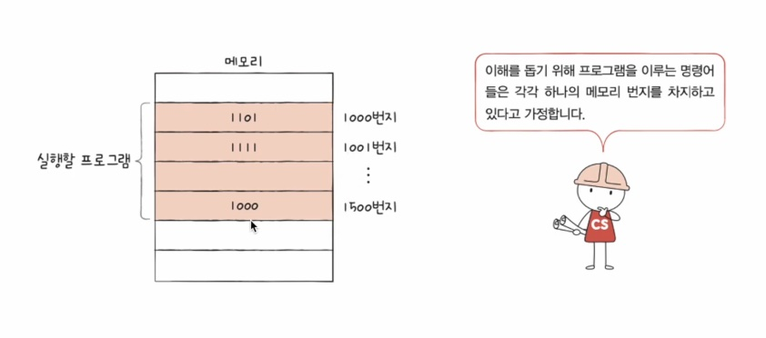

- CPU가 실행하고자 하는 프로그램이 1000번지~1500번지까지 저장

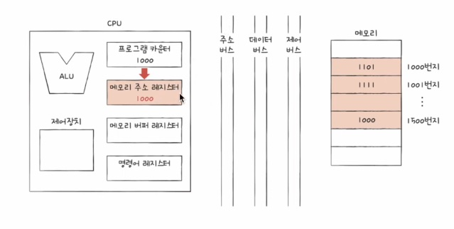

- 다음으로 실행할 명령어가 프로그램 카운터에 저장: 1000
- 프로그램 카운터에 저장된 메모리 주소 값은 메모리 주소 레지스터에 복사

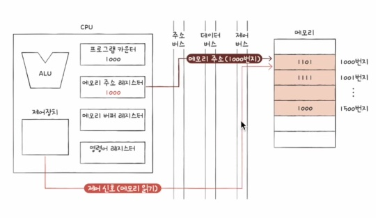

- 메모리 읽기 신호와 함께, 몇번지 주소를 읽고 싶은지 쏴줌

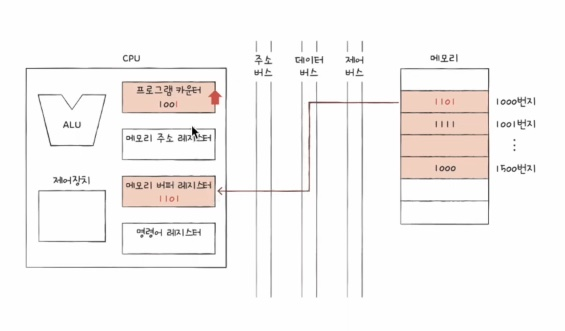

- 메모리는 1000번지에 저장된 값을 데이터 버스를 통해서 메모리 버퍼 레지스터로 전달
- 프로그램 카운터는 1이 증가, 다음으로 실행할 주소 업데이트 -> 프로그램을 순차적으로 실행하는 원리

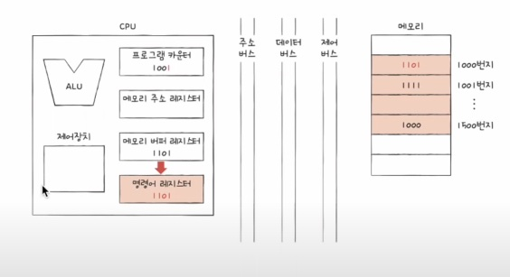 

- 제어장치가 해석하기 위해서 1101 명령어를 명령어 레지스터에 복사

### 순차적인 실행 흐름이 끊기는 경우

- 특정 메모리 주소로 실행 흐름을 이동하는 명령어 실행시
(e.g. JUMP, CONDITONAL JUMP, CALL, RET)
- 인터럽트 발생시
- ETC...

5. 플래그 레지스터: 연산 결과 또는 CPU 상테에 대한 부가적인 정보
6. 범용 레지스터: 다양하고 일반적인 상황에서 자유롭게 사용
7. 스택 포인터: 스택의 꼭대기 가르킴
  - 스택과 스택 포인터를 이용한 주소 지정 방식
  - 스택포인터: 스택의 꼭대기를 가리키는 레지스터 (스택이 어디까지 차 있는지에 대한 표시)
  - 스택은 메모리에 안에 스택 영역(스택처럼 사용하라고 지정된 공간)에 있음

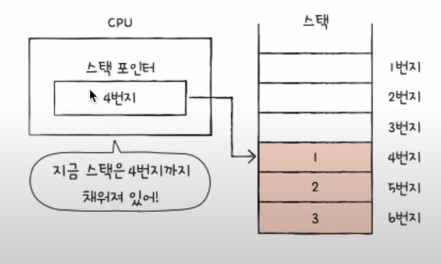  

- 8. 베이스 레지스터: 기준 주소 저장
  - 변위 주소 지정 방식: 오퍼랜드 필드의 값(변위)과 특정 레지스터의 값을 더하여 유효 주소 얻기
  - 연산코드: 이런 내용을 수행하라, 레지스터: 이 레지스타 값과, 오퍼랜드: 이 주소를 더한 곳에 있는 데이터로 이렇게 구성
  - 오퍼랜드 + 프로그램 카운터 or 베이스 레지스터 값을 더하여 유효 주소 얻기 방식 있음
  - 상대 주소 지정 방식: 오프랜드 필드의 값(변위)과 프로그램 카운터의 값을 더하여 유효 주소 얻기
  - 베이스 레지스터 주소 지정 방식: 오퍼랜드 필드의 값(변위)과 베이스 레지스터의 값을 더하여 유효 주소 얻기, 기준 주소를 바탕으로 오퍼랜드 만큼 떨어진 코드 실행

# 4-3 명령어 사이클과 인터럽트

### 들어가기 전

- CPU는 Memory안에 있는 프로그램을 정해진 흐름대로 처리하게 됨
- 정해진 흐름을 명령어 사이클이라 함.
- 정해진 흐름을 끊는 신호를 인터럽트.

## 명령어 사이클

- 명령어 사이클
  - 프로그램 속 명령어들은 일정한 주기가 반복되며 실행, 이 주기를 명령어 사이클
  - 인출 사이클: 메모리 안에 저장된 값을 CPU 내부에 가져오는 주기
  - 실행 사이클: 갖고 왔으면 해당 값을 실행
  - 명령 사이클: 인출-실행-인출-실행 반복
  - 그런데 CPU로 명령어를 가지고 와도 바로 실행이 불가능한 경우도 있음. ex) 간접 주소 지정 방식
    - 인출 사이클이 끝나고 메모리 접근이 더 필요한 경우 간접 사이클 후에 실행 사이클 실행

## 인터럽트

- 인터럽트
  - CPU가 꼭 주목해야 할 때, CPU가 얼른 처리해야 할 다른 작업이 생겼을 때 발생
  - 동기 인터럽트(예외), 비동기 인터럽트(하드웨어 인터럽트)가 있음.
  - 동기 인터럽트(예외)
    - CPU가 예기치 못한 상황을 접했을 때 발생
    - 예외적인 상황이 발생 했을때 실행을 중단하거 해당 상황을 처리
    - 종류로는 폴트, 트랩, 중단, 소프트웨어 인터럽트가 있음 -> 운영체제에서 다룰 예정
  
- 하드웨어 인터럽의의 처리 순서
  1. 입출력장치는 CPU에 인터럽트 요청 신호를 보냄
  2. CPU는 실행 사이클이 끝나고 명령어를 인출하기 전 항상 인터럽트 여부를 확인
  3. CPU는 인터럽트 요청을 확인하고 인터럽트 플래그를 통해 현재 인터럽트를 받아들일 수 있는지 여부 확인
  4. 인터럽트를 받아들일 수 있다면 CPU는 지금까지의 작업을 백업
  5. CPU는 인터럽트 벡터를 참조하여 인터럽트 서비스 루틴을 실행
  6. 인터럽트 서비스 루틴이 끝나면 4에서 백업해 둔 작업을 복구하여 실행을 재개

- 인터럽트 요청 신호
  - 입출력 장치가 CPU에게 인터럽트(끼어들거나, 어떤 일을 하는 것)를 요청하는 신호
  - CPU가 인터럽느 요청 신호를 받았으면 실행 사이클이 끝나고 플래그 레지스터 속 인터럽트 플래그 확인
  - 모든 인터럽트를 인터럽트 플래그로 막을 수 있는건 아님(Non maskable interrupt)
  - 비동기 인터럽트는 막을 수 있는 인터럽트(Maskable interrupt), 막을 수 없는 인터럽트(Non maskable interrupt)로 나뉨

- 인터럽트 서비스 루틴
  - CPU가 인터럽트를 받아들이기로 했다면 인터럽트 서비스 루틴 실행
  - 인터럽트가 발생했을 때 해당 인터럽트를 어떻게 처리하기 위한 프로그램
  - ex) 키보드가 인터럽트 요청을 보내면 이렇게 행동, 마우스가 인터럽트 요청을 보내면 이렇게 행동
  - 인터럽트 서비스 루틴도 프로그램이기에 메모리에 저장

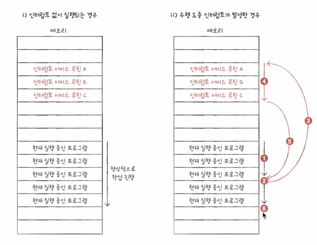  

- 인터럽트 벡터
  - 각각의 인터럽트를 구분하기 위한 정보
  - 인터럽트마다 고유의 인터럽트 시작 주소를 가짐, 인터럽트 벡터를 통해 인터럽트 서비스 루틴의 시작점 파악

- CPU가 인터럽트를 처리한다
  - 인터럽트 서비스 루틴을 실행하고, 본래 수행하던 작업으로 다시 되돌아옴.
  - 인터럽트의 시작 주소는 인터럽트 벡터를 통해 알 수 있음

- 스택 영역

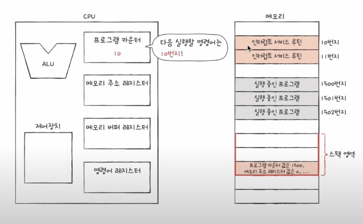  

- 프로그램 카운터에 1500번지가 저장되어있다고 가정
- 10번지의 인터럽트 서비스 루틴을 실행해야한다 가정하면, 해당 프로그램 카운터 값을 스택영역에 저장
- 언제든 되돌아와서 수행을 해야하기 때문

- 인터럽트 요청신호: CPU의 작업을 방해하는 인터럽트에 대한 요청
- 인터럽트 플래그: 인터럽트 요청 신호를 받아들일지 무시할지를 결정하는 비트
- 인터럽트 벡터: 인터럽트 서비스 루틴의 시작 주소를 포함하는 인터럽트 서비스 루틴의 식별 정보
- 인터럽트 서비스 루틴: 인터럽트를 처리하는 프로그램

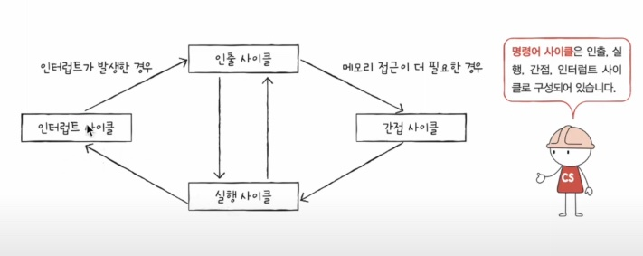  