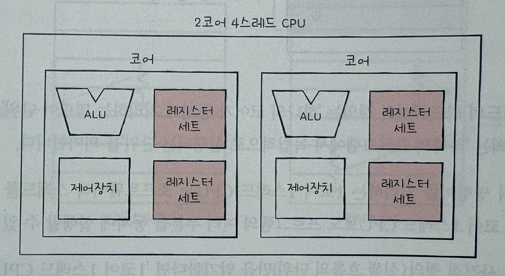

# 5-1 빠른 CPU를 위한 설계 기법
## 클럭
- 컴퓨터 부품들은 클럭 신호에 맞춰 움직이고, CPU는 명령어 사이클에 맞춰 명령어를 실행함.
- 클럭 속도가 높아지면? CPU는 명령어 사이클을 더 빠르게 반복할 것
- 따라서 클럭 속도가 높은 CPU는 일반적으로 성능이 좋음.
- 클럭 속도
  - Hz로 측정 
  - 기본 클럭 속도, 최대 클럭 속도가 존재. -> 일정하지 않음
  - 고성능을 요하는 순간에 순간적으로 클럭속도를 높임.
  - 최대 클럭 속도를 강제로 더 올리는 기법을 오버클럭킹이라 함.
  - ex) Base 2.5GHz, Max 4.9GHz CPU는 1초에 클럭이 기본적으로 25억번, 순간적으로 최대 49억번 반복되는다는 것을 의미함.
- 클럭 속도를 높이면 무조건 CPU가 빨라질까?
  - 발열이 심해짐

## 코어와 멀티코어
- 전통적 관점에서의 CPU : 명령어를 실행하는 부품
- 현대적 관점에서의 CPU : 명령어를 실행하는 부품을 여러개 포함하는 부품
    - 현재 명령어를 실행하는 부품은 코어임. CPU 안에는 여러개의 코어가 존재함
    - 코어를 여러개 포함하고 있는 CPU를 멀티코어 CPU or 멀티코어 프로세서라고 함. -> CPU내의 일꾼이 많은 것
    - 클럭 속도 2.4GHz 단일 코어 CPU vs 클럭 속도 1.9GHz 멀티 코어 CPU 
        - 일반적으로 후자가 성능 우수
    - ex) 8코어 CPU - 8개의 명령어를 실행하는 부품(코어)을 가진 CPU
- CPU의 연산 속도는 코어 수에 비례하여 증가하진 않음
    - 코어마다 처리할 연산이 적절히 분배되지 않기 때문
    - 또한, 처리하고자 하는 작업량보다 코어 수가 많아도 연산속도는 증가하지 않음 (일 안하는 코어가 생김)

## 스레드와 멀티 스레드
- 스레드의 사전적 의미는 '실행 흐름의 단위'임.

### 하드웨어적 스레드
- 하나의 코어가 동시에 처리하는 명령어 단위
- 2코어 4스레드 CPU - 명령어를 실행하는 부품 2개, 한번에 4개의 명령어를 처리할 수 있는 CPU

    

- 하나의 코어로 여러 명령어를 동시에 처리하는 CPU를 멀티스레드 프로세서 or 멀티스레드 CPU라 함.
    ex) 8코어 16스레드 -> 8개의 코어가 있고, 각 코어는 2개의 하드웨어 스레드를 처리함.

### 소프트웨어적 스레드
- 하나의 프로그램에서 독립적으로 실행되는 단위
- 워드 프로세서 
  - 입력 받은 내용을 출력하는 기능
  - 입력 받은 내용을 검사하는 기능
  - 입력 받은 내용을 수시로 저장하는 기능
- 위 세 기능을 작동시키는 코드를 각각의 스레드로 만들면서 동시에 실행할 수 있음

    

### 멀티스레드 프로세서
- 멀티스레드 프로세서는 하나의 코어로 여러 명령어를 동시에 처리하는 CPU
- How?
    - 가장 큰 핵심은 레지스터임.
    - 하나의 명령어를 처리하기 위해 필요한 레지스터를 여러대 가지고 있으면 됨
        - ex) 프로그램 카운터, 스택 포인터, 메모리 버퍼 레지스터, 메모리 주소 레지스터
    - 하나의 명령어를 처리하기 위해 필요한 레지스터들의 집합을 레지스터 세트라 표기하면 아래 그림과 같이 구성됨
        
        

- 메모리 속 프로그램 입장에서 본 하드웨어 스레드
    - 한 번에 하나의 명령어를 처리하는 CPU
    - 예시
        - 2코어 4스레드 CPU는 한번에 네개의 명령어를 처리. 
        - 프로그램 입장에서는 한 번에 하나의 명령어를 처리하는 CPU가 네 개 있는 것처럼 보임.
        - 따라서 하드웨어 스레드를 논리 프로세서라고 부르기도 함.

### 정리
- 코어 : 명령어를 실행할 수 있는 하드웨어 부품
- 스레드 : 명령어를 실행하는 단위
- 멀티코어 프로세서 : 명령어를 실행할 수 있는 하드웨어 부품이 CPU안에 두 개 이상 있는 CPU
- 멀티스레드 프로세서 : 하나의 코어로 여러개의 명령어를 동시에 실행할 수 있는 CPU

# 5-2 명령어 병렬 처리 기법
- 명령어 병렬 처리 기법이란? CPU를 한시도 쉬지 않고 작동시키는 기법
    - ex) 명령어 파이프라이닝, 슈퍼스칼라, 비순차적 명령어 처리

## 명령어 파이프라인
- 하나의 명령어가 처리되는 전체 과정 (클럭 단위로 나눔)
    - 명령어 인출
    - 명령어 해석
    - 명령어 해석
    - 결과 저장
- CPU는 각 단계를 동시에 실행할 수 있음.
- 명령어 파이프라이닝 : 동시에 여러 개의 명령어를 겹쳐 실행하는 기법 (like 공장 생산 라인)


- 파이프라이닝은 성능이 높지만 위험요소가 존재함
- 파이프라인 위험
    - 데이터 위험
    - 제어 위험
    - 구조적 위험

### 데이터 위험
- 명령어 간 데이터 의존성에 의해 발생
    - 아래 예시의 경우, 명령어 1이 수행되어야 명령어 2를 수행가능.
    - 명령어 1의 실행이 끝나기전에 명령어 2를 인출하면 R1에 이상한 값이 들어가서 에러가 생길 수 있음.
    - 예시
        - 명령어 1 : R1 <- R2 + R3
        - 명령어 2 : R4 <- R1 + R5

### 제어 위험
- 분기 등으로 인한 프로그램 카운터의 갑작스러운 변화에 의해 발생
- 프로그램 카운터는 현재 실행 중인 명령어의 다음 주소로 갱신됨.
- 프로그램 카운터 값에 갑작스러운 변화가 생기면, 명령어 파이프라인에 미리 가지고 와서 처리 중이었던 명령어들은 아무 쓸모가 없어짐.        
- 제어 위험을 해결하기 위해, '분기 예측'을 사용함
- 분기 예측은 프로그램이 어디로 분기할지 미리 예측한 후 그 주소를 인출하는 기술


### 구조적 위험 (자원 위험)
- 명령어들을 겹쳐 실행하는 과정에서 서로 다른 명령어가 동시에 ALU, 레지스터 등과 같은 CPU 부품을 사용하려고 할 때 발생

## 슈퍼스칼라
- CPU 내부에 여러 개의 명령어 파이프라인을 포함한 구조.
- 공장 생산 라인을 여러개 두는 것과 같음
- 슈퍼스칼라 구조로 명령어 처리가 가능한 CPU -> 슈퍼스칼라 CPU or  슈퍼스칼라 프로세서
    - 매 클럭 주기마다 동시에 여러 명령어를 인출할 수도 있고, 실행할 수도 있어야 함.
- 이론적으로는 파이프라인 개수에 비례하여 프로그램 처리속도가 빨라짐
- 하지만 파이프라인 위험 등의 예상치 못한 문제가 있기 때문에, 파이프라인 갯수에 정확히 비례하진 않음


## 비순차적 명령어 처리 (Out of order execution - OoOE)
- 명령어들을 순차적으로 실행하지 않는 기법. 즉, 새치기를 허용함
- 모든 명령어를 순차적으로만 처리한다면, 파이프라인 위험과 같은 상황에서 명령어 파이프라인은 멈춰버릴 수 있음
- 예시
    - 소스 코드
    ```
        1) M(100) <- 1
        2) M(101) <- 2
        3) M(102) <- M(100) + M(101)
        4) M(150) <- 1
        5) M(151) <- 2
        6) M(152) <- 3
    ```
    - 순차적 명령어 처리
        - 1번, 2번 명령어가 끝날 때까지 기다린 후, 3번 명령어가 실행됨
    - 비순차적 명령어 처리
        - 3번 명령어를 제일 마지막에 처리해버림
        - 기다리는 시간이 없기 때문에 훨씬 효율적으로 명령어를 처리하게 됨
- 명령어간 어떤 의존성도 없는 명령어들만 순서를 바꿀 수 있음.
- 비순차적 명령어 처리가 가능한 CPU는 명령어들이 어떤 명령어와 데이터 의존성을 가지고 있는지, 순서를 바꿔 실행할 수 있는 명령어에는 어떤 것들이 있는지 판단 가능해야함

# CISC와 RISC
## 명령어 집합
- 명령어는 CPU마다 조금씩 차이가 있음.
- CPU가 이해할 수 있는 명령어들의 모음을 명령어 집합 or 명령어 집합 구조(Instruction Set Architecture - ISA)라 함.
- 즉, CPU마다 ISA가 다름
- 인텔 노트북 속 CPU는 x86 or x86-64 ISA를 이해하고, 아이폰 속 CPU는 ARM ISA를 이해함
    - 인텔 CPU를 사용하는 컴퓨터와 아이폰은 서로의 명령어를 이해할 수 없음.
    - 실행 파일은 명령어로 이루어져 있고, 서로의 컴퓨터가 이해할 수 있는 명령어가 다르기 때문.
    - 인텔 CPU에서 만든 실행 파일은 아이폰에서 실행 안됨 -> 크로스 컴파일 혹은 아이폰에서 직접 컴파일 해야 됨.
    - 즉, 같은 소스 코드 더라도, ISA가 다르면 컴파일된 어셈블리어도 달라짐

        

- ISA가 같은 CPU끼리는 서로의 명령어를 이해할 수 있지만, ISA가 다르면 서로의 명령어를 이해할 수 없음
    - 이러한 점 때문에 ISA를 CPU의 언어라고 볼 수 있음.
- ISA가 다르면 많은 것들이 달라짐
    - 제어장치가 명령어를 해석하는 방식
    - 사용되는 레지스터의 종류와 개수
    - 메모리 관리 방법 
    - 등등
- ISA는 위와 같은 이유로 CPU 하드웨어 설계에도 큰 영향을 미침
    - ISA가 명령어를 제시하고, 하드웨어는 해당 명령어를 잘 처리하는 방식으로 설계됨.
- 명령어 병렬 처리 기법들을 잘 적용하기 용이한 ISA가 있고, 그렇지 못한 ISA가 있음
    - 전자의 ISA : CISC와 RISC가 대표적임.

## CISC (Complex Instruction Set Computer)
- 직역 : 복잡한 명령어 집합을 활용하는 컴퓨터
- 인텔 CPU가 이해하는 ISA인 x86, x86-64가 대표적인 CISC 기반의 ISA임
- 장점
    - 다양하고 강력한 기능의 명령어 집합을 활용함
        - 따라서, 명령어의 형태와 크기가 다양한 가변 길이 명령어를 활용
        - 또한, 상대적으로 적은 수의 명령어로도 프로그램을 실행할 수 있음 
        - 그렇기에 컴파일된 프로그램의 크기가 작음
            - 메모리를 최대한 아끼며 개발해야 했던 시절에 인기가 높았음.
- 단점
    - 활용하는 명령어가 워낙 복잡하고 다양한 기능을 제공하기 때문에
        - 명령어의 크기와 실행되기까지의 시간이 일정하지 않음.
        - 명령어 하나를 실행하는 데에 여러 클럭 주기가 필요함
        - 이는 명령어 파이프라인을 구현하는데 큰 걸림돌임.
            - 명령어 파이프라인 기법을 위해서, 이상적인 명령어는 각 단계에서 소요되는 시간이 동일해야함.
            - 하지만, CISC의 규격화되지 않은 명령어가 파이프라이닝을 어렵게 만듦.
    - CISC의 대다수의 복잡한 명령어는 사용 빈도가 낮음
        - 불과 20%의 명령어가 사용량의 80%를 차지.
        - 사용하는 명령어만 사용한다는 뜻

## RISC (Reduced Instruction Set Computer)
- CISC의 한계로 배운 교훈
    - 원활한 파이프라이닝을 위해서, 명령어 길이와 수행 시간이 짧고 규격화되야함
    - 어차피 자주 쓰이는 명령어만 주로 사용됨. 따라서 자주 쓰이는 기본적인 명령어를 작고 빠르게 만드는 것이 중요함.
- RISC의 특징
    - CISC와 달리 짧고 규격화된 명령어, 되도록 1클럭 내외로 실행되는 명령어를 지향함.
    - 즉, 고정 길이 명령어를 활용함.
    - 따라서 RISC는 명령어 파이프라이닝에 최적화되어 있음.
    - 메모리에 직접 접근하는 명령어를 load, store 두개로 제한할 만큼 메모리 접근을 단순화하고 최소화함.
        - 따라서, CISC보다 주소 지정 방식의 종류가 적은 경우가 많음
    - RISC는 메모리 접근을 줄이는 대신, 레지스터를 적극 사용
        - CISC보다 레지스터 연산이 많고, 범용 레지스터 개수도 더 많음
    - 다만, 명령어 개수가 CISC보다 적기 때문에 더 많은 명령으로 프로그램을 작동시킴.


    

