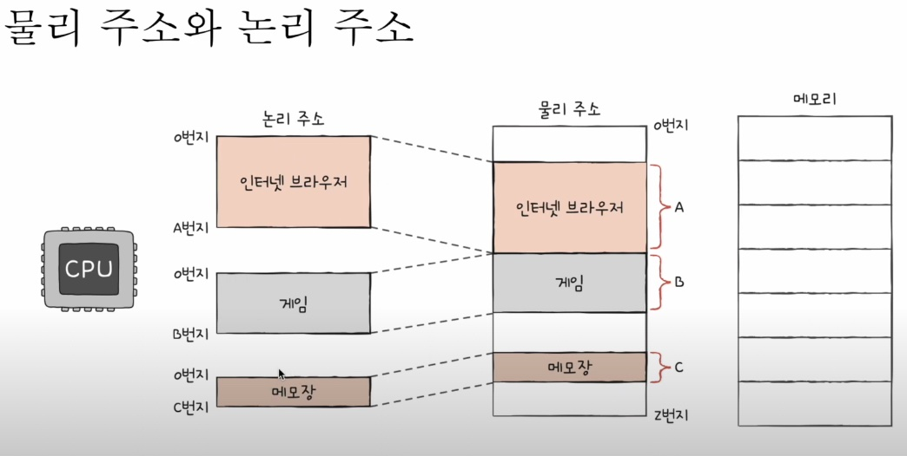
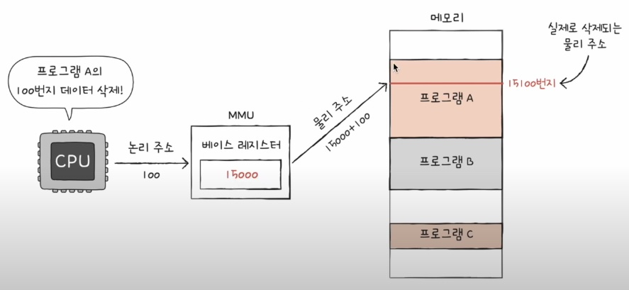
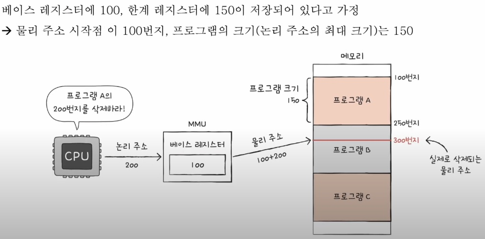
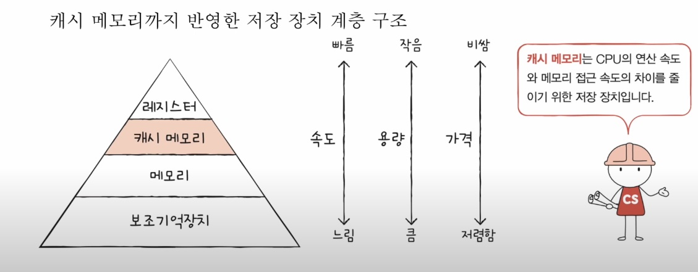
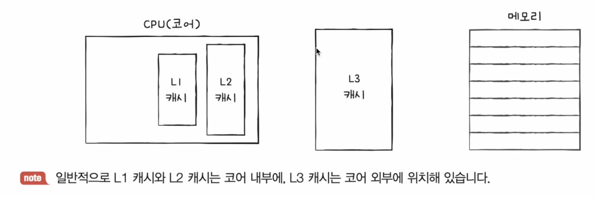
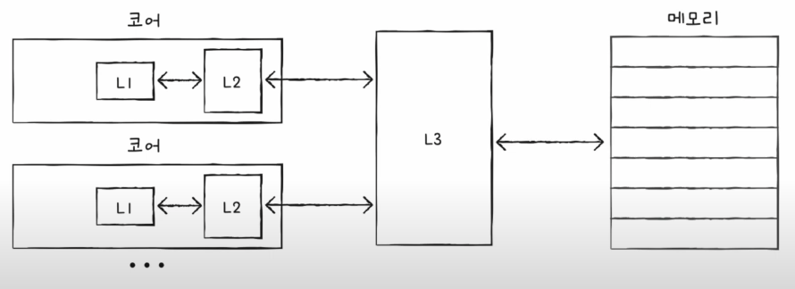

# 6-1 RAM의 특성과 종류

### 들어가며

- 주기억장치의 종류에는 크게 RAM과 ROM 두 가지가 있고 메모리라는 용어는 그 중 RAM을 지칭하는 경우가 많다.
- RAM이 크면 정확히 뭐가 좋을까? DRAM, SRAM? SDRAM?, DDR SDRAM?

## RAM의 특징
- CPU는 메모리로부터 명령어와 데이터들을 가지고와 실행
- RAM은 실행할 대상을 저장 but 전원이 꺼지면 저장된 내용이 사라짐 -> 휘발성 저장 장치
- 전원이 꺼져도 해당 대상들을 저장할 보조기억장치가 필요 ex) SSD, HDD -> 비휘발성 저장 장치

## RAM의 용량과 성능
- RAM이 크면 뭐가 좋을까?, RAM의 용량은 컴퓨터 성능에 어떤 영향을 미칠까?
- RAM이 작으면 CPU가 여러가지 프로그램을 동시에 실행할 성능이 저하 
- -> 새로운 프로그램이 실행될때마다 보조기억장치에 새로운 프로그램을 복사해야하니깐
- 즉 많은 프로그램들을 동시에 실행하는 데에 유리.

## RAM의 종류
- DRAM, SRAM, SDRAM, DDR SDRAM

1. DRAM (Dynamic RAM)
- Dynamic = '동적의'
- 저장된 데이터가 동적으로 사라지는 RAM(전원을 꼽고 있어도 사라짐)
- 데이터 소멸을 막기 위해 주기적으로 재활성화 해야
- 일반적으로 메모리로 사용되는 RAM
    - 상대적으로 소비전력이 낮고 저렴하고 집적도 높음
    - 대용량으로 설계하기 용이하기 때문

2. SRAM(Static RAM)
- Static = '정적의'
- 저장된 데이터가 정적인(사라지지 않는) RAM(그래도 전원 뽑으면 데이터 사라짐)
- DRAM 보다 일반적으로 더 빠름
- 일반적으로 캐시 메모리에서 사용되는 RAM
    - 상대적으로 소비전력이 높고 가격이 높고 집적도가 낮아
    - 대용량으로 설계할 필요는 없으나 빨라야 하는 장치에 사용


- DRAM vs SRAM

|               | DRAM             | SRAM          |
|---------------|------------------|---------------|
| 재충전        | 필요함            | 필요 없음      |
| 속도           | 느림              | 빠름           |
| 가격           | 저렴함            | 비쌈           |
| 집적도         | 높음              | 낮음           |
| 소비 전력      | 적음              | 높음           |
| 사용 용도      | 주기억장치(RAM)   | 캐시 메모리     |

3. SDRAM(Synchronous DRAM)
- 특별한 (발전된 형태의) DRAM
- 클럭 신호와 동기화된 DRAM -> 클럭 신호가 반복될때마다 한번에 한번씩 데이터를 주고 받음

4. DDR SDRAM(Double Data Rate SDRAM)
- 특별한 (발전된 형태의) SDRAM
- 최근 가장 대중적으로 사용하는 RAM
- 대역폭을 넓혀 속도를 빠르게 만든 SDRAM
- 대역폭: 데이터를 주고 받는 길의 넓이
- DDR SDRAM vs SDRAM(SDR: Single Data Rate SDRAM), 대역폭이 두 배 넓은 SDRAM
- DDR2 SDRAM vs DDR SDRAM
- DDR3, DDR4 SDRAM도 있음. SDR SDRAM보다 각각 8배, 16배 대역폭 넓음.

# 6-2 메모리의 주소 공간

### 들어가며
- 논리 주소와 물리 주소로 주소 공간을 나눈 이유?
- 논리 주소를 물리 주소로 변환하는 방법?

## 물리 주소와 논리 주소
- CPU와 실행 중인 프로그램은 현재 메모리 몇 번지에 무엇이 저장되어 있는지 다 알 수 없음
- 메모리에 저장된 값들은 시시각각 변하기 때문
    - 새롭게 실행되는 프로그램은 새롭게 메모리에 적재
    - 실행이 끝난 프로그램은 메모리에서 삭제
    - 같은 프로그램을 실행하더라도 실행할 때 마다 적재되는 주소는 달라짐
- 이를 극복하기 위해 주소 체계를 물리주소, 논리주소로 나눔

- 물리 주소
    - 메모리 입장에서 바라본 주소
    - 말 그대로 정보가 실제로 저장된 하드웨어상의 주소

- 논리 주소
    - CPU와 실행 중인 프로그램 입장에서 바라본 주소
    - 실행 중인 프로그램 각각에게 부여된 0번지부터 시작하는 주소


    

- 모든 프로그램마다 논리 주소 0번지 존재, 프로그램마다 각각 부여된 주소 -> 논리 주소
- 물리 주소는 겹치는 주소 번지 존재하지 X
- 그렇다면 물리 주소와 논리 주소 간의 변환은 어떻게 이루어질까?

## 물리 주소와 논리 주소의 변환
- MMU(메모리 관리 장치)라는 하드웨어에 의해 변환
- MMU는 논리 주소와 베이스 레지스터 값(프로그램의 기준 주소)을 더하여 논리 주소를 물리 주소로 변환
- 베이스 레지스터: 프로그램의 가장 작은 물리 주소(프로그램의 첫 물리 주소)를 저장하는 셈
- 논리 주소: 프로그램의 시작점으로부터 떨어진 거리인 셈

    

- 논리 주소 100: 기준 주소로 부터 100번지 떨어진 주소

## 메모리 보호
- 한계 레지스터
    - 프로그램의 영역을 침범할 수 있는 명령어의 실행을 막음
    - 베이스 레지스터가 실행 중인 프로그램의 가장 작은 물리 주소를 저장한다면, 한계 레지스터는 논리 주소의 최대 크기를 저장
    - 베이스 레지스터 값 <= 프로그램의 물리 주소 범위 < 베이스 레지스터 + 한계 레지스터 값
- CPU가 접근하려는 논리 주소는 한계 레지스터가 저장한 값보다 커서는 안됨

    

- 한계 레지스터보다 큰 메모리 주소 번지에 접근하려하기 때문에 막아야함
- CPU는 메모리에 접근하기 전 접근하고자 하는 논리 주소가 한계 레지스터보다 작은지를 항상 검사
- 실행 중인 프로그램의 독립적인 실행 공간을 확보 & 하나의 프로그램이 다른 프로그램을 침버하지 못하게 보호

# 6-3 캐시 메모리

### 들어가며
- CPU가 메모리에 접근하는 시간은 CPU 연산속도보다 느림.

## 저장 장치 계층 구조
- CPU와 가까운 저장 장치는 빠르고, 멀리 있는 저장 장치는 느림
- 속도가 빠른 저장 장치는 저장 용량이 작고, 가격이 비쌈
- 레지스터 vs 메모리(RAM) vs USB 메모리
- 낮은 가격대의 대용량 저장 장치를 원한다면 느린 속도 감수, 
- 빠른 속도의 저장 장치를 원한다면 작은 용량과 비싼 가격 감수
- Memory hierachy라고도 함. 여기서 메모리는 RAM이 아닌 일반적인 저장 장치 의미

## 캐시 메모리
- CPU와 메모리 사이에 위치한 레지스터보다 용량이 크고 메모리보다 빠른 SRAM 기반의 저장 장치
- CPU의 연산 속도와 메모리 접근 속도의 차이를 조금이나마 줄이기 위해 탄생
- CPU가 매번 메모리에 왔다 갔다 하는 건 시간이 오래 걸리니, 메모리에서 CPU가 사용할 일부 데이터를 미리 캐시 메모리로 가지고 와서 쓰자

   

- 계층적 캐시 메모리 (L1-L2-L3 캐시)

    

- 멀티코어 프로세서의 캐시 메모리

    

- 각 코어마다 L1,L2 캐시, L3 캐시롤 공유하는 형태

- 분리형 캐시
    - L1캐시를 조금 더 빠르게 만들기 위해 명령어만을 담고 있는 L1캐시(L1I), 데이터만을 담고 있는 L1캐시(L1D) 분리하는 형태도 있음

## 참조 지역성의 원리
- 캐시 메모리는 메모리보다 용량이 작음, 당연하게도 메모리의 모든 내용을 저장할 수 없음, 어떤 내용을 저장할까?
- CPU가 자주 사용할 법한 내용을 예측하여 저장
- 예측이 들어 맞을 경우(CPU가 캐시 메모리에 저장된 값을 활용할 경우) = 캐시 히트
- 예측이 틀렸을 경우(CPU가 메모리에 접근해야 하는 경우) = 캐시 미스
- 캐시 적중률 = 캐시 히트 횟수 / (캐시 히트 횟수 + 캐시 미스 횟수), 높을수록 성능이 좋음
- 참조 지역성의 원리: CPU가 사용할 법한 데이터를 예측하는 방법
    - CPU가 메모리에 접근할 때의 주된 경향을 바탕으로 만들어진 원리
    1. CPU는 최근에 접근했던 메모리 공간에 다시 접근하려는 경향이 있음
    2. CPU는 접근한 메모리 공간 근처를 접근하려는 경향이 있음

- 1번 케이스
```c
#include <stdio.h>

int main(void) {
    int num = 2;

    for (int i = 1; i <= 9; i++)
        printf("%d X %d = %d\n", num, i, num * i);

    return 0;
}
```
- 코드 실행할때 num이라는 변수 다시 접근하는 경향

- 2번 케이스(공간 지역성): 접근한 메모리 공간 근처를 접근하려는 경향
    - 프로그램과 관련된 기능이 모여서 저장


