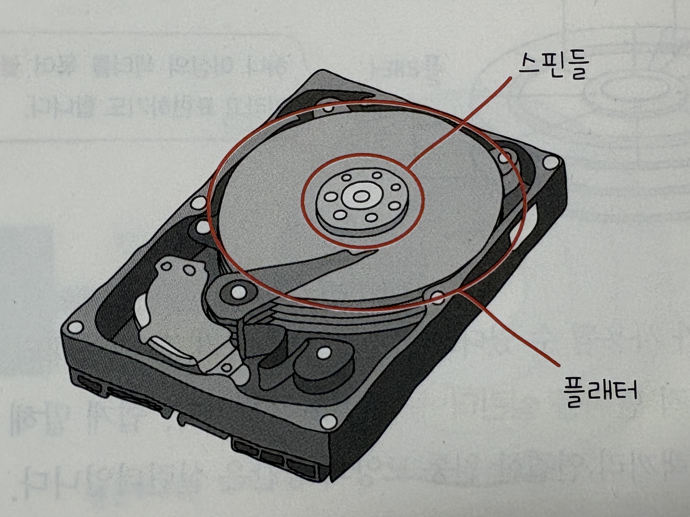
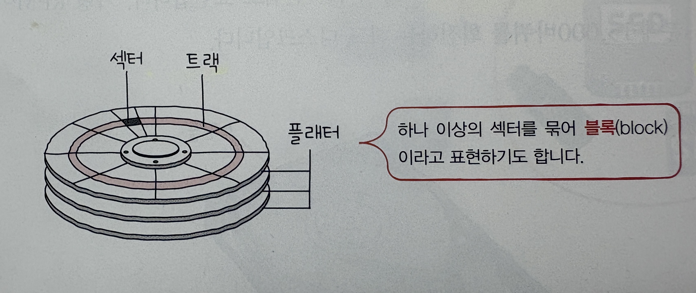
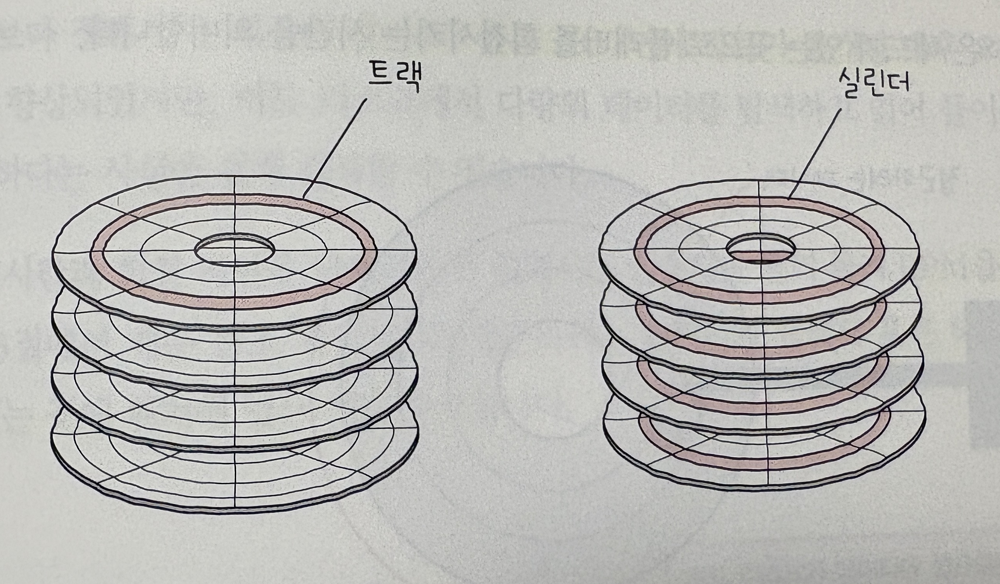
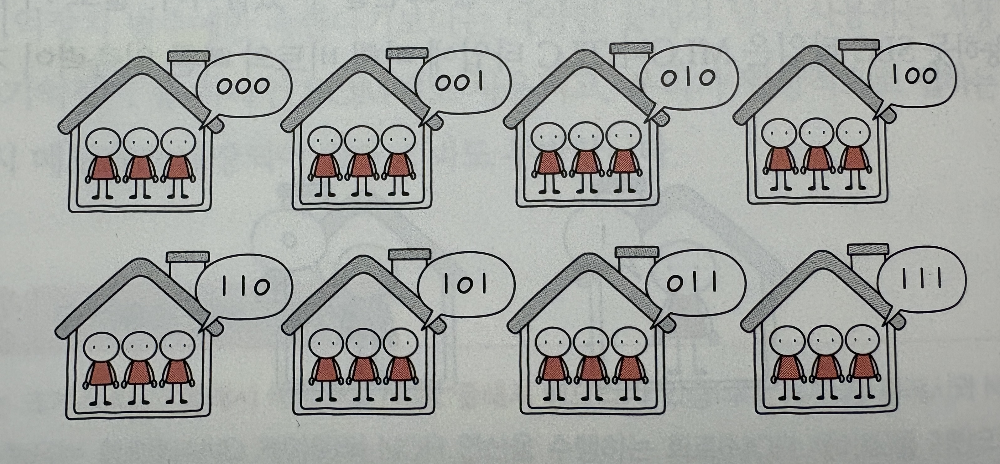
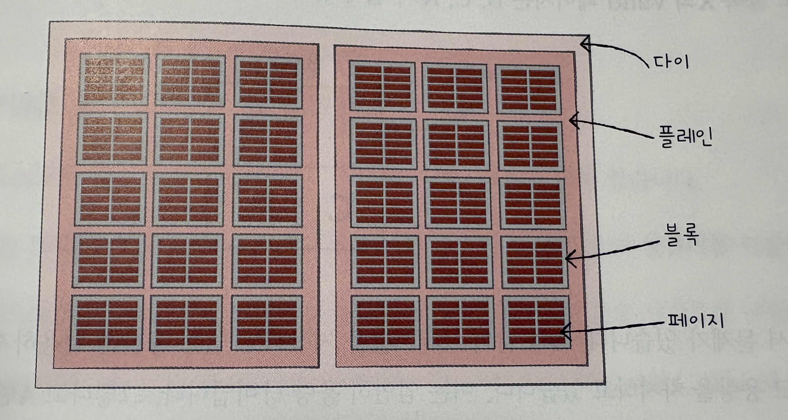
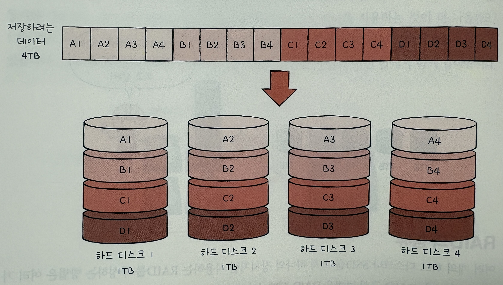
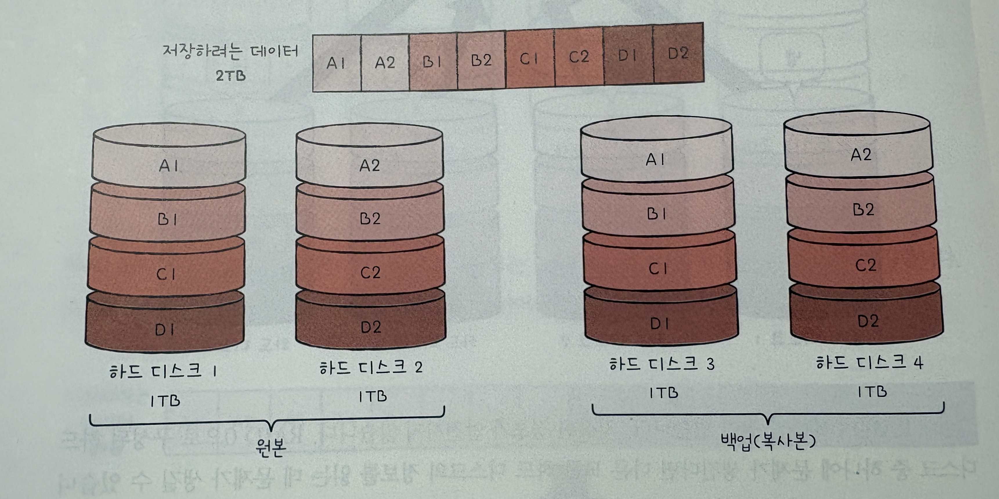
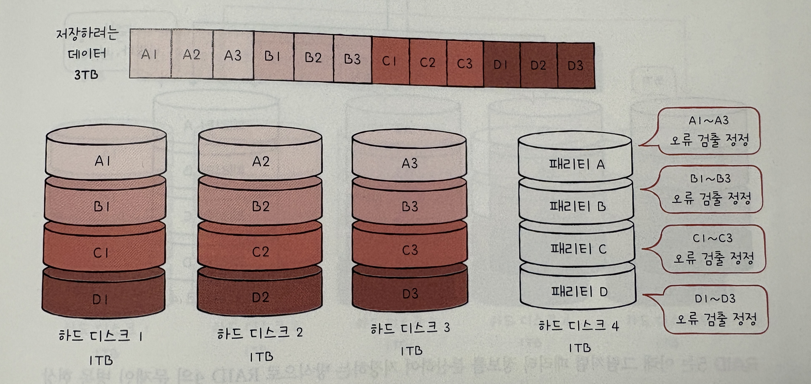
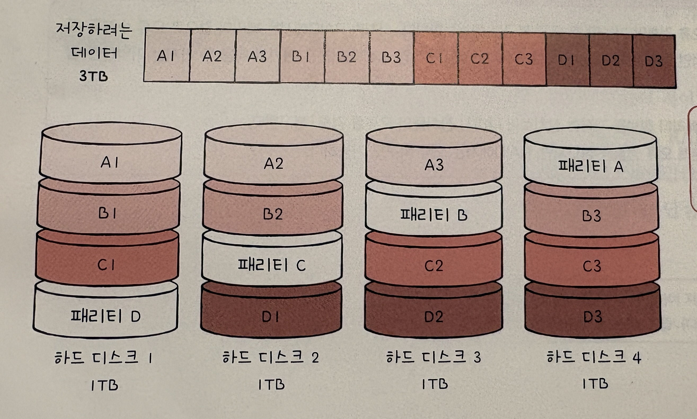
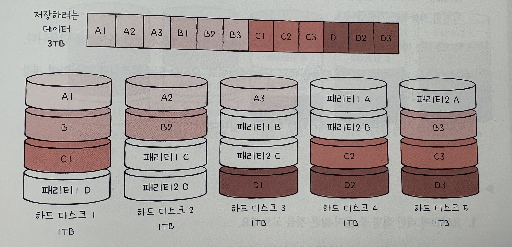

# 7-1 다양한 보조기억장치

## 하드 디스크
- 하드 디스크
    - 자기적인 방식으로 데이터를 저장하는 보조기억장치
    - 플래터
        - 실질적으로 데이터가 저장되는 곳
        - 자기 물질로 덮여있어 수많은 N, S극을 저장함
        - N극과 S극은 0, 1 역할을 수행
    - 스핀들
        - 플래터를 회전시키는 구성 요소
        - RPM 단위를 사용 (1분에 15000번 플래터를 회전시키는 하드 디스크 -> 15000RPM)
    - 헤드
        - 플래터를 대상으로 데이터를 읽고 쓰는 구성 요소
        - 원하는 위치로 헤드를 이동시키는 디스크 암에 부착되어 있음
        - 플래터의 양면을 사용하면, 플래터당 두개의 헤드가 사용됨

      

- 플래터에 데이터 저장
    - 트랙과 섹터라는 단위로 데이터 저장
    - 동심원을 트랙, 트랙 중 한 조각을 섹터라고 함.
    - 섹터는 하드 디스크의 가장 작은 전송 단위 (일반적으로 섹터의 크기는 512 바이트)

      
    
    - 실린더
        - 여러 갭의 플래터 상에서 같은 트랙이 위치한 곳을 모아 연결한 논리적 단위
        - 연속된 정보는 보통 한 실린더에 기록됨
            - 디스크 암을 움직이지 않고 데이터에 접근할 수 있기 때문

      

- 플래터에 저장된 데이터에 접근
    - 데이터 접근 시간은 크게 탐색 시간, 회전 지연, 전송 시간으로 나뉨
    - 탐색 시간
        - 접근하려는 데이터가 저장된 트랙까지 헤드를 이동시키는 시간
    - 회전 지연
        - 헤드가 있는 곳으로 플래터를 회전시키는 시간
    - 전송 시간
        - 하드 디스크와 컴퓨터 간에 데이터를 전송하는 시간
    - RPM을 높이는 것도 시간을 줄이는데 중요하지만, 데이터가 플래터 혹은 헤드를 조금만 옮겨도 접근할 수 있는 곳에 위치해 있는 것도 중요함

## 플래시 메모리
- 전기적으로 데이터를 읽고 쓸 수 있는 반도체 기반의 저장 장치 (USB, SD 카드, SSD ...)
- 보조기억장치 뿐만 아니라 ROM 같은 주기억장치에도 사용됨
- NAND, NOR 플래시 메모리가 있음. 대용량 저장 장치로 주로 NAND가 사용됨
- 셀
    - 플래시 메모리에서 데이터를 저장하는 가장 작은 단위
    - SLC : 한 셀에 1비트 저장
    - MLC : 한 셀에 2비트 저장
    - TLC : 한 셀에 3비트 저장
    - QLC : 한 셀에 4비트 저장
### SLC
- 한 셀로 두 개의 정보 표현 가능
- 빠른 입출력 가능
- 수명이 김
- 용량 대비 가격이 높다
- 데이터를 읽고 쓰기가 매우 많이 반복되며, 고성능의 빠른 저장 장치가 필요한 경우 사용함

### MLC
- 한 셀로 네 개의 정보 표현 가능
- SLC 타입에 비해 속도와 수명은 떨어지지만, 한 셀에 두 비트씩 저장할 수 있다는 점에서 SLC보다 용량이 큼
- SLC보다 용량 대비 가격이 저렴

### TLC
- 한 셀로 8개의 정보 표현 가능
- SLC, MLC보다 수명과 속도가 떨어지지만 용량 대비 가격도 저렴

### 셀보다 더 큰 단위
- 페이지
    - 셀들이 모여 만들어진 단위
    - 읽기와 쓰기는 페이지 단위로 이루어짐
    - Free, Valid, Invalid 세개의 상태를 가짐
        - Free : 새로운 데이터를 저장할 수 있는 상태    
        - Valid : 데이터를 저장하고 있는 상태   
        - Invalid : 유효하지 않은 데이터를 저장하고 있는 상태
    - 플래시 메모리는 덮어쓰기가 불가능하여, Valid 상태인 페이지에는 새 데이터를 저장할 수 없음
        - 네개의 페이지로 이루어진 블록에 A, B, C 데이터가 각각의 페이지에 저장되어있음
        - A를 지우고 A'를 저장하면, A를 저장한 페이지는 Invalid가 되고 마지막 페이지에 A'가 저장됨
        - 기존에 A가 저장된 페이지는 낭비가 됨
        - 이때 가비지 컬렉션 기능을 사용함 -> 유효한 페이지만 다른 블록으로 넘겨서, Invalid인 페이지를 Free로 만드는 기능. 기존 블록은 제거함.
- 블록
    - 페이지가 모여 만들어진 단위
    - 삭제는 블록 단위로 이루어짐
- 플레인 : 블록이 모여 만들어진 단위
- 다이 : 플레인이 모여 만들어진 단위

# 7-2 RAID의 정의와 종류

## RAID 정의
- 여러 개의 물리적 보조기억장치를 마치 하나의 논리적 보조기억장치처럼 사용하는 기술

## RAID의 종류
- RAID 구성 방법을 RAID 레벨이라 표현함
- RAID0 ~ RAID6이 대표적
- 그 이외에 RAID 10. RAID 50등이 있음

### RAID 0
- 여러 개의 보조기억장치에 데이터를 단순히 나누어 저장하는 방식
- 스트라입 : 줄무늬처럼 분산되어 저장된 데이터
- 스트라이핑 : 데이터를 분산하여 저장하는 것
- 장점 : 빠르다
- 단점 : 정보가 안전하지 않다. 디스크 하나에 문제가 생기면 모든 디스크의 정보를 읽는데 문제가 생김

### RAID 1
- 복사본을 만드는 방식 (미러링)
- 단점
    - 원본과 복사본에 데이터를 써야하기 때문에 속도는 RAID 0 보다 느림
    - 용량이 적어짐 -> 비용 증가로 이어짐
- 장점
    - 복구가 매우 간단함

### RAID 4
- RAID 1 처럼 완전하 복사본을 만드는 대신, 오류를 검출하고 복구하기 위한 정보를 저장한 장치를 두는 구성 방식
- 패리티 비트 : 오류를 검출하고 복구하기 위한 정보
- RAID 1보다 적은 하드 디스크로도 데이터를 안전하게 보관 가능

### RAID 5
- RAID 4에서는 데이터 저장 할 때마다, 패리티를 저장하는 디스크에도 데이터를 쓰게 되므로, 패리티 저장 장치에 병목이 발생함
- RAID 5는 패리티 정보를 분산하여 저장하는 방식으로 병목 현상 해소

### RAID 6 
- 기본적으로 RAID 5와 같은 구성이지만, 패리티를 두 개 두는 방식
- RAID 4나 5보다 안전한 방식
- 하지만 속도는 느림
- 저장속도를 희생하더라도, 안전하게 보관하고 싶을때 사용

