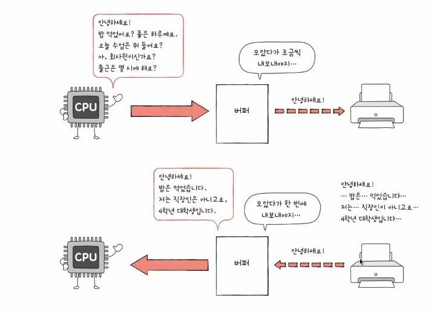
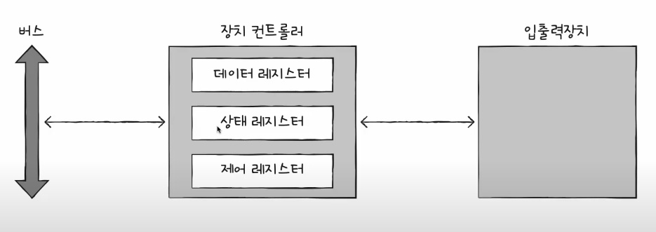
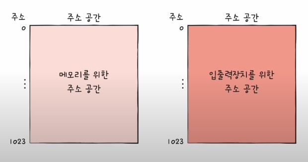
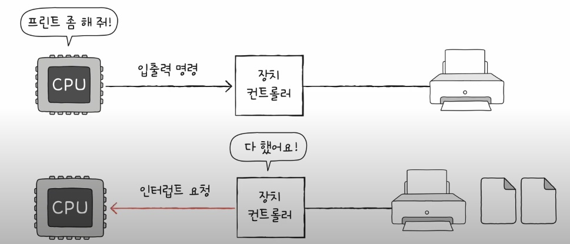
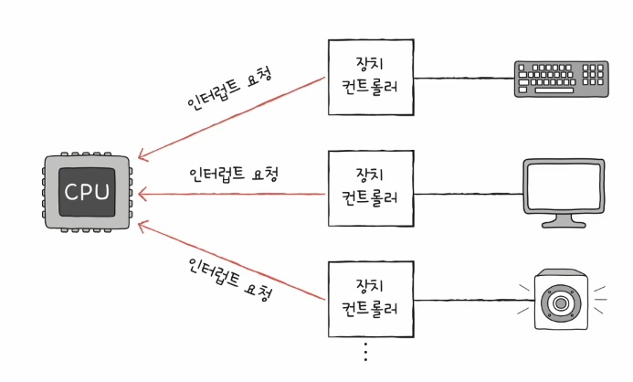
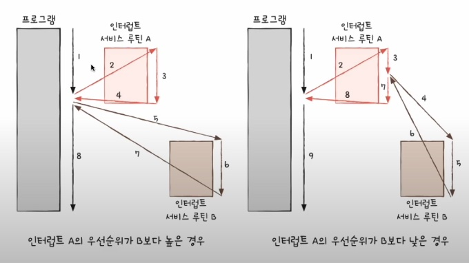
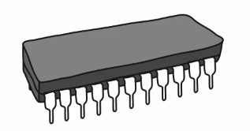
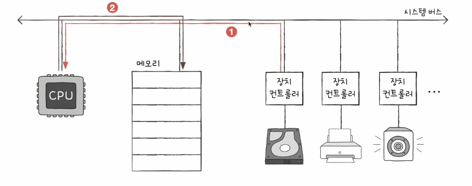

# 8-1 장치 컨트롤러와 장치 드라이버

### 들어가며

- 입출력장치는 어떻게 컴퓨터 내부와 데이터를 주고 받는걸까?
- 입출력장치는 보조기억장치도 포함

## CPU - 입출력장치 정보 주고 받기

- 입출력장체는 앞서 CPU, 메모리보다 다루기가 더 까다로움
1. 입출력장치에는 종류가 너무나도 많다.
    - 장치가 다양하면 장치마다 속도, 데이터 전송 형식 등도 다양함.
    - 다양한 입출력장치와 정보를 주고받는 방식을 규격화하기 힘듦.

2. 일반적으로 CPU와 메모리의 데이터 전송률은 높지만 입출력장치의 데이터 전송률은 낮음
    - 전송률: 데이터를 얼마나 빨리 교환할 수 있는지를 나타내는 지표

## 장치 컨트롤러

- 이런 이유로 입출력장치는 장치 컨트롤러를 통해 컴퓨터와 연결
- 입출력장치는 장치 컨트롤러를 통해 컴퓨터 내부와 정보를 주고 받음

## 장치 컨트롤러의 역할

- CPU와 입출력장치 간의 통시중개
    - 다양한 입출력장치들로부터 오는 정보를 규격화하기 어렵다는 문제 해결 가능
- 오류 검출
- 데이터 버퍼링
    - 버퍼링: 전송률이 높은 장치와 낮은 장치 사이에 주고 받는 데이터를 버퍼라는 임시 저장 공간에 저장하여 전송률을 비슷하게 맞추는 방법

    

## 장치 컨트롤러의 구조

- 장치 컨트롤러는 버스에 연결돼서 정보를 주고 받음
- 정보의 종류는 3가지이며, 각각의 다른 레지스터에 저장
- 상태 레지스터와 제어 레지스터는 하나의 레지스터(상태/제어 레지스터)로 사용되기도

### 데이터 레지스터

- CPU와 입출력장치 사이에 주고받을 데이터가 담기는 레지스터(버퍼)
- RAM을 사용하기도

### 상태 레지스터

- 상태 정보 저장
    - 입출력장치가 입출력 작업을 할 준비가 되었는지,
    - 입출력 작업이 완료되었는지,
    - 입출력장치에 오류는 없는지 등의 상태 정보

### 제어 레지스터

- 입출력장치가 수행할 내용에 대한 제어 정보

## 장치 드라이버

- 장치 컨트롤러의 동작을 감지하고 제어하는 프로그램
- 장치 컨트롤러가 입출력장치를 연결하기 위한 하드웨어적인 통로라면,
- 장치 컨트롤러가 입출력장치를 연결하기 위한 소프트웨어적인 통로
- 장치 드라이버가 설치되어 있지 않다면 해당 입출력장치 사용 불가
- 컴퓨터(운영체제)가 연결된 장치의 드라이버를 인식하고 실행할 수 있다면 컴퓨터 내부와 정보를 주고받을 수 있음
- 컴퓨터(운영체제)가 장치 드라이버를 인식하거나 실행할 수 없다면 그 장치는 컴퓨터 내부와 정보를 주고받을 수 없음

# 8-2 다양한 입출력 방법

### 들어가며

- 세 가지 입출력 방식: 프로그램 입출력, 이터럽트 기반 입출력, DMA 입출력

## 프로그램 입출력

- 프로그램 속 명령어로 입출력장치를 제어하는 방법, 입출력 명령어로써 장치 컨트롤러와 상호작용
- 메모리에 저장된 정보를 하드 디스크에 백업(=하드 디스크에 새로운 정보 쓰기)
    1. CPU는 하드 디스크 컨트롤러의 제어 레지스터에 쓰기 명령 내보내기
    2. 하드 디스크 컨트롤러는 하드 디스크 상태 확인 -> 상태 레지스터에 준비 완료 표시
    3. CPU는 상태 레지스터를 주기적으로 읽어보면 하드 디스크의 준비 여부를 확인
    4. 하드 디스크가 준비되었다면 백업할 메모리의 정보를 데이터 레지스터에 쓰기

- 프로그램 입출력 방식: CPU가 장치 컨트롤러의 레지스터 값을 읽고 씀으로써 이루어짐
    - CPU가 이 레지스터들 입출력장치의 주소를 알 수 있을까?
    - ex: 프린터 컨트롤러의 상태 레지스터를 읽어라, 프린터 컨트롤러의 데이터 레지스터에 100을 써라.
    - 이러한 명령어들은 어떻게 표현되고, 어떻게 메모리에 저장될까?

- 프로그램 입출력 방식: 메모리 맵 입출력 & 고립형 입출력

### 프로그램 입출력 - 메모리 맵 입출력

- 메모리에 접근하기 위한 주소 공간과 입출력장치에 접근하기 위한 주소 공간을 하나의 주소 공간으로 간주하는 방법
- ex: 516번지: 프린터 컨트롤러의 데이터레지스터, 517번지: 프린터 컨트롤러의 상태 레지스터
- ex: 518번지: 하드 디스크 컨트롤러의 데이터 레지스터, 519번지: 하드디스크 컨트롤러의 상태 레지스터
- '517번지를 읽어 들여라 == 프린터 상태 읽기, '518번지에 a를 써라' == 하드 디스크에 a 쓰기
- 메모리 접근 명령어 == 입출력장치 접근 명령어
- 메모리를 위한 주소공간과, 입출력장치에 접근하는 주소 공간을 하나의 주소 공간으로 간주했기 때문

### 프로그램 입출력 - 고립형 입출력
- 메모리를 위한 주소 공간과 입출력 장치를 위한 주소 공간을 분리하는 방법
- (입출력 읽기/쓰기 선을 활성화시키는) 입출력 전용 명령어 사용

### 메모리 맵 입출력 vs 고립형 입출력 비교

| 항목 | **메모리 맵 입출력** | **고립형 입출력** |
|------|------------------------|--------------------|
| 주소 공간 | 메모리와 입출력장치는 같은 주소 공간 사용 | 메모리와 입출력장치는 분리된 주소 공간 사용 |
| 주소 공간 소모 | 메모리 주소 공간이 축소됨 | 메모리 주소 공간이 축소되지 않음 |
| 명령어 사용 | 메모리와 입출력장치에 같은 명령어 사용 가능 | 입출력 전용 명령어 사용 |

## 인터럽트 기반 입출력

### 인트럽트 복습

- (하드웨어) 인터럽트의 개념: CPU 사이클의 낭비를 막기 위해 입출력장치가 다른 일을 할 수 있도록 알람하는 역할
- 플래그 레지스터 속 인터럽트 비트: 인터럽트 비트 활성화 되면 인터럽트 받을 수 있음
- 인터럽트 요청 신호: CPU에게 입출력장치가 인터럽트 발생시키는 요청
- 인터럽트 서비스 루틴: 인터럽트를 처리하기 위한 특별한 프로그래밍

- 하드웨어 인터럽트는 장치 컨트롤러에 의해 발생

- CPU는 사이클을 효율적으로 사용 가능

### 동시다발적인 인터럽트

- 인터럽트 발생 순서대로?, 인터럽트 서비스 루틴 A,B 가 순서대로 실행되었다면, 순서대로 처리 가능
- 현실적으로 모든 인터럽트를 순차적으로 처리 불가, 더 빨리 처리해야하는(우선순위가 높은) 인터럽트가 있기 때문
- 우선 순위를 반영한 인터럽트

- NMI(Non Maskable Interrupt)가 발생한 경우, 플래그 레지스터 속 인터럽트 비트를 활성화한 채 인터럽트를 처리한 경우

### PIC(Programmable Interrupt Controller)

- 여러 장치 컨트롤러에 연결되어
- 장치 컨트롤러의 하드웨어 인터럽트의 우선순위를 판단한 뒤
- CPU에게 지금 처리해야하는 인터럽트가 무엇인지 판단하는 하드웨어
- NMI 우선순위까지 판단하지 않음

## DMA 입출력

- 프로그램 입출력, 인터럽트 기반 입출력의 공통점?
- 입출력장치와 메모리 간의 데이터 이동은 CPU가 주도하고, 이동하는 데이터도 반드시 CPU를 거침.

### 입출력장치의 데이터를 메모리에 저장하는 경우

- CPU가 장치컨트롤러의 데이터 레지스터로부터 메모리에 쓰고자하는 값을 CPU레지스터로 읽어들임
- 이 값을 다시 메모리로 쓰게됨

### 메모리의 데이터를 입출력에 저장하는 경우

- 메모리에 저장된 값을 메모리로부터 CPU로 읽음
- 읽은 값을 장치 컨트롤러로 쓰기
- CPU가 처리할 일이 많은데, 하드 디스크 백업과 같이 대용량 데이터를 이동한다면?

### DMA(Direct Memory Access)

- CPU를 거치지 않고 입출력장치가 직접적으로 접근하는 기능
- DMA 컨트롤러라는 하드웨어가 필요

### DMA 입출력 과정

- CPU는 DMA 컨트롤러에 입출력 작업 명령
- DMA 컨트롤러는 CPU 대신 장치 커트롤러와 상호작용하며 입출력 작업을 수행
- 입출력 작업이 끝나면 DMA 컨트롤러는 인터럽트를 통해 CPU 작업이 끝났음을 알림
- CPU는 입출력 작업의 시작과 끝만 관여

- 앞선 예시의 DMA 과정에서 시스템 버스를 이용, 그런데 시스템 버스는 공용 자원이기에 동시 사용이 불가능
- CPU가 시스템 버스를 사용할 때 DMA 컨트롤러는 시스템 버스를 사용할 수 없고,
- DMA 컨트롤러가 시스템 버스를 사용할 때는 CPU가 시스템 버스를 사용할 수 없음
- DMA 컨트롤러는
    - CPU가 시스템 버스를 이용하지 않을 때마다 조금씩 시스템 버스 이용
    - CPU가 일시적으로 시스템 버스를 이용하지 않도록 허락을 구하고 시스템 버스 이용
    - 이렇게 DMA 컨트롤러가 시스템 버스를 사용하는 방식을 Cycle stealing이라 함

### 입출력 버스

- 장치 컨트롤러가 시스템 버스에 직접 연결되어도 괜찮을까?
- 입출력 버스를 통해 시스템 버스의 이용 빈도 낮추기
- ex: PCI 버스, PCI express(PCIe) 버스와 입출력 장치를 연결짓는 슬롯
    - 슬롯 -> 입출력 버스 -> 시스템 버스(결국 CPU와 상호작용)
- DMA가 더욱 발전해서, 입출력 프로세서(입출력 채널) 등장

