# 1.1 컴퓨터 네트워크를 알아야하는 이유

## 컴퓨터 네트워크란?

여러 개의 장치가 마치 그물처럼 서로 연결되어 정보를 주고받을 수 있는 통신망
자료구조 중 노드와 간선으로 이뤄진 그래프(Graph)라는 형태를 띔

## 인터넷이란?

여러 네트워크를 연결한 네트워크의 네트워크를 의미

## 개발자가 컴퓨터 네트워크를 알아야하는 이유

### 개발자 업무는 2가지로 분류 가능

1. 프로그램을 만드는 업무
2. 프로그램을 유지 보수하는 업무

### 프로그램을 만드는 업무에서 네트워크 지식이 필요한 경우

- Spring, Python등 프로그래밍 언어에서 네트워크 기능을 제공하는 경우가 있음
- Django : https://docs.djangoproject.com/en/5.1/ref/request-response/

### 프로그램을 유지 보수하는 업무에서 네트워크 지식을 활용하는 경우

- 웹서버에서 발생된 오류 진단 ( 404 Not Found 등 )
- 유지보수 도구 사용 ( 네트워크 명령어 : netstat )

# 1.2 네트워크 거시적으로 살펴보기

## 네트워크의 기본 구조

- 모든 네트워크는 노드, 노드를 연결하는 간선, 노드 간 주고받는 메시지로 구성
- 노드 : 정보를 주고받을 수 있는 장치
- 간선 : 정보를 주고받을 수 있는 유무선의 통신 매체
- 메시지 : 노드간 주고받는 정보
- 호스트 : 가장 자리에 위치한 노드, 종단 시스템(End System)이라고도 함
- 중간에 위치한 노드 : 네트워크 장비

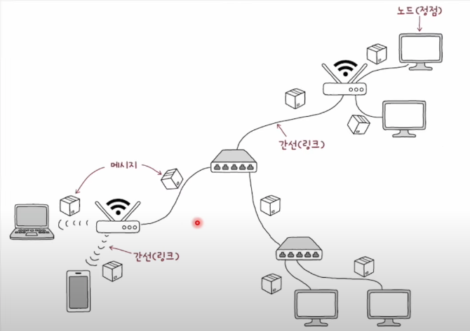

### 호스트(Host)

- 네트워크의 가장자리에 위치한 노드
- 네트워크를 통해 흐르는 정보를 최초로 생성 및 송신하고, 최종적으로 수신
- 서버 컴퓨터, 개인 데스크톱, 노트북, 스마트폰 등이 될 수 있다

### 서버(Server)

- 어떠한 서비스를 제공하는 호스트
- 요청에 대한 응답을 보냄

### 클라이언트(Client)

- 서버에게 어떠한 호스트를 요청하고 서버의 응답을 제공 받는 호스트
- 요청을 보내는 호스트

### 네트워크 장비

- 가장자리에 위치하지 않는 노드, 중간에 거치는 노드
- 이더넷 허브, 스위치, 라우터, 공유기 등 있음

### 통신 매체

- 호스트와 네트워크 장비 또한 유무선 매체를 통해 연결되어 있어야함
- 간선 : 통신매체, 유선으로 연결되면 유선매체 무선이면 무선 매체
- 성능과 관련있기 때문에 참고 정도로 알아두면 좋음

### 메시지

- 통신 매체로 연결된 노드가 주고받는 정보를 메시지라고 함
- 파일, 메일 등이 될 수 있음

## 범위에 따른 네트워크 분류

### LAN ( Local Area Network )

- 가까운 지역을 연결한 근거리 통신망
- 가정, 기업, 학교처럼 한정된 공간에서의 네트워크 의미

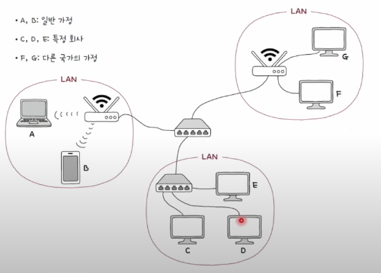

### WAN ( Wide Area Network)

- 먼 지역을 연결하는 광역 통신망
- 인터넷이 WAN으로 분류
- 같은 LAN에 속한 호스트끼리 메시지를 주고받아야할 때, 인터넷 연결과 같은 WAN이 필요 없지만, 다른 LAN에 속한 호스트와 메시지를 주고받아야 할 때는 WAN이 필요
- WAN은 ISP(Internet Service Provider)라는 인터넷 서비스 업체가 구축하고 관리, 대표적 KT, LG유플러스,SK브로드밴드

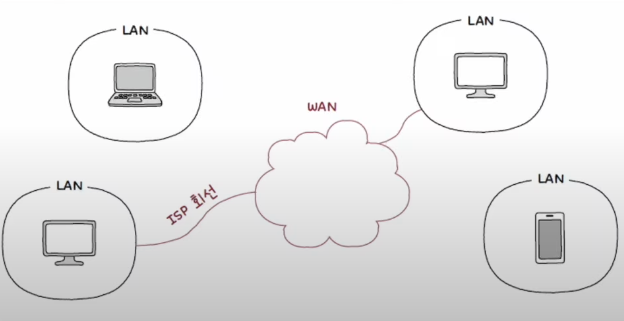

## 메시지 교환 방식에 따른 네트워크 분류

### 회선 교환 방식

- 메시지 전송로인 회선(Circuit)을 설정하고 이를 통해 메시지 주고받는 방식
- 회선을 설정한다는 두 호스트가 연결되었다라는 말과 같음
- 두 호스트 사이에 연결을 확보한 후에 메시지를 주고받는 특성 덕분에 주어진 시간 동안 전송되는 정보의 양이 비교적 일정
- 회선 스위치는 호스트 사이에 일대일 전송로 확보하는 네트워크
- 단점으론 회선의 이용 효율이 낮아 질 수 있다. 메시지를 주고받지 않으면 회선 점유하는 것이 낭비

### 패킷 교환 방식(Packet Switching)

- 메시지를 패킷(Packet)이라는 작은 단위로 쪼개어 전송
- 패킷은 패킷 교환 네트워크상에서 송수신되는 메세지의 단위
- 현대 인터넷은 대부분 이 방식
- 정해진 경로만으로 메시지 송수신 하지 않음
- 중간 노드인 패킷 스위치를 거쳐 패킷 송수신
- 패킷 스위치는 패킷이 수신지까지 올바르게 도달할 수 있도록 최적의 경로 결정하거나 패킷의 송수신 식별 ( 라우터, 스위치 )

### 패킷의 구조

-> 패킷은 페이로드와 헤더로 구성되고, 때로는 트레일러도 포함

## 주소와 송수신지 유형에 따른 전송 방식

### 헤더에 담기는 대표적인 정보, 주소(Address)

- 송수신지를 특정하는 정보 ( IP 주소, MAC주소 )
- 주소가 있으면 누구에게 전송할지 지정 가능

### 송수신지 유형별 전송 방식

#### 유니캐스트(Unicast)

- 하나의 수신지에 메시지를 전송
- 송신지와 수신지가 일대일로 메시지를 주고받는 경우(가장 일반적인 송수신 형태)

#### 브로드캐스트(Broadcast)

- 네트워크상의 모든 호스트에게 전송
- 브로드캐스트 도메인(Broadcast Domain) - 브로드캐스트가 전송되는 범위 -> LAN의 범위를 이것으로 보는 경우가 많다.

# 1.3 네트워크 미시적으로 살펴보기

## 프로토콜(Protocol)

### 택배로 책을 보내는 예시

멀리 떨어진 영수(수신지 호스트)에게 택배로 책을 선물

1. 선물할 책(페이로드)을 택배 상자에 넣기
2. 배송 주소 등 택배 기사가 읽을 메시지(헤더)를 작성하고 첨부
3. 택배 기사(네트워크 장비)를 통해 발송
   이 과정이 올바르게 수행되려면, 언어가 통해야 한다는 전제가 필요

- 나와 영수가 이해하는 언어
- 나와 택배 기사가 이해하는 언어
- 택배 기사와 택배 기사가 이해하는 언어

### 네트워크 세상의 언어 프로토콜

- 프로토콜: 노드 간에 정보를 올바르게 주고받기 위해 합의된 규칙이나 방법
- 일상 속 언어와 달리 통신 과정에서 일반적으로 여러 프로토콜을 함께 사용

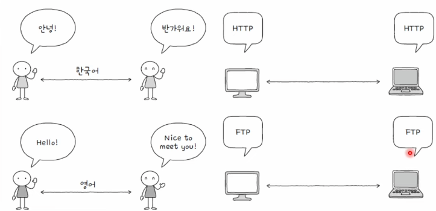

### 프로토콜 예시 : 모든 프로토콜에는 목적과 특징이 있다.

- IP는 패킷을 수신지까지 전달히기 위해 사용되는 프로토콜이다.
  -> IP라는 프로토콜의 목적 : 패킷을 수신지까지 전달
- ARP는 192.168.1.1과 같은 형태의 IP주소를 A1:B2:C3:D4:E5:F6과 같은 형태의 MAC주소로 대응하기 위해 사용되는 프로토콜이다.
  -> ARP의 목적 : IP주소를 A1:B2:C3:D4:E5:F6과 같은 형태의 MAC주소로 대응
- HTTPS는 HTTP에 비해 보안상 더 안전한 프로토콜이다.
  -> HTTPS의 특징 : HTTP보다 더 안전함
- TCP는 UDP에 비해 일반적으로 느리지만 신뢰성이 높은 프로토콜
  -> TCP의 특징 : UDP에 비해 느리지만 신뢰성이 높음

### TCP와 UDP 프로토콜의 헤더

TCP는 신뢰성 높은 전송을 수행하기 위해 헤더에 더 많은 정보가 포함

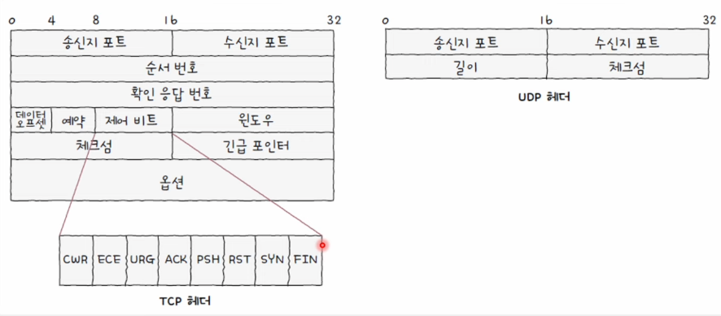

## 네트워크 참조 모델

### 영수에게 선물할 책을 택배로 보내는 과정

1. 선물할 책을 준비
2. 책이 상하지 않도록 책을 포장
3. 포장된 책을 택배 상자에 담기
4. 택배 상자를 밀봉
5. 택배 기사가 확인할 메시지를 택배 상자에 붙임
6. 택배 상자를 택배 기사에게 전달

### 영수가 택배를 전달 받는 과정 -> 정확히 반대

1. 택배 상자를 택배 기사로부터 전달 받음
2. 택배 기사가 확인한 메시지를 제거
3. 택배 상자 개봉
4. 택배 상자에서 포장된 책을 꺼냄
5. 포장용지를 제거
6. 선물 받은 책을 확인

### 네트워크 참조 모델

- 네트워크를 통해 송수신하는 과정
- 통신이 이루어지는 각 과정을 계층으로 나눈 구조

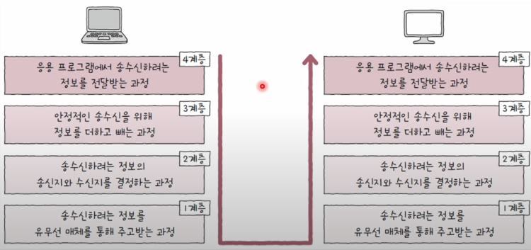

### 네트워크 참조 모델을 나눈 이유

1. 네트워크 구성과 설계가 용이 -> 목적에 맞게 프로토콜과 네트워크 장비를 계층별로 구성 가능
2. 네트워크 문제 진단과 해결 용이 -> 문제 발생 지점을 추축 가능하여, 문제 진단과 해결이 수월
   네트워크 참조 모델은 대표적으로 OSI(OSI 7 Layers), TCP/IP 모델(TCP/IP 4계층)

### OSI 모델

- 국제 표준화 기구 ISO에서 만든 네트워크 참조 모델

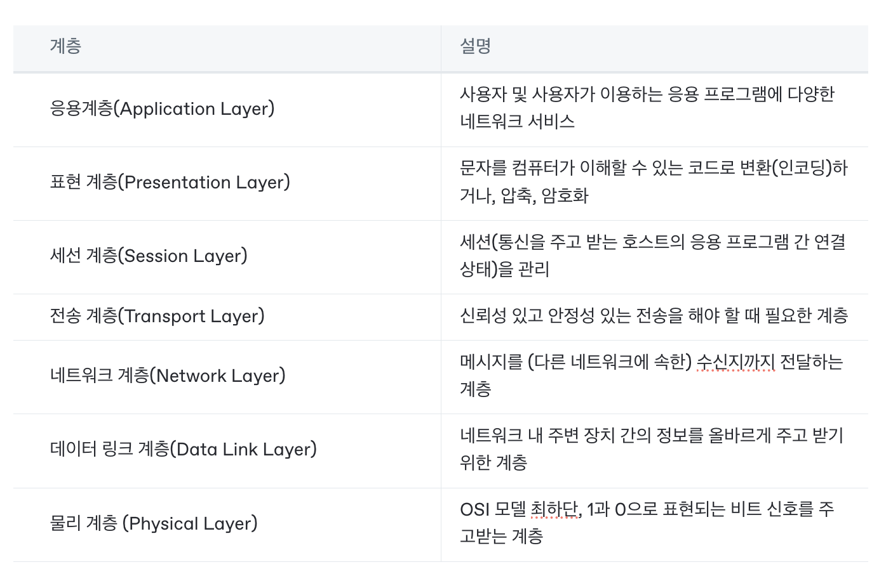

- 물리 계층 + 데이터 링크 계층 -> LAN 기술이 많이 녹아 있음
- 네트워크 계층 -> LAN 간의 통신을 위한 기술이 포함( IP, 라우팅 등)
- 전송 계층 -> 사용자 프로세스를 식별하기 위한 포트 포함

### TCP / IP 모델

- TCP / IP 4계층
- 인터넷 프로토콜 스위트(Internet Protocol Suite)
- TCP / IP 프로토콜 스택(Protocol Stack)

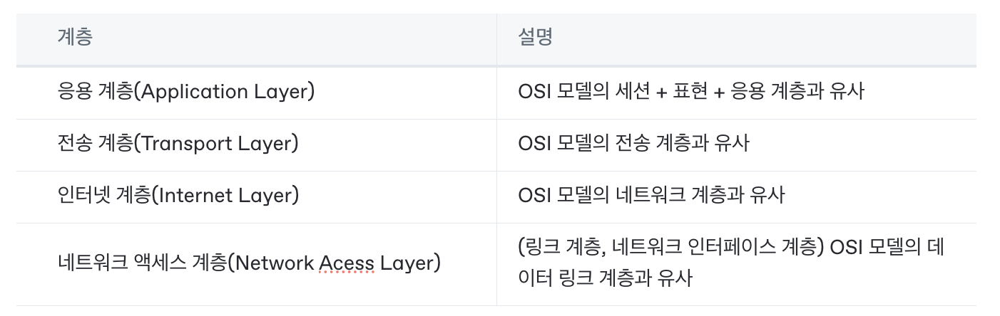

- TCP / IP 모델에선 물리 계층의 역할을 하는 것이 없다가 지배적

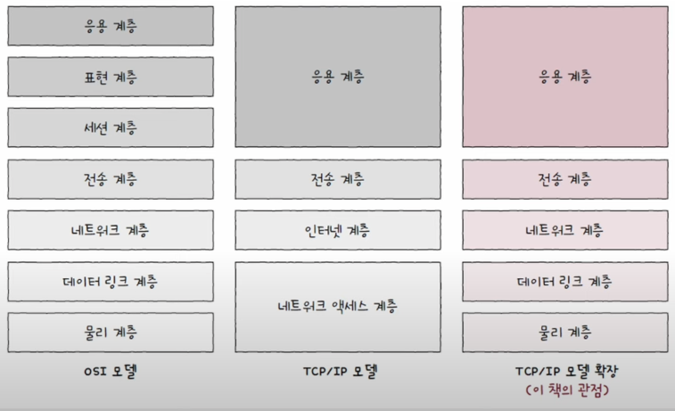

## 캡슐화와 역캡슐화

### 송신 과정에서 캡슐화, 수신 과정에서 역캡슐화

- 메시지는 송신지 입장에서는 가장 높은 계층에서부터 가장 낮은 계층으로 이동
- 메시지는 수신지 입장에서는 가장 낮은 계층에서부터 가장 높은 계층으로 이동

### 캡슐화

- 계층 별 프로토콜의 목적과 특징에 부합하는 헤더가 추가
- 상위 계층으로부터 내려받은 패킷을 페이로드로 삼아, 프로토콜에 걸맞는 헤더(혹은 트레일러)를 덧붙인 후 하위 계층으로 전달
- 물리 계층에서 신호로 변화

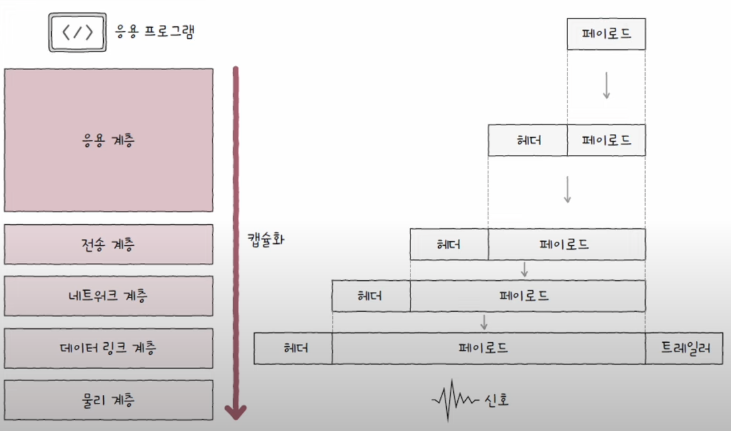

### 역캡슐화

- 계층 별 프로토콜의 목적과 특징에 부합하는 헤더 제거
- 캡슐화 과정에서 붙였던 헤더(및 트레일러)를 각 계층에서 확인한 뒤 제거하는 과정

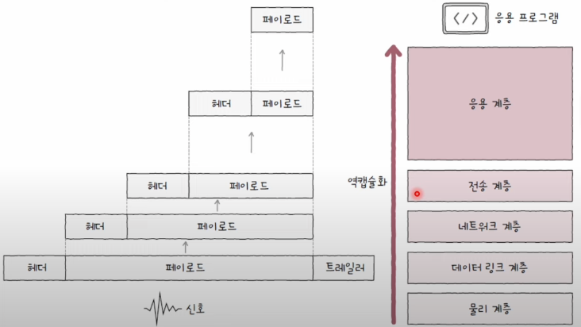

### PDU ( Protocol Data Unit)

- 각 계층에서 송수신 되는 메시지의 단위
- 현재 계층의 PDU = 상위 계층의 데이터 + 현재 계층의 프로토콜 헤더(및 트레일러)

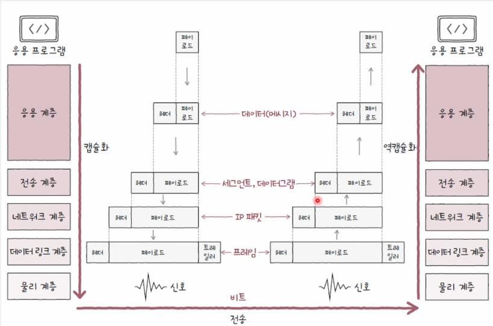

## OSI 7계층, TCP/IP 4계층은 사실 아무것도 해 주지 않는다.

- 네트워크 지식 = 네트워크 참조모델 이라 오해하기 쉽다.
- 새로운 프로토콜과 네트워크 장비는 만들어 지고 있고
- 모든 프로토콜이 모든 모델의 특정 계층에 완벽히 대응되지 않음
- TCP 모델의 경우 전공 서적마다 자유롭게 기술
- 네트워크의 장비 같은 경우, 상위 계층에 포함된 장비는 하위 계층의 특징을 포함하는 경우가 많음.
- 네트워크 참조 모델이나 특정 계층은 네트워크를 작동시키는 주체가 아니다.
- 네트워크 참조 모델에 속한 프로토콜과 네트워크 장비가 네트워크를 작동시키는 주체.
- 실질적으로 개발자는 프로토콜과 네트워크 장비 탐구 대상

## 트래픽과 네트워크 성능 지표

### 트래픽(Traffic)

- 네트워크 내의 정보량
- 트래픽은 주로 노드에서 측정: "특정 시점에 노드를 경유하는 정보량"
- 과도한 트래픽이 야기하는 문제 : 과부하(성능 저하) 발생
  -> 네트워크 내의 성능은 어떻게 판단될까?

### 처리율(Throughput)

- 단위 시간당 네트워크를 통해 실제로 전송되는 정보량
- 표현 단위
  - bps(bit/s) Bits per second
  - Mbps(Mbits/s) Megabits per second
  - Gbps(Gbit/s) Gigabits per second
  - Pps(p/s) Packets per second

### 대역폭(Bandwidth)

- 컴퓨팅 영역에서의 정의 - 단위 시간 동안 통신 매체를 통해 송수신할 수 있는 최대 정보량
- 정보를 주고 받을 폭
- bps, Mbps, Gbps 단위 사용

### 패킷 손실(Packet Loss)

- 송수신되는 패킷이 손실된 상황
- 손실된 패킷수, 전체 패킷 / 유실된 패킷 (백분위) 사용
- Ping 명령어로도 알 수 있다.

  Ping(Packet Internet Groper) : 컴퓨터 네트워크 상태를 점검, 진단하는 명령어
