# 2.1 이더넷

## 이더넷(Ethernet) 표준

- 현대 LAN, 특히 유선 LAN 환경에서 가장 대중적으로 사용되는 기술
- 다양한 통신 매체의 규격, 송수신되는 프레임의 형태, 프레임을 주고받는 방법등이 정의 된 기술
- 유선 LAN 환경은 대부분 이더넷을 기반으로 구성
  - 물리 계층에서 사용되는 케이블 -> 이더넷 규격을 따름
  - 데이터 링크 계층에서 주고 받는 프레임? -> 이더넷 프레임의 형식을 따름

### 국제 표준으로써의 이더넷

- 이더넷은 IEEE 802.3이라는 이름으로 국제 표준이 됨
- IEEE 802.3 == 이더넷 관련 다양한 표준의 모음
  - IEEE 802.3은 이더넷 관련 표준을 만드는 작업 그룹(전문가 단체)를 의미하기도 함
- 오늘날에도 이더넷은 발전 중이며, 새로운 표준들이 생기는 중
- 이더넷(IEEE 802.3) 관련 표준 : 802.3 뒤 버전을 나타내는 알파벳으로 표현
  ex) 802.3u, 802.3ab
  이 장에서 물리 계층, 데이터 링크 계층의 장비( 허브, 스위치, NIC, 케이블 등)
  모두 특정 이더넷 표준을 이해하고 따른다고 봐도 무방
  이더넷 표준에 따라 지원되는 네트워크 장비, 통신 매체의 종류, 전송 속도 등이 달라진다 정도로만 이해

## 이더넷과 통신 매체

### 이더넷 표준에 따라 통신 매체의 종류, 속도가 달라진다?

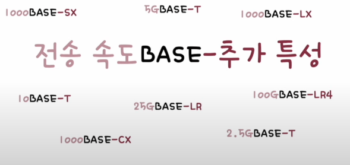

### 전송 속도

- 숫자만 표기 Mbps
- 숫자 뒤에 G, Gbps 속도

### BASE

- 베이스 밴드의 약자로, 변조 타입을 의미
- 개발과 거리 있음

### 추가 특성(Additional distinction)

- 통신 매체의 특성을 명시
- 다양한 특성이 명시될 수 있음
  - 전송 가능한 최대 거리 -> 10BASE-2, 10BASE-5
  - 물리 계층 인코딩 방식 -> 데이터가 비트 신호로 변환되는 방식
  - 레인 수 -> 비트 신호를 옮길 수 있는 전송로 수
- 가장 중요한 추가 특성 -> 통신 매체의 종류

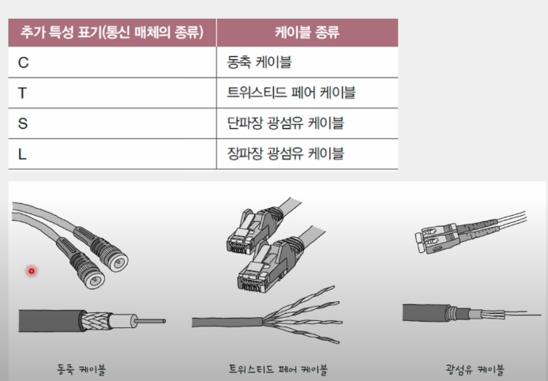

ex) 10BASE-T 케이블 : 10Mbps 속도를 지원하는 트위스티드 페어 케이블

### 이더넷은 지금도 발전하는중

- 고속 이더넷(Fast Ethernet)
- 기가비트 이더넷(Gigabit Ethernet)
- 10기가비트 이더넷(10 Gigabit Ethernet)

## 이더넷 프레임(Ethernet Frame)

### 이더넷 프레임

- 이더넷 네트워크에서 주고받는 프레임
- 캡슐화를 거쳐 송신됨 : 상위 계층 정보 + 헤더 + 트레일러
  - 헤더 - 프리앰블, 수신지 MAC 주소, 송신지 MAC 주소, 타입/길이
  - 페이로드 - 데이터트레일러 FCS
- 역캡슐화를 거쳐 수신됨

  - 헤더, 트레일러 제거 후 상위 계층으로 올려보냄

  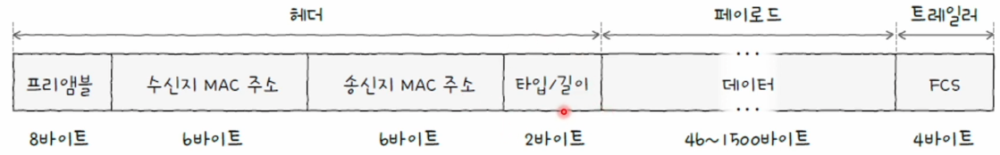

### 프리앰블(Preamble)

- 이더넷 프레임의 시작을 알리는 8바이트(64비트) 크기의 정보
- 첫 7바이트는 10101010값을 가지고, 마지막 바이트는 10101011값을 가짐
- 송수신지 간의 동기화를 위해 사용되는 정보

### 수신지 MAC 주소와 송신지 MAC 주소

- 물리적 주소라고도 불림
- 일반적으로 고유하고, 일반적으로 변경되지 않는 주소
- MAC 주소는 네트워크 인터페이스마다 부여되는 6바이트(48비트) 길이의 주소 ( 24 제조사, 24 주소표현 )
  - LAN 내의 송수신지 특정
  - 일번적으로 NIC(Network Interface Controller) 장치가 네트워크 인터페이스 역할을 담당
  - 한 컴퓨터에 MAC 주소도 여러 개 있을 수 있음
    -> 가상 머신마다 MAC 주소가 부여됨, 변경도 쉬움
    네트워크 인터페이스 : 네트워크로 나가기 위한 관문, 호스트가 통신 매체의 유무선의 혹은 가상의 통신 매체와 연결되는 지점.

### 컴퓨터의 MAC 주소 확인

```bash
$ ifconfig
en0: flags=8863<UP,BROADCAST,SMART,RUNNING,SIMPLEX,MULTICAST> mtu 1500
options=400<CHANNEL_IO>
ether 90:9c:4a:c6:37:82
```

### 타입/길이

- 타입 혹은 길이 명시
- 필드에 명시된 크기가 1500(16진수 05DC)이하일 경우 : 이 필드는 프레임의 크기(길이)
- 필드에 명시된 크기가 1536(16진수 0600)이상일 경우 : 이 필드는 타입
- 타입이란?

  - 이더타입
  - 어떤 정보를 캡슐화했는지를 나타내는 정보
  - 대표적으로 상위계층에서 사용된 프로토콜이 명시

  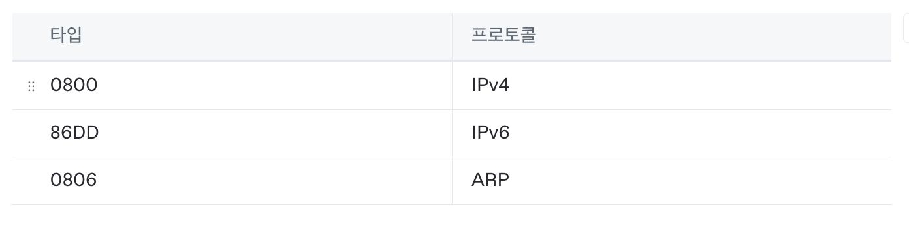

### 데이터

- 페이로드, 상위 계층에서 전달받거나 전달해야 할 내용
- 최대 크기 : 1500바이트
- 최소 크기 : 46바이트
  - 46바이트보다 작다면 크기 맞추기용 데이터인 패딩(Padding)이 채워짐
  - 보통 0으로 채워짐

### FCS(Fram Check Sequence)

- 오류 검출용 정보 : FCS는 수신한 이더넷 프레임에 오류가 있는지 확인하기 위한 필드
  - 이 필드에는 CRC(Cyclic Redundacy Check)라는 오류 검출용 값이 명시됨

### 이더넷 외의 기술 토큰 링( token ring )

- 토큰 링 네트워크에서는 호스트들이 링 형태로 연결
- 호스트끼리 돌아가며 토큰이라는 특별한 정보를 교환
- 네트워크 내 다른 호스트에게 메시지를 송신하려면 반드시 이 토큰을 가지고 있어야 함

# 2.2 NIC와 케이블

## NIC(Network Interface Controller)

- 호스트와 통신 매체를 연결하고 MAC 주소가 부여되는 네트워크 장비
- 케이블(Cable) NIC에 연결되는 물리 계층의 유선 통신 매체

  - 트위스티드 페어 케이블
  - 광섬유 케이블

    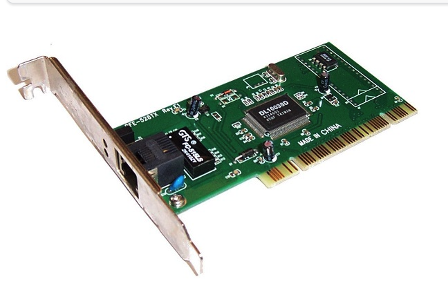

    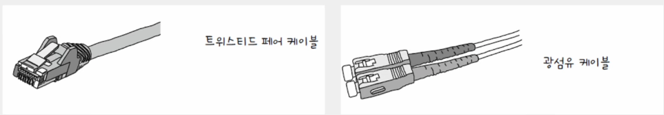

### NIC는 호스트의 귀와 입

- NIC는 네트워크 인터페이스 카드, 네트워크 어댑터, LAN 카드, 네트워크 카드, 이더넷 카드 등 다양한 명칭으로 불림

### 호스트를 네트워크(LAN)에 연결하는 장비

- 호스트와 유무선 통신 매체를 연결
- 통신 매체 신호와 컴퓨터가 이해하는 정보 상호 변환
  - 호스트가 네트워크를 통해 송수신하는 정보는 NIC를 거치게 됨
  - 네트워크 인터페이스 역할을 수행

### NIC는 MAC주소를 인식

- 자신과 관련 없는 수신지 MAC 주소가 명시된 프레임 폐기
- FCS 필드를 토대로 오류를 검출해 잘못된 프레임을 폐기

### NIC 마다 지원되는 속도가 다르다는 점에 유의

- NIC의 지원 속도는 10Mbps부터 100Gbps에 이르기까지 NIC마다 다름
- 네트워크 속도에 영향을 끼침
- 내장된 NIC가 있어도 높은 대역폭에서 많은 트래픽을 감당해야하는 환경에서는 고속 NIC 추가하는 경우도

## 케이블

### 트위스티드 페어 케이블(Twisted Pair Cable)

- 구리 선으로 전기 신호를 주고받는 통신 매체
- 생김새 = 커넥터 + 케이블 본체

  - 커넥터 : 주로 활용되는 커넥터 -> RJ-45
  - 케이블 본체 : 구리 선이 두가닥(Pair)씩 꼬아진(Twisted) 형태

    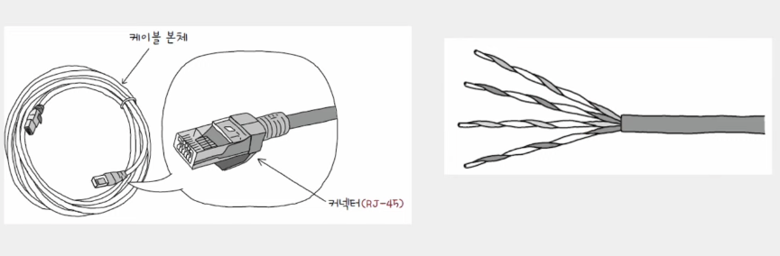

### 구리 선은 노이즈에 민감

- 차폐(Shielding) - 구리 선 주변을 감싸 노이즈를 감소시키는 방식
- 브레이드 실드(Braided Shield) 혹은 포일 실드 (Foil Shield)
  - 차폐에 사용된 그물 모양의 철사와 포일

### 실드에 따른 트위스티드 페어 케이블의 분류

- STP(Shielded Twisted Pair) - 브레이드 실드로 감싼 케이블
- FTP(Foil Twisted Pair) - 포일 실드로 노이즈를 감소시킨 케이블
- UTP(Unshielded Tiwsted Pair) - 아무것도 감싸지 않은 구리 선만 있는 케이블

- XX에는 케이블 외부를 감싸는 실드이 종류(하나 혹은 두개)
- Y에는 꼬인 구리 선 쌍을 감싸는 실드의 종류
  XX/YTP
  S/FTP - (케이블 외부) 브레이드 실드 (꼬인 각 구리 선 쌍) 포일실드
  SF/FTP - (케이블 외부) 브레이드 실드와 포일 실드 (각 구리 선 쌍) 포일 실드

  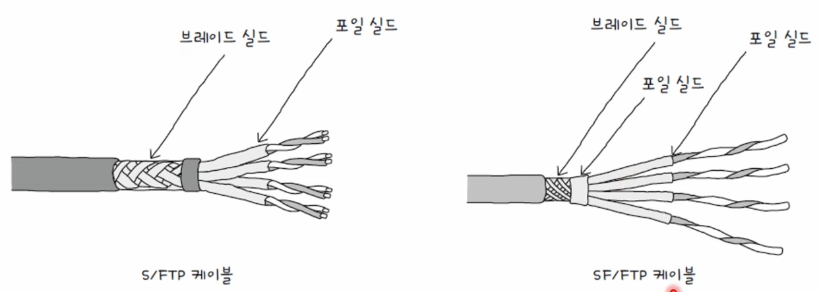

### 카테고리에 따른 트위스티드 페어 케이블 분류

- 카테고리가 높을 수록
- 지원 가능한 대역폭이 높아짐
- 송수신 할 수 있는 데이터의 양이 많아짐
- 일반적으로 더 빠른 정송이 가능함

### 광섬유 케이블

- 빛(광신호)을 이용해 정보를 주고받는 케이블
- 전기 신호를 이용하는 케이블에 비해 속도도 빠르고, 먼 거리까지 전송이 가능
- 노이즈로부터 간섭받는 영향도 적으므로 대륙 간 네트워크 연결에도 사용
- 생김새 = 커넥터 + 본체
- 커넥터 종류 다양
- 광섬유 케이블 본체 내부는 머리카락과 같은 형태의 광섬유로 구성
  - 광섬유는 빛을 운반하는 매체
  - 광섬유 중심에는 코어 - 코어는 광섬유에서 실질적으로 빛이 흐르는 부분
  - 코어를 둘러싸는 클래딩(Cladding) - 빛이 코어 안에서만 흐르도록 빛을 가두는 역할

# 2.3 허브

## 네트워크 장비

- 물리 계층의 대표 장비 - 허브
- 데이터 링크 계층 대표 장비 - 스위치
- 허브는 현 네트워크 내에서 거의 사용되지 않음
- 스위치와 대비되는 네트워크 특성(반이중, CSMA/CD) 때문에 설명

## 물리 계층에는 주소 개념이 없다

### 주소 개념이 없는 물리 계층

- 단지 호스트와 통신 매체 간의 연결과 통신 매체상의 송수신이 이루어 질 뿐
- 물리 계층 장비는 송수신되는 정보에 대한 어떠한 조작(송수신 내용 변경)이나 판단도 않음

### 데이터링크 계층에는 주소 개념이 있다

- MAC 주소
- 데이터 링크 계층 이상 장비들은 송수신지 특정 가능, 송수신 정보에 대한 조작 가능

## 허브(Hub)

### 물리 계층의 허브

- 여러 대의 호스트를 연결하는 장치
- 리피터 허브(Repeater Hub) 혹은 이더넷 허브(Ethernet Hub)
- 포트(Port) - 커넥터를 연결할 수 있는 연결 지점

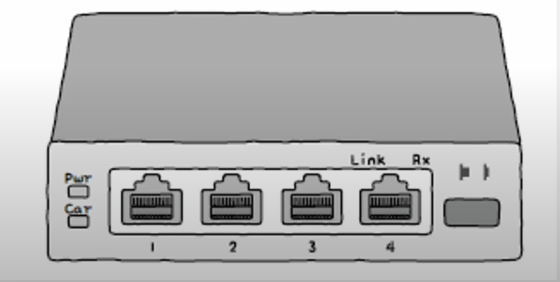

### 허브의 전송 특징

1. 받은 정보는 모든 포트로 내보냄
   a. 정보에 대한 어떠한 조작도 판단도 하지 않음(물리 계층 장비라서)
   b. 전달받은 신호를 다른 모든 포트로 그대로 다시 내보냄
   -> 데이터 링크 계층에서 패킷의 MAC 주소를 확인하고 자신과 관련 없는 주소는 폐기
2. 반이중 통신
   a. 반이중(Half Duplex) 모드 - 마치 1차선 도로처럼 송수신을 번갈아 가면서 하는 통신 ex) 무전기
   b. 전이중(Full Duplex) 모드 - 송수신을 동시에 양방향으로 할 수 있는 통신 방식 ex) 전화기

### 허브의 특징이 야기하는 문제, 충돌(Collision)

- 동시에 허브에 신호를 송신하면 충돌이 발생
- 허브에 호스트가 많이 연결되어 있을 수록 충돌 발생 가능성이 높음

### 콜리전 도메인(Collision Domain)

- 충돌이 발생할 수 있는 영역
- 허브에 연결된 모든 호스트는 같은 콜리전 도메인에 속함
- 충돌을 피하기 위해, 콜리전 도메인이 작아야 함.
- 해결법
  - CSMA/CD 사용
  - 다른 장비(스위치) 사용

### CSMA/CD(Carrier Sense Multiple Acess with Collision Detection)

- 반이중 이더넷 네트워크에서 충돌을 방지하는 대표적인 프로토콜
  다음과 같은 과정으로 충돌 해결

1. 캐리어 감지 - 통신 매체의 현재 사용 가능 여부 검사 : 메시지를 보내기 전 현재 전송 중인 것이 있는지 먼저 확인
2. 다중 접근 - 복수의 호스트가 부득이 동시에 네트워크에 접근할 때 : 충돌 발생
3. 충돌 검출
   a. 전송 중단, 충돌 발생을 알리는 잼 신호(Jam Signal) 보냄
   b. 임의의 시간 동안 기다린 뒤 재전송

# 2.4 스위치

## 허브의 충돌 문제

- CSMA/CD로 어느 정도 완화 가능
- 전달받은 신호를 수신지 호스트가 연결된 포트로만 내보내고, 전이중 모드로 통신하면 됨

## 스위치(Switch, L2 Switch)

- 허브와 달리 특정 MAC 주소를 가진 호스트에만 프레임 전달 가능
- 전이중 모드 통신 지원(CSMA/CD 프로토콜이 필요하지 않음)

### 스위치의 주요 기능

1. 스위치의 MAC 주소 학습 기능
   a. 전달받은 신호를 원하는 포트로만 내보냄
   b. 포트별로 콜리전 도메인이 나누어지기에 충돌 위험이 감소
2. 스위치의 VLAN 기능
   a. 논리적으로 LAN을 분리하는 가상의 LAN, VLAN 구성 가능

## 스위치의 MAC 주소 학습 기능 (MAC Address Learning)

- 특정 포트와 해당 포트에 연결된 호스트의 MAC 주소와의 관계를 기억
- 원하는 호스트에만 프레임을 전달
- MAC 주소 테이블 (Mac Adress Table)

  - 스위치 포트와 연결된 호스트의 MAC 주소 간의 연관 관계를 나타내는 정보

    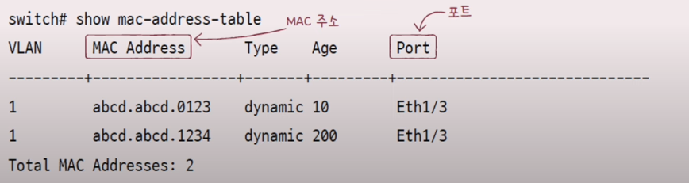

## 스위치 MAC 주소 테이블 각 항목

1. 플러딩
2. 포워딩과 필터링
3. 에이징

- 호스트 A가 호스트 C로 프레임을 전송하는 상황을 가정
- 스위치가 MAC 주소 학습 전 : 스위치는 호스트 A,B,C,D 의 MAC 주소와 연결된 포트의 연관 관계를 모름
- MAC 주소 학습 : 프레임 내 송신지 MAC 주소 필드를 바탕으로 이루어짐
  -> 하지만 호스트 C의 MAC 주소에 대해 알지 못함

  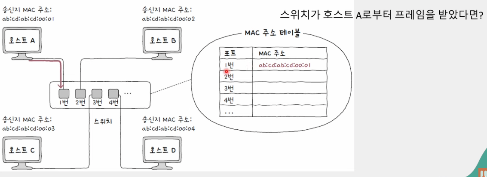

- 플러딩 (Flooding) : 허브처럼 모든 포트로 프레임 전송
- 호스트 B,C,D 프레임 수신 -> 호스트 B와 D는 폐기
- 호스트 C는 스위치로 응답 프레임을 전송
- 송신지 MAC 주소 필드로 호스트 C의 MAC주소 학습, MAC 주소 테이블에 기록

  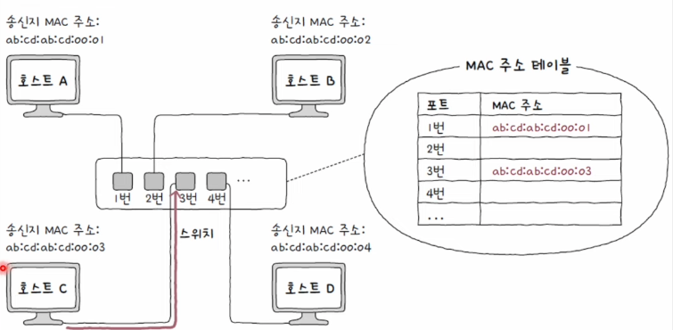

- 호스트 A와 C가 프레임을 주고 받을 때는 다른 포트로 프레임을 내보낼 필요가 없음
- 호스트 A가 호스트 C에게 프레임을 전송하면
- 스위치는 호스트 B,D가 연결된 포트로는 내보내지 않도록 필터링(Filterling)
- 호스트 C가 연결된 포트로 프레임을 포워딩(Forwarding)

### 에이징(Aging)

- 만약 MAC 주소 테이블에 등록된 포트에서 일정 시간 동안 프레임을 받지 못하면 해당 항목은 삭제

### 참고) 브릿지(Bridge)

- 데이터 링크 계층의 스위치와 유사한 장비
- 네트워크 영역을 구획하여 콜리전 도메인을 나누거나 네트워크를 확장
- 단일 장비로서 브릿지는 스위치에 비해 사용 빈도 줄어드는 추세
- 스위치가 성능 더 좋음

  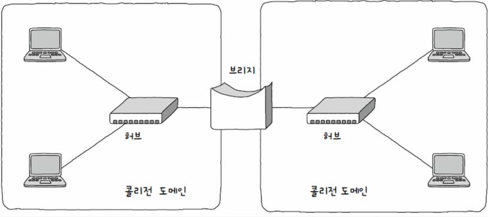

## VLAN(Virtual LAN)

### VLAN

- 한 대의 스위치로 가상의 LAN을 만드는 방법
- 불필요한 트래픽(허브, 스위치의 플러딩)으로 인한 성능 저하 방지
- 한 대의 물리적 스위치를 여러 대의 스위치가 있는 것처럼 논리적인 단위로 LAN을 구획
- 총무부와 개발부가 같은 스위치로 연결되어있다면, 모든 브로드캐스트를 공유할 수 밖에 없음 -> 불필요한 트래픽 발생

  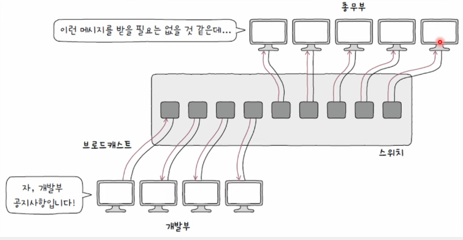

- 한 대의 물리적 스위치라해도, 마치 여러대의 스위치가 있듯이, 호스트의 물리적 위치와 관계 없이 구성된 가상의 LAN
- VLAN은 사실상 다른 LAN : 서로 다른 네트워크로 간주, 브로드캐스트 도메인이 달라짐
- VLAN1과 VLAN2가 통신하려면 3계층이상(네트워크 간의)의 장비가 필요

  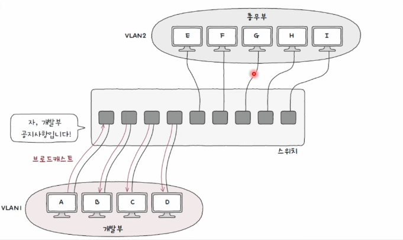

### VLAN의 종류 : 포트 기반 VLAN (Port Based VLAN)

- 스위치의 포트가 VLAN을 결정하는 방식
- 특정 포트에 VLAN을 할당한 뒤, 해당 포트에 호스트를 연결하여 VLAN에 참여
  - 호스트 A와 B는 VLAN2를 할당한 포트에 연결되어 있으므로 같은 LAN에 속한 셈
  - 호스트 C는 VLAN3에 속해 있으므로 호스트 A,B와 다른 LAN에 속한 셈
- 정적 VLAN이라고도 불림

  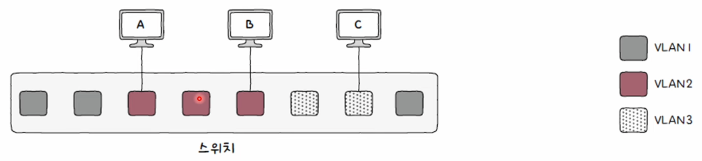

### MAC 기반 VLAN(MAC Based VLAN)

- 사전에 설정된 MAC 주소에 따라 VLAN이 결정
- 송수신하는 프레임 속 MAC 주소가 호스트가 속할 VLAN을 결정하는 방식
- 동적 VLAN이라고 불림
