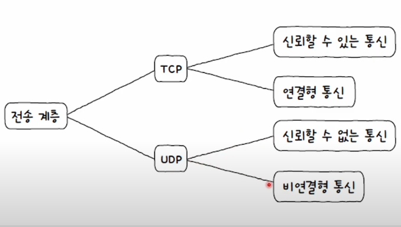
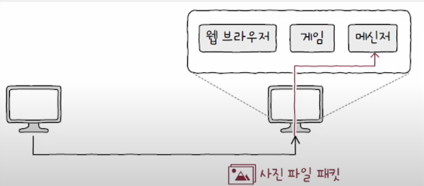
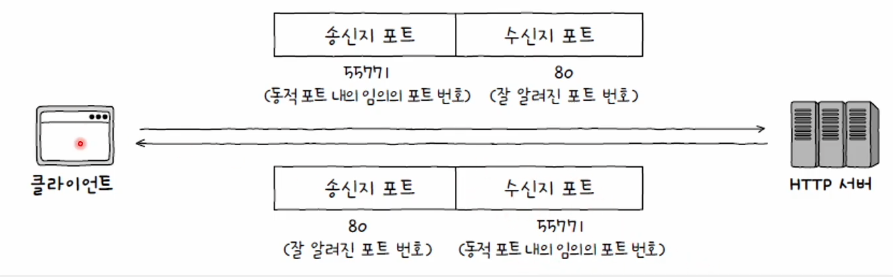
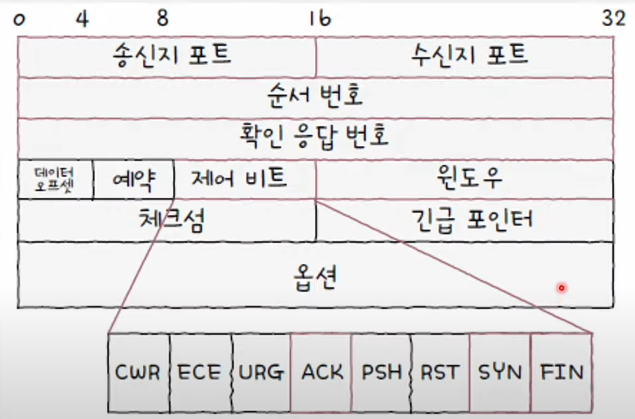
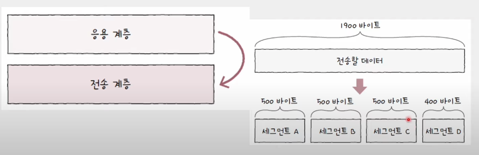
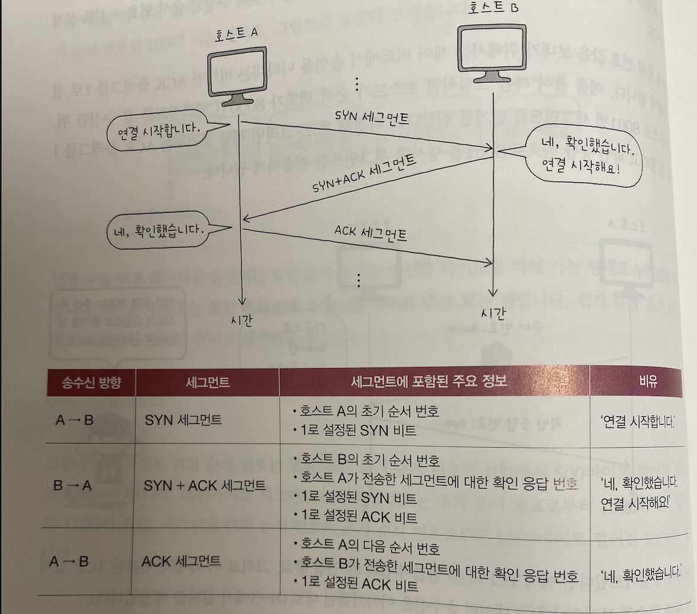
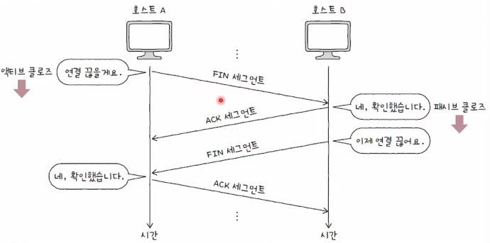
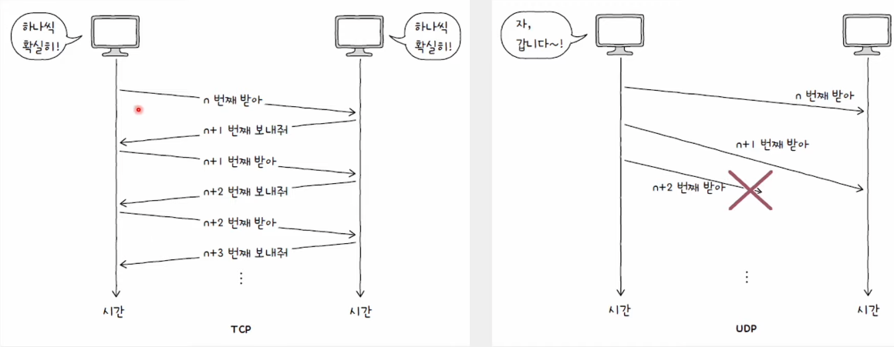
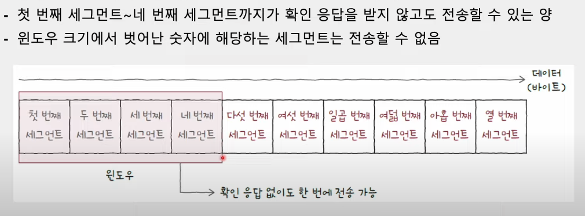
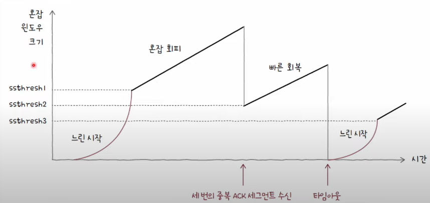

# 4 전송 계층

## 4-1 전송 계층 개요 : IP의 한계와 포트

### 네트워크 계층과 응용 계층 사이의 전송 계층
  * IP 한계 보완: 신뢰할 수 있는 통신과 연결형 통신 기능 제공
  * 응용 계층의 프로세스(실행 중인 프로그램) 식별: 포트 번호 활용

### 신뢰할 수 없는 통신과 비연결형 통신 
  - IP의 특징
    * 신뢰할 수 없는 (비신뢰성) 프로토콜(Unreliable Protocol)
    * 비연결형 프로토콜(Connectionless Protocol)
  
  - IP 패킷의 전달 = 신뢰성이 없는 통신 + 비연결형 통신

  - 신뢰할 수 없는 통신
    * 패킷이 수신지까지 제대로 전송되었다는 보장을 하지 않음
    * 통신 과정에서 패킷이 잘못 전송 되어도 이를 확인하지 않고,
      재전송도 하지 않으며, 순서대로 패킷이 도착할 것이라는 보장도 하지 않는다는 의미
    * 최선형 전달(Best Effort Delivery)라고 하며, 최선을 다해보겠지만, 전송 결과애 대해서 어떠한 보장도 하지 않겠다는 뜻.     

  - 비연결형 통신
    * 송수신 호스트 간에 사전 연결 수립 작업을 거치지 않음
    * 그저 수신지를 향해 패킷을 보내기만 할 뿐
    * 전송 계층에는 송수신 호스트 간에 사전 연결 수립 작업을 거침. 이를 TCP라함.

  - IP는 왜 신뢰할 수 없는, 비연결형 통신을 할까?
    - 주된 이유는 성능! 신뢰할 수 없는 통신 = 성능에 악영향
    - 신뢰성 있는 전송이 모든 경우에 필요한 것은 아님

  - TCP 
    * 연결형 통신을 가능하게 함
      - 송수신하는 동안에는 연결을 유지하고, 송수신이 끝나면 연결을 종료
    * 신뢰성 있는 통신을 가능하게 함
      - 재전송을 통한 오류 제어, 흐름 제어, 혼잡 제어 등 다양한 기능들을 제공
      
  - UDP 
    * 신뢰할 수 없는 통신, 비연결형 통신을 가능하게함
    * TCP보다 비교적 빠른 전송이 가능

  

### 응용 계층을 식별하는 전송 계층
  - 포트를 활용한 애플리케이션 식별
    * 포트(Port): 네트워크 상의 애플리케이션 식별 정보
      - 패킷은 실행 중인 특정 애플리케이션 프로세스까지 전달되어야함.

  

  - 포트의 분류
    * 패킷 내 수신지 포트와 송신지 포트를 통해 송수신지 호스트의 애플리케이션을 식별
    * 16비트로 표현 가능: 사용 가능한 포트의 수는 2^16(65536)개
      - 할당 가능한 포트 번호: 0번~65535번

    | 포트 종류    | 포트 번호 범위   |
    |:-------------:|:------------:|
    | 잘 알려진 포트(Well-known Port)| 0~1023     |
    | 등록된 포트(Registered Port)  | 1024~49151 |
    | 동적 포트(Dynamic Port)  | 49152~65535 |

  - 잘 알려진 포트
    * 0번부터 1023번까지의 포트
    * 시스템 포트(System Port)
    * 범용적으로 사용되는 애플리케이션 프로토콜이 일반적으로 사용하는 포트 번호를 의미

    | 잘 알려진 포트 번호    | 설명  |
    |:-------------:|:------------:|
    | 20, 21 | FTP |
    | 22 | SSH |
    | 23 | TELNET |    
    | 53 | DNS |   
    | 68,68 | DHCP |   
    | 80 | HTTP |  
    | 443 | HTTPS |   

  - 등록된 포트
    * 포트 번호 1024번부터 49151번까지
    * 잘 알려진 포트에 비해서 덜 범용적
    * 흔히 사용되는 애플리케이션 프로토콜에 할당하기 위해 사용

    | 등록된 포트 번호    | 설명  |
    |:-------------:|:------------:|
    | 1194 | OpenVPN |
    | 1433 | Microsoft SQL Server 데이터베이스 |
    | 3306 | MySQL 데이터베이스 |    
    | 6379 | Redis |   
    | 8080 | HTTP 대체 |
    | 27017 | Mongo DB |

  - 인터넷 할당 번호 관리 기관(IANA; Internet Assigned Numbers Authority)    
    * 잘 알려진 포트와 등록된 포트
    * 물론 포트 번호는 권고일 뿐 강제 사항은 아님  

  - 동적 포트, 사설 포트(Private Port), 임시 포트(Ephemeral Port)
    * 특별히 관리되지 않는 포트 번호 범위: 자유롭게 사용 가능
    * 서버는 대부분 잘 알려진 포트와 등록된 포트 사용
    * 클라이언트는 대부분 동적 포트 사용
      - ex) 웹 브라우저

  

   - '특정 호스트'에서 실행 중인 '특정 애플리케이션 프로세스' 식별
    * IP 주소: 포트 번호 형식
      ex) 192.168.0.15:8000

### 포트를 활용하는 기술: 포트 기반 NAP
  - NAT
    * NAT 변환 테이블: 변환의 대상이 되는 IP 주소 쌍
    * 사설 IP 주소 하나당 공인 IP 주소 하나가 대응: 많은 사설 IP 주소를 변환하기에는 무리가 있음
    * 공인 IP 주소의 낭비: 사설 IP 주소의 수만큼 공인 IP 주소가 필요

    
<strong>NAT 변환 테이블</strong>

    | 네트워크 외부 | 네트워크 내부 |
    |:-------------:|:------------:|
    | 1.2.3.4 | 192.168.0.5 |
    | 1.2.3.5 | 192.168.0.6 |

  - 포트 기반의 NAT, NAPT
    * NAPT(Network Address Port Translation) 또는 APT (Address Port Translation)
    * NAPT는 NAT 테이블에 변활할 IP 주소 쌍과 더불어 포트 번호도 함께 기록하고, 변환
    * 하나의 공인 IP 주소(1)를 여러 사설 IP 주소(N)로 공유 가능
      - 사설 IP 주소: 공인 IP 주소를 N:1로 변환
      - 공인 IP 주소 수 부족 문제를 개선한 기술

    
<strong>NAT 변환 테이블</strong>

    | 네트워크 외부 | 네트워크 내부 |
    |:-------------:|:------------:|
    | 1.2.3.4:6200 | 192.168.0.5:1025 |
    | 1.2.3.4:6201 | 192.168.0.6:1026 |

### 포트 포워딩(Port Forwarding)
 
- 가령...
  * 네트워크 내부의 여러 호스트가 공인 IP 주소를 공유하는 상황
  * 네트워크 외부에서 내부로 (원격 좁석을 시도하는 등) 통신을 시작하는 상황
  * 외부 호스트 입장에서는 어떤 IP 주소(및 포트)를 수신지 주소로 삼아야할까?

- 포트 포워딩
  * 네트워크 내 특정 호스트에 IP 주소와 포트 번호를 미리 할당하고,
  * 해당 IP 주소:포트 번호로써 해당 호스트에게 패킷을 전달하는 기능

  | 서비스 포트 | 프로토콜 | IP 주소 |  내부 포트 |
  |:-------------:|:------------:|:------------:|:------------:|
  | 1234 | TCP/IP | 192.168.100.100 | 1025 | 
  | 4321 | TCP/IP | 192.168.100.101 | 1026 | 
  
  * 공인 IP 주소:1234로 전송한 패킷은 192.168.100.100:1025로 전달
  * 공인 IP 주소:4321로 전송한 패킷은 192.168.100.101:1026으로 전달

### ICMP(Internet Control Message Protocol)

  - IP의 신뢰할 수 없는 비연결형 통신, 이 전송 특성을 보완하는 ICMP
    * IP 패킷 전송 과정에 대한 피드백 메시지 제공
    * 네트워크 계층에 속하는 프로토콜
    * 피드백 메시지?
      1. 전송 과정에서 발생한 문제 상황에 대한 오류 보고
      2. 네트워크에 대한 진단 정보(네트워크상의 정보 제공)

  - ICMP 메시지 = 타입(Type) + 코드(Code)
    * 타입: ICMP 메시지 유형 번호
    * 코드: 구체적인 메시지 내용 번호

    
<strong>전송 과정에서 발생한 문제 상황에 대한 오류 보고</strong>

    | 타입 이름(타입 번호)                 | 코드 번호 | 코드 설명                                      |
    |:-------------------------------------:|:-----------:|:------------------------------------------------:|
    | 수신지 도달 불가(3) : 특정 패킷이 수신지까지 도달할 수 없음을 나타냄                  | 0         | 네트워크 도달 불가                             |
    | 수신지 도달 불가(3) : 특정 패킷이 수신지까지 도달할 수 없음을 나타냄                         | 1         | 호스트 도달 불가                               |
    | 수신지 도달 불가(3) : 특정 패킷이 수신지까지 도달할 수 없음을 나타냄                    | 2         | 프로토콜 도달 불가; 수신지에서 특정 프로토콜을 사용할 수 없음 |
    | 수신지 도달 불가(3) : 특정 패킷이 수신지까지 도달할 수 없음을 나타냄                         | 3         | 포트 도달 불가                                 |
    | 수신지 도달 불가(3) : 특정 패킷이 수신지까지 도달할 수 없음을 나타냄      | 4         | 단편화가 필요하지만 DF가 1로 설정되어 단편화할 수 없음 |
    | 시간 초과 (11)                      | 0         | TTL 만료        

    
<strong>네트워크에 대한 진단 정보(네트워크상의 정보 제공)</strong>

    | 타입 이름(타입 번호)  | 코드 번호 | 코드 설명                                   |
    |:-----------------------:|:-----------:|:-------------------------------------------:|
    | 에코 요청 (8)         | 0         | 에코 요청                                  |
    | 에코 응답 (0)         | 0         | 에코 요청에 대한 응답                      |
    | 라우터 광고 (9)       | 0         | 라우터 광고; 라우터가 호스트에게 자신을 알림 |

    * Ping, Traceroute 명령어는 ICMP 메시지를 기반으로 동작
    * ICMP는 IP의 보조일 뿐: 신뢰성의 완전 보장 X
    

## 4-2 TCP와 UDP

### 전송 계층의 가장 중요한 프로토콜, TCP와 UDP

  - TCP(Transmission Control Protocol)
    * 신뢰할 수 있는 통신을 위한 연결형 프로토콜

  - UDP(User Datagram Protocol)
    * TCP보다 신뢰성은 떨어지지만 비교적 빠른 통신이 가능한 비연결형 프로토콜

### TCP 통신 단계

  - TCP는 통신(데이터 송수신)하기 전에 연결을 수립하고 통신이 끝나면 연결을 종료
  - 데이터 송수신할 때 신뢰성 있는 전송을 위한 여러가지 기능 제공(재전송을 통한 오류 제어,흐름 제어, 혼잡 제어)

  - MSS(Maximum Segment Size) 단위
    * MSSS - TCP로 전송할 수 있는 최대 페이로드 크기
    * TCP 헤더 크기는 제외
    * IP MTU = IP 헤더 + TCP 헤더 + 페이로드

    <table>
        <tr>
            <td>이더넷 헤더</td>
            <td>IP 헤더</td>
            <td>TCP 헤더</td>
            <td>페이로드</td>
            <td>FCS</td>
        </tr>
    </table>

### TCP 세그먼트 구조

  

  * 송신지 포트(Source Port)와 수신지(Destination Port)
    - 송수신하는 포트 번호
    - 포트 번호는 16비트로 표현할 수 있기 때문에,2^16-1까지 표현 가능

  * 순서 번호(Sequence Number) -> 중요
    - 순서 번확 명시되는 필드
    - 순서 번호
      * 송수신되는 세그먼트 데이터의 첫 바이트에 부여되는 번호
      * 세그먼트의 올바른 송수신 순서를 보장하기 위한 번호

  * 확인 응답 번호(Acknowledgment Number) -> 중요
    - 상대 호스트가 보낸 세그먼트에 대한 응답
    - 다음으로 수신하기를 기대하는 순서 번호가 명시
 
  
  * 응용 계층으로부터 전송해야하는 1900바이트 크기의 데이터를 전달 받았다고 가정
  * 편의상 MSS 500바이트라고 가정, 4개의 세그먼트로 분할

  * 순서 번호 = 초기 순서 번호 + 송신한 바이트 수
    - 초기 순서 번호(ISN, Initail Sequence Number)는 무작위 값 -> 예시로는 100이 할당되었다 가정.
    - 세그먼트 B의 순서 번호는 초기 순서 번호인 100에서 500바이트 떨어진 셈으로 600
    - 세그먼트 C의 순서 번호는 초기 순서 번호로부터 1000바이트 떨어진 1100
    - 세그먼트 D의 순서는 초기 순서번호로부터 1500바이트 떨어진 1600

  * 확인 응답 번호
    - 수신자가 다음으로 받기를 기대하는 순서 번호(일반적으로 '수신한 순서 번호 +1')
    - 확인 응답 번호 값을 보내기 위해서는 제어 비트에서 승인을 나타내는 비트인 ACK 플래그를 1로 설정

  * 제어 비트(Control Bits) 또는 플래그 비트(Flag Bits)
    - 햔재 세그먼트에 대한 부가 정보
    - 기분적으로 8비트로 구성
      * ACK: 세그먼트의 승인을 나타내기 위한 비트
      * SYN: 연결을 수립하기 위한 비트
      * FIN: 연결을 종료하기 위한 비트

  * 윈도우(Window)
    - 수신 윈도우(한 번에 수신하고자 하는 데이터의 양)의 크기가 명시

### TCP 연결 수립과 종료 

  - 연결 수립: 쓰리 웨이 핸드셰이크
    * 쓰레 웨이 핸드셰이크(Three-way Handshake) 세 개의 단계로 이루어진 TCP의 연결 수립 과정
    * ex) 호스트 A와 B가 쓰레 웨이 핸드셰이크를 한다고 가정

  

    * 액티브 오픈(Active Open): 연결 시작 호스트의 연결 수립과정(여기선 A)
    * 패시브 오픈(Passive Open): 연결 수락 호스트의 연결 수립 과정(여기선 B)

  - 연결 종료
    * 송수신 호스트가 각자 한 번씩 FIN과 ACK를 주고 받으며 TCP가 연결 종료
      - 액티브 클로즈(Active Close): 종료 시작 호스트의 종료 과정
      - 패시브 클로즈(Passive Close): 종료 수락 호스트의 종료 과정

  
  
  | 송수신 방향 | 세그먼트       | 세그먼트에 포함된 주요 정보                                     | 비유              |
|:-------------:|:----------------:|:-------------------------------------------------------------|-------------------:|
| A → B       | FIN 세그먼트   | • 1로 설정된 FIN 비트                                         | ‘연결 끊을게요.’   |
| B → A       | ACK 세그먼트   | • 호스트 A가 전송한 세그먼트에 대한 확인 응답 번호 • 1로 설정된 ACK 비트 | ‘네, 확인했습니다.’ |
| B → A       | FIN 세그먼트   | • 1로 설정된 FIN 비트                                         | ‘이제 연결 끊어요.’ |
| A → B       | ACK 세그먼트   | • 호스트 B가 전송한 세그먼트에 대한 확인 응답 번호 • 1로 설정된 ACK 비트 | ‘네, 확인했습니다.’ |

- 네 단계로 연결을 종료한다는 점에서 포 웨이 핸드셰이크(Four-way Handshake)라고 부르기도 함

### TCP 상태

- 상태(State): 현재 어떤 통신 과정에 있는지를 나타내는 정보
- 상태를 유지하고 활용하는 TCP
  * 스테이트풀(Stateful) 프로토콜

- TCP 상태의 유형
  * 1. 연결이 수립되지 않은 상태
  * 2. 연결 수립과정에서 주로 볼 수 있는 상태
  * 3. 연결 종료 과정에서 주로 볼 수 있는 상태

  | 상태 분류 | 주요 상태                                                  |
  |:-----------:|:----------------------------------------------------------:|
  | ①         | CLOSED, LISTEN                                           |
  | ②         | SYN-SENT, SYN-RECEIVED, ESTABLISHED                      |
  | ③         | FIN-WAIT-1, CLOSE-WAIT, FIN-WAIT-2, LAST-ACK, TIME-WAIT, CLOSING |

- 연결이 수립되지 않은 상태
  * CLOSED - 아무런 연결이 없는 상태
  * LISTEN - 일종의 대기 상태(SYN 세그먼트를 기다리는 상태)
    - 서버로써 동작하는 패시브 오픈 호스트는 일반적으로 LISTEN 상태 유지
    - LISTEN 호스트에게 SYN 세그먼트를 보내면 쓰리 웨이 핸드셰이크 시작

- 연결 수립과정에서 주로 볼 수 있는 상태
  * SYN-SENT
    - 연결 요청을 보낸 뒤 대기하는 상태
    - 액티브 오픈 호스트가 SYN 세그먼트를 보낸 뒤 그에 대한 응답인 SYN + ACK 세그먼트를 기다리는 상태
  
  * SYN-RECEIVED
    - 패시브 오픈 호스트가 SYN + ACK 세그먼트를 보낸 뒤 그에 대한 ACK 세그먼트를 기다리는 상태
  
  * ESTABLISHED
    -  연결이 확립되었음을 나타내는 상태

- 연결 종료 상태
  * FIN-WAIT-1
    - 일반적인 TCP 연결 종료 과정에 있어 FIN-WAIT-1은 연결 종료의 첫 단계
  * CLOSE-WAIT
    - 종료 요청인 FIN 세그먼트를 받은 패시브 클로즈 호스트가 그에 대한 응답으로 ACK 세그먼트를 보낸 후 대기하는 상태
  * FIN-WAIT-2
    - FIN-WAIT-1 상태에서 ACK 세그먼트를 받고 상대 호스트의 FIN 세그먼트를 기다리는 상태
  * LAST-ACK
    - CLOSE-WAIT 상태에서 FIN 세그먼트를 전송한 뒤 이에 대한 ACK 세그먼트를 기다리는 상태
  * TIME-WAIT
    - 액티브 클로즈 호스트가 FIN 세그먼트를 수신한 뒤, 이에 대한 ACK 세그먼트를 전송한 뒤 접어드는 상태
    - 패시브 클로즈 호스트는 마지막 ACK 세그먼트를 수신하면 CLOSED 상태로 전이
    - TIME-WAIT 상태의 액티브 클로즈 호스트는 일정 시간을 기다린 뒤 CLOSED 상태로 전이
      -> ACK 세그먼트가 전송되는 과정에서 유실되거나 잘못 전송되는 경우도 있기 때문.

### UDP

  - UDP 데이터그램의 구조
    * UDP는 TCP와 달리 비연결형 통신을 수행하는 신뢰할 수 없는 프로토콜
    * 그래서 연결 수립 및 해제, 재전송을 통한 오류 제어, 혼잡 제어, 흐름 제어등을 수행하지 않음
    * 상태를 유지하지도 않음 - 스테이트리스(Stateless) 프로토콜
    * UDP는 TCP에 비해 적은 오버헤드로 패킷을 빠르게 처리
    * 주로 실시간 스트리밍 서비스, 인터넷 전화처럼 실시간성이 강조되는 상황에서 TCP보다 더 많이 쓰임

  - UDP vs TCP
    * TCP의 전송 방식은 수신지에 하나씩 확실하게 전달
    * UDP의 수신지에 패킷들을 빠르게 마구 던지는 것과 같다. 그 과정에서 패킷이 손실되거나 순서가 바뀔 수도 있다.

  

## TCP의 오류,흐름,혼잡제어

- TCP의 기능
  * 재전송을 기반으로 다양한 오류를 제어
  * 흐름 제어를 통해 처리할 수 있을 만큼의 데이터 송수신
  * 혼잡 제어를 통해 네트워크가 혼잡한 정도에 따라 전송량 조절

### 재전송 기반 오류 제어

- 오류 검출과 재전송
  * TCP 세그먼트의 체크섬 필드, 충분할까?
  * TCP가 신뢰성을 제대로 보장하려면?
    - 송신 호스트가 송신한 세그먼트에 문제가 발생했음을 인지할 수 있어야
    - 오류를 감지하게 되면 해당 세그먼트를 재전홍할 수 있어야
  
  * 그렇다면 TCP는 언제 오류를 검출하고 재전송할까?
    - 중복된 ACK 세그먼트를 수신했을 때
      * 수신 호스트 측이 받는 세그먼트의 순서 번호 중에서 일부가 누락된 경우

    - 타임아웃이 발생했을 때
      * 호스트가 세그먼트를 전송할 때 마다 재전송 타이머(Retransmission Timer) 시작
      * 타임아웃이 발생할 때 까지 ACK 세그먼트를 받지 못하면 재전송
 
  - 재전송 기법: ARQ(Automatic Repeat Request, 자동 재전송 요구)
    * 수신 호스트의 답변(ACK)과 타임아웃을 토대로 문제를 진단하고,
    * 문제가 생긴 메시지를 재전송함으로써 신뢰성을 확보하는 방식

    - ARQ의 대표적인 세가지 방식
      * Stop-and-Wait ARQ
      * Go-Back-N ARQ
      * Selective Repeat ARQ

    - 1. Stop-and-Wait ARQ
      * 제대로 전달했음을 확인하기 전까지는 새로운 메시지를 보내지 않는 방식
      * 송신하고, 확인받고, 송신하고, 확인받고 이 단순한 과정을 반복
      * 장점: 단순하지만, 높은 신뢰성을 보장
      * 단점: 네트워크의 이용 효율이 낮아지고 성능이 저하됨

      * 송신 호스트(A): 확인 응답을 받기 전에는 더 보내고 싶어도 못 보냄
      * 수신 호스트(B): 더 많은 데이터를 처리할 수 있어도 하나씩만 확인 응답

      * Stop-and-Wait QRQ의 문제 해결 방법
        - 각 세그먼트에 대한 ACK 세그먼트가 도착하기 전이더라도 여러 세그먼트를 보낼 수 있어야 함
        - 파이프라이닝(Pipelining) - 연속해서 메시지를 전송할 수 있는 기술

    - 2. Go-Back-N ARQ
      * 파이프라이닝 기반 ARQ 일종
      * 여러 세그먼트 전송 중 오류가 발생하면 해당 세그먼트부터 전부 재전송
      * 순서 번호 n번에 대한 ACK 세그먼트는 'n번만의' 확인 응답이 아닌 'n번까지의 누적 확인 응답'
      * 누적 확인 응답(CACK, Cumulatvie Acknowledgement)

      * [참고] 빠른 재전송(Fast Retransimit)
        - 재전송 타이머가 만료되기 전이라도 세 번의 동일한 ACK 세그먼트를 받았다면 곧바로 재전송
        - 타이머가 끝날 때까지 기다리는 시간을 줄일 수 있음

    - 3. Selective Repeat ARQ
      * 선택적으로 재전송: 각각의 패킷들에 대해 ACK 세그먼트를 보내는 방식
      * Go-Back-N ARQ의 ACK 세그먼트가 누적 확인 응답이라면,
        Selective Repeat ARQ의 ACK 세그먼트는 개별 확인 응답(Selective Acknowledgment)

      * 오늘날 대부분의 호스트는 Selective Repeat ARQ 지원
      * Selective Repeat ARQ를 사용하지 않을 경우 Go-Back-N ARQ로 동작
      
### 흐름 제어

- 파이프라이닝 기반 Go-Back-N ARQ/Selective Repeat ARQ
  * 한 번에 무한히 많은 데이터를 보내고 받을 수 있을까? -> 불가능하다.

- 파이프라이닝 기반 Go-Back-N ARQ/Selective Repeat ARQ가 정삭 동작하려면
  * 수신 호스트가 한 번에 얼마나 받아 처리할 수 있는지 반드시 고려해야 함
  * 호스트가 한 번에 받아서 처리 할 수 있는 세그먼트의 양에는 한계가 있기 때문
  * 한 번에 n개의 바이트를 받아서 처리할 수 있다면, n바이트만 보내야함

#### TCP의 흐름 제어
  * 송신 호스트가 수신 호스트의 처리 속도를 고려하며 송수신 속도를 균일하게 유지하는 기능
    - Stop-and-Wait ARQ를 사용하면 별도의 흐름 제어가 필요하지 않음 -> 하나주고 하나 받으니깐
  * 파이프라이닝 기반의 Go-Back-N ARQ와 Selective Repeat ARQ에서는 흐름 제어 필요

- 슬라이딩 윈도우(Sliding Window): TCP 흐름 제어 기법
  * 윈도우(Window) - 송신 호스트가 파이프라이닝 할 수 있는 최대량
    즉, 윈도우의 크기만큼 확인 응답을 받지 않고도 한 번에 전송 가능하다는 의미

  
  * 수신 호스트로부터 첫 번째 세그먼트에 대한 ACK 세그먼트를 받았다면?
  * 윈도우는 오른쪽으로 한칸 이동

  * 수신 호스트로부터 두 번째 세그먼트에 대한 ACK 세그먼트를 받았다면?
  * 윈도우는 오른쪽으로 한칸 더 이동
  * 윈도우가 점차 오른쪽으로 미끄러지듯 움직임

- 송신 측의 운도우(송신 윈도우)도 있다
  * 수신 호스트는 TCP 헤더(윈도우 필드)를 통해 송신 호스트에게 자신이 받을 데이터의 양을 알려줌
  * 송신 윈도우: 헤더로 전달받은 수신 윈도우 토대로 연산

### 혼잡 제어

- 혼잡(Congestion)
  * 많은 트래픽으로 인해 패킷의 처리 속도가 늦어지거나 유실될 우려가 있는 네트워크 상황

#### TCP의 혼잡 제어(Congestion Control)
  * 송신 호스트가 혼잡한 정도에 맞춰 유동적으로 전송량을 조절하는 기능
  * 흐름 제어의 주체가 수신 호스트라면 혼잡 제어의 주체는 송신 호스트

  - 혼잡 윈도우(Congestion Window) - 혼잡 없이 전송할 수 있을 법한 데이터양
    * 혼잡 윈도우가 크면? 한 번에 전송할 수 있는 세그먼트 수가 많음
    * 혼잡 윈도우가 작으면? (네트워크가 혼잡한 상황) 한 번에 전송할 수 있는 세그먼트 수가 적음

    * 수신 윈도우는 수신 호스트가 헤더로 알려줌
    * 혼잡 윈도우는 송신 호스트가 알아서 직접 계산해서 알아내야 함

  - TCP의 혼잡 제어 알고리즘
    * 혼잡 제어를 수행하는 일련의 방법
    * 가장 기본 적인 알고리즘인 AIMD (Additive Increase/Multiplicative Decrease)
      - '합으로 증가, 곱으로 감소'
      - 혼잡이 감지 되지 않는다면 - 혼잡 윈도우를 RTT(Round Trip Time) 마다 1씩 선형적으로 증가
      - 혼잡이 감지되면 - 혼잡 윈도우를 절반으로 떨어뜨리는 동작을 반복
        -> 송신 호스트 입장에서 혼잡을 감지하는 기준 1. 중복된 ACK 세그먼트를 수신햇을때, 2. 타임아웃이 발생될 때

  - RTT(Round Trip Time)
    * RTT(Round Trip Time) - 메시지를 전송한 뒤 그에 대한 답변을 받는 데 까지 걸리는 시간 
    * Ping 명령어로 나올 수 있음

  - 느린 시작(Slow Start) 알고리즘
    * 혼잡 윈도우를 1부터 시작해 문제 없이 수신된 ACK 세그먼트 하나당 1씩 증가 시키는 방식
    * 혼잡 윈도우는 RTT마다 2배씩 지수적으로 증가: 초기 전송 속도 빠른 확보

    * 느린 시작 임계치(Slow Start Threshold)
    * 혼잡 윈도우 값이 계속 증가하다가,
      1) 혼잡 윈도우 크기가 느린 시작 임계치 이상이 되거나
      2) 타임아웃이 발생하거나
      3) 세 번의 중복된 ACK 세그먼트를 수신하면
        - 다음 세가지 방법 중 하나를 선택
    | 상황 분류 | 방법|
    |:-----------------------------:|:----------------------------------------------------------------------:|
    | 타임아웃 발생               | 혼잡 윈도우 값을 1로, 느린 시작 임계치를 혼잡이 감지되었을 시점의 혼잡 윈도우 값의 절반으로 초기화한 뒤 **느린 시작 재개** |
    | 혼잡 윈도우 ≥ 느린 시작 임계치 | 느린 시작 종료, **혼잡 회피** 수행                                             |
    | 세 번의 중복 ACK 발생       | (빠른 재전송 후) **빠른 회복** 수행                                           | 

  - 혼잡 회피 알고리즘
    * RTT마다 혼잡 윈도우를 1MSS씩 증가시키는 알고리즘
    * 혼잡 윈도우 크기 선형적으로 증가
    * "워워워": 느린 시작 임계치를 넘어셔먼 혼잡 여지가 있으니 조심해서 혼잡 윈도우 증가하기

  - 빠른 회복(Fast Recovery) 알고리즘
    * 세번의 중복 세그먼트 수신 VS 타임 아웃 뭐가 더 심각한 문제일까? -> 타임아웃이 더 심각
    * 세번의 중복 세그먼트 수신 -> 이정도는 느린 시작 건너 뛰어도 되지 않아?
    * 세번의 중복 세그먼트 수신: 빠른 재전송 + 빠른 회복 알고리즘
    * 빠른 전송률 회복을 위해 느린 시작은 건너뛰고 혼잡 회피를 수행하는 알고리즘
    * 단, 빠른 회복 도중이라도 타임아웃이 발생하면 다시 느린 시작을 수행

  

  1. 초기에는 빠른 전송률 확보를 위해 지수적으로 혼자 윈도우 값을 증가시키는 느린 시작 알고리즘을 수행
  2. 느린시작 임계치에 다다르면 혼잡 회피 수행
  3. 세번의 중복 ACK 세그먼트를 수신 할 경우 빠른 재전송 이후 빠른 회복 수행
  4. 그러다 타임아웃 발생하면, 윈도우 크기를 1로 초기화 시킨 뒤에 처음부터 느린 시작. 