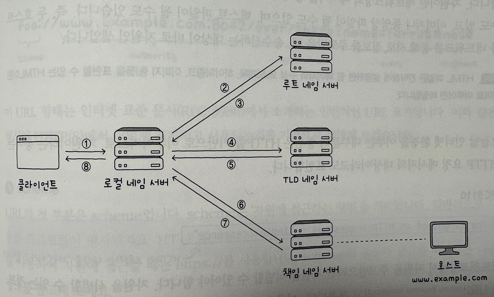

# 응용 계층

## 5-1 DNS와 자원

### 도메인 네임과 네임 서버

- 등장 배경 : IP 주소는 기억하기 어렵고 외우기 어려움
- 해결 방법 : 상대 호스트를 특정하기 위해 도메인 네임 등장
- 도메인 네임 : 호스트의 IP 주소와 대응되는 문자열 형태의 호스트 특정 정보. 즉, 문자열 형태의 호스트 이름
- DNS 서버 : 도메인 네임을 관리하는 서버
- 도메인 네임이 전화번호라면, DNS 서버는 전화번호부 역할을 함.

  - 호스트마다 유지하는 개인 전화번호부도 같은 파일도 있음 -> hosts 파일

    

#### 도메인 네임

- www.google.com.
  - 도메인 네임은 점을 기준으로 게층적으로 분류함
  - 루트 도메인 : 도메인 네임의 마지막 부분
    - .으로 표현
  - 최상위 도메인(TLD) : 일반적으로 아는 도메인 네임의 마지막 부분
    - 일반적으로 루트 도메인(.)은 생략하기 때문
    - 예시에서는 com
  - 2단계 도메인 : 최상위 도메인 바로 아래에 있는 도메인
    - 예시에서는 google
  - 3단계 도메인 : 2단계 도메인 바로 아래에 있는 도메인
    - www
  - 전체 주소 도메인 네임(FQDN) : 도메인 네임을 모두 포한하는 도메인 네임
    - www.google.com.
  - 호스트 네임 : FQDN의 첫번째 부분(www). 때로는 FQDN 자체를 가리키기도 함


#### 계층적 네임 서버

- 계층적인 도메인 네임 구조를 효율적으로 관리하기 위해 네임 서버도 계층적으로 구성됨
  - 네임 서버는 여러개 존재하며, 전세계 여러 군데에 위치해 있음. -> 계층적이고 분산된 도메인 네임에 대한 관리 체계를 도메인 네임 시스템, 줄여서 DNS라고 부름
- 리졸빙 과정 : 도메인 네임을 풀이하는 과정. 즉, IP 주소를 모르는 상태에서 도메인 네임에 대응되는 IP 주소를 알아내는 과정
- 리졸빙 과정에 다양한 네임 서버 사용함. 크게 4가지
  - 로컬 네임 서버
    - 클라이언트가 리졸빙 요청을 보낼 때, 가장 먼저 찾는 네임 서버
    - 클라이언트는 당연히 로컬 네임 서버 주소를 알고 있어야함 (보통 ISP에서 할당해줌)
    - 보통 ISP에서 할당해줌. 공개 DNS 서버 사용할 수도 있음
      - ex) 8.8.8.8(Google), 8.8.4.4(Google), 1.1.1.1(Cloudflare)
  - 루트 네임 서버
    - 로컬 네임 서버가 모르는 경우, 루트 네임 서버에게 도메인 질의
    - 루트 도메인을 관장하는 네임 서버임.
    - 질의에 대해 TLD 네임 서버 주소를 알려줌
  - TLD 네임 서버
    - TLD 네임 서버는 최상위 도메인을 관장하는 네임 서버임.
    - TLD 하위 도메인 네임을 관리하는 네임 서버 주소를 반환함.
    - 하위 도메인 네임을 관리하는 네임 서버도 마찬가지로, 그보다 하위 도메인 네임을 관리하는 네임 서버 주소를 반환 할 수 있음
  - 책임 네임 서버
    - 다른 네임 서버에게 떠넘기지 않고 곧바로 답할 수 있는 네임 서버
    - 즉, 로컬 네임 서버가 마지막으로 질의하는 네임 서버임.

##### 리졸빙 과정

- 로컬 네임 서버가 네임 서버들에게 질의하는 방법은 크게 2가지
  - 재귀적 질의
  - 반복적 질의
- 재귀적 질의

  

- 반복적 질의

  

- 위 방법들에는 문제가 있음
  - 과정이 너무 길어서 응답시간이 오래 걸리고 네트워상의 메시지 수가 지나치게 늘어날 수 있음
  - 네임 서버들이 기존에 응답받은 결과를 임시로 저장했다가 같은 질의에 이를 활용함 -> 이를 DNS 캐시라고 함
  - DNS 캐시를 저장하는 용도로만 사용하는 서버도 있음.
  - DNS 캐시는 TTL(Time To Live) 값을 가지고 있음. 이 값은 캐시된 데이터가 유효한 시간을 의미함.
  - 이 값이 만료되면 캐시된 데이터는 사라짐.

### 자원을 식별하는 URI

- 자원이란, 네트워크상의 메세지를 통해 주고받는 대상
  - HTML, 이미지, 동영상, 텍스트 파일 등
  - 인터넷 상의 대부분의 통신은 HTTP를 기반으로 하기 때문에, 자원이란 용어는 'HTTP 요청 메세지의 대상'이라고도 표현
- URI : 자원을 식별할 수 있는 정보
- URI를 식별 정보 기준으로 2가지로 분류 : URL, URN
  - URL : 위치를 이용해 자원을 식별
  - URN : 이름을 이용해 자원을 식별

#### URL

- 더 많이 사용되는 방법임.
- URL 형식

  

- 1. scheme
  - 자원에 접근하는 방법을 의미
  - 일반적으로 사용할 프로토콜을 명시함
  - 예시 : http, https, ftp, file 등
- 2. authority
  - 호스트를 특정할 수 있는 정보
  - IP주소 혹은 도메인 네임을 명시함
  - 예시 : 192.168.0.1:8080, www.google.com:80
- 3. path
  - 자원이 위치한 경로
  - 예시 : /index.html, /images/logo.png
- 4. query
  - 더 많은 정보가 필요한 경우 사용
  - 예를들어, 검색 엔진에서 검색 키워드를 전달 혹은 정렬기준을 전달하는 경우
  - ?로 시작하는 key,value 형태의 문자열을 사용함. &를 사용하여 여러 개의 쿼리를 전달할 수 있음
  - 예시 : ?key=value&key2=value2
- 5. fragment
  - 자원의 일부를 가리키는 정보
  - 예를들어, 웹 페이지에서 특정 부분을 가리키는 경우. 특정 부분으로 이동함.
  - 예시 : #logo

#### URN

- 자원의 위치가 변경되면 기존 URL로는 자원을 식별할 수 없음
- URN은 자원의 위치와 무관하게 자원을 식별할 수 있음
- 예시 : urn:isbn:978-3-8435-0000-0

## 5-2 HTTP

### HTTP의 특성

- HTTP : 응용 계층에서 정보를 주고받는 데 사용되는 프로토콜
- 4가지 특성
  - 요청과 응답 기반
  - 미디어 독립적
  - 상태를 유지하지 않음
  - 지속 연결을 지원

#### 요청과 응답 기반 프로토콜

- 클라이언트와 서버가 서로 HTTP 요청 메세지와 HTTP 응답 메세지를 주고받는 구조로 동작

#### 미디어 독립적

- 자원의 특성을 제한하지 않음
- 예를들어, 텍스트 파일, 이미지, 동영상 등 다양한 형태의 자원을 주고받을 수 있음
- HTTP 메세지로 주고받는 자원의 종류르 미디어 타입이라함. MIME 타입이라고 부름
- 미디어 타입은 웹에서 확장자와 같은 개념
- type/subtype 형태로 표현됨
  - 예시 : text/html, image/jpeg, video/mp4
- type/subtype;parameter=value 형태로 매개변수를 포함할 수도 있음
  - 예시 : text/html;charset=utf-8

#### 상태를 유지하지 않음

- 서버가 HTTP 요청을 보낸 클라이언트와 관련된 상태를 기억하지 않음
- HTTP 서버는 많은 클라이언트와 상호작용하기 때문에, 각 클라이언트의 상태를 기억하는게 매우 부담됨
- 또한, 서버가 여러대 일 경우, 모든 서버가 모든 클라이언트의 상태 정보를 공유하는게 매우 어려움
- 따라서, 서버는 클라이언트의 상태를 기억하지 않음
- HTTP의 중요한 설계 목표는 확장성과 견고성임.
- 상태를 유지하지 않으면,
  - 언제든 쉽게 서버를 추가할 수 있음 -> 확장성이 높음
  - 서버가 다운되더라도 다른 서버로 대체가 가능함 -> 견고성이 높음

#### 지속 연결을 지원

- HTTP는 TCP 상에서 동작하는데, HTTP는 비연결형 프로토콜이지만, TCP는 연결형 프로토콜임
- 초기 HTTP는 TCP 연결을 맺고 메세지를 주고받고 연결을 끊는 과정을 반복함
- 추가적인 요청-응답을 하기 위해선 다시 TCP 연결을 맺어야함
- 이를 해결하기 위해, HTTP 버전 1.1부터 지속 연결을 지원함. (킵얼라이브)

  - 하나의 TCP 연결상에서 여러 개의 요청-응답을 주고받을 수 있는 기술임.

  

### HTTP 메시지 구조

- HTTP 메시지 구조
  - 시작 라인
  - 필드 라인
  - 메시지 본문

#### 시작 라인

- 요청 메시지의 경우, 요청 라인
  - 메서드, 요청 대상, HTTP 버전
    - 메서드 : 서버의 자원에 대해 수행할 작업의 종류 (GET, POST, PUT, DELETE 등)
    - 요청 대상 : HTTP 요청을 보낼 서버의 자원 (URI의 path 명시)
    - HTTP 버전 : 사용하는 HTTP 버전
  - GET /index.html HTTP/1.1
- 응답 메시지의 경우, 상태 라인
  - HTTP 버전, 상태 코드, 이유 구문
    - HTTP 버전 : 사용하는 HTTP 버전
    - 상태 코드 : 서버가 요청을 처리한 결과
    - 이유 구문 : 상태 코드의 이유를 설명하는 구문
  - HTTP/1.1 200 OK

#### 필드 라인

- 0개 이상의 HTTP 헤더가 명시. 헤더 라인이라고도 함
  - HTTP 헤더는 HTTP 통신에 필요한 부가 정보를 의미
- 형식 : 헤더 이름 : 헤더값
- 예시
  ```
    HOST: www.google.com
    User-Agent: curl/7.64.1
    Accept: text/html
  ```

#### 메시지 본문

- HTTP 요청 혹은 응답 메시지에서 본문이 필요한 경우, 메시지 본문에 명시함.
- 본문은 존재할 수도 있고, 다양한 콘텐츠 타입이 사용될 수 있음
- 예시

  ```
  HTTP/1.1 200 OK
  Content-Type: text/html

  <html>
    <body>
      <h1>Hello, World!</h1>
    </body>
  </html>
  ```

  ```
  POST /users HTTP/1.1
  Content-Type: application/json

  {
    "id": 1,
    "name": "John Doe"
  }
  ```

### HTTP 메서드

#### GET - 가져다주세요

- 특정자원을 조회할 때 사용되는 메서드
- 요청 메시지에는 일반적으로 본문을 포함시키지 않음. 대신 쿼리 문자열을 사용함.
- 요청 메시지

```
GET /index.html?name=John&age=20 HTTP/1.1
Host: www.google.com
Accept: text/html
```

- 응답 메시지

```
HTTP/1.1 200 OK
Content-Type: text/html
Content-Length: 100

<html>
  <body>
    <h1>Hello, World!</h1>
  </body>
</html>
```

#### HEAD - 헤더만 가져다주세요

- GET과 동일하게 자원을 조회하는 메서드
- 다만, 응답 메시지에서 본문을 포함하지 않음. 대신 헤더만 반환함
- 주로 헤더 정보를 확인하고 싶을 때 사용됨

#### POST - 처리해 주세요

- 서버로 하여금 특정 작업을 처리하도록 요청하는 메서드
- 요청 메시지에는 본문을 포함함
- 응답 메시지에 Location 헤더를 통해 새로 생성된 자원의 위치를 클라이언트에게 알려줄 수 있음
- 일반적으로, 클라이언트가 서버에 새로운 자원을 생성하고자 할 때 사용
- 요청 메시지

```
POST /users HTTP/1.1 // 시작 라인(요청라인)
Host: www.google.com // 필드 라인
Content-Type: application/json // 필드 라인

{
  "id": 1, // 게시글 id
  "name": "John Doe", // 게시글 작성자
  "contents": "Hello, World!" // 게시글 내용
}
```

- 응답 메시지

```
HTTP/1.1 201 Created
...
Location: /users/1

{
  "id": 1,
  "name": "John Doe",
  "contents": "Hello, World!"
}
```

#### PUT - 덮어써 주세요

- '덮어쓰기'를 요청하는 메서드
- 요청 메시지

```
PUT /users/1 HTTP/1.1
Host: www.google.com
Content-Type: application/json

{
  "name": "Jane Doe"
}
```

#### PATCH - 일부 수정해 주세요

- 부분적 수정을 요청하는 메서드
- PUT은 전체 수정을 요청하는 메서드이지만, PATCH는 부분적 수정을 요청하는 메서드임

#### DELETE - 삭제해 주세요

- 특정 자원을 삭제하는 메서드
- 요청 메시지

```
DELETE /texts/a.txt HTTP/1.1
Host: www.google.com
```

### HTTP 상태 코드

- 요청에 대한 결과를 나타내는 세자리 정수

#### 200번대: 성공 상태 코드

- 요청이 성공했음을 의미

| 상태 코드 | 이유 구문  | 설명                                                    |
| --------- | ---------- | ------------------------------------------------------- |
| 200       | OK         | 요청이 성공했음                                         |
| 201       | Created    | 요청이 성공했으며, 새로운 자원이 생성되었음 (ex - POST) |
| 202       | Accepted   | 요청을 잘 받았으나, 아직 요청한 작업을 끝내지 않았음    |
| 204       | No Content | 요청이 성공했지만, 메시지 본문으로 표시할 데이터가 없음 |

#### 300번대: 리다이렉션 상태 코드

- 리다이렉션과 관련된 상태 코드
- 리다이렉션 : 요청을 완수하기 위해 추가적인 조치가 필요한 상태
- 즉 클라이언트의 요청을 다른 곳을 이동시키는 메서드

##### 영구적인 리다이렉션

- 경로가 영구적으로 재지정되는 것을 의미

| 상태 코드 | 이유 구문          | 설명                                                       |
| --------- | ------------------ | ---------------------------------------------------------- |
| 301       | Moved Permanently  | 영구적인 리다이렉션 : 재요청 메서드 GET으로 변경될 수 있음 |
| 308       | Permanent Redirect | 영구적인 리다이렉션 : 재요청 메서드 변경되지 않음          |

- 308은 301과 동일하지만, 301의 애매함 때문에 308이 등장함
- 어떤 URL에 요청을 보낸 결과로 영구적인 리다이렉션 관련 상태 코드를 받았다면, 해당 URL은 기억할 필요가 없다고 봐도 무방함.

##### 일시적인 리다이렉션

- 경로가 일시적으로 재지정되는 것을 의미

| 상태 코드 | 이유 구문          | 설명                                               |
| --------- | ------------------ | -------------------------------------------------- |
| 302       | Found              | 일시적인 리다이렉션 : 재요청 메서드 변경될 수 있음 |
| 303       | See Other          | 일시적인 리다이렉션 : 재요청 메서드 GET으로 변경   |
| 307       | Temporary Redirect | 일시적인 리다이렉션 : 재요청 메서드 변경되지 않음  |

- 클라이언트가 POST 요청 메시지를 보낸 상황
  - 302 상태 코드를 받으면, 재요청 메서드가 GET으로 변경될 수도 있음.
  - 303 상태 코드를 받으면, 재요청 메서드가 GET으로 변경됨.
  - 307 상태 코드를 받으면, 재요청 메서드가 그대로 POST로 유지됨.
- 클라이언트의 요청을 '다른곳'으로 이동시키는것이 리다이레션임.
  - 다른곳은 URL이 될수도있고, 캐시가 될수도 있음
  - 여기서 설명한 내용은 모두 URL로 이동시키는 경우임.
  - 304(Not Modified)는 캐시를 사용하는 경우임 -> 다음장

#### 400번대: 클라이언트 에러 상태 코드

- 클라이언트에 의한 에러가 있음을 나타내는 상태 코드

| 상태 코드 | 이유 구문          | 설명                                                                             |
| --------- | ------------------ | -------------------------------------------------------------------------------- |
| 400       | Bad Request        | 클라이언트의 요청이 잘못되었음 (ex - 잘못된 메서드, 잘못된 메시지 내용이나 형식) |
| 401       | Unauthorized       | 인증이 필요한 리소스에 인증 없이 접근함                                          |
| 403       | Forbidden          | 해당 리소스에 접근할 권한이 없음                                                 |
| 404       | Not Found          | 요청한 자원을 찾을 수 없음                                                       |
| 405       | Method Not Allowed | 허용되지 않은 HTTP 메서드를 사용함                                               |

- 인증 : 자신이 누구인지 증명하는 것
- 권한 : 인증된 주체에게 작업을 허용하는 것

#### 500번대: 서버 에러 상태 코드

- 서버에 의한 에러가 있음을 나타내는 상태 코드

| 상태 코드 | 이유 구문             | 설명                                                                                |
| --------- | --------------------- | ----------------------------------------------------------------------------------- |
| 500       | Internal Server Error | 요청을 처리할 수 없음 (ex - 서버 내부 오류)                                         |
| 502       | Bad Gateway           | 중간 서버의 통신 오류 (ex - 게이트웨이 서버가 오류)                                 |
| 503       | Service Unavailable   | 현재는 요청을 처리할 수 없으나, 추후 가능할 수 있음 (ex - 서버 과부하, 일시적 점검) |

## 5.3 HTTP 헤더와 HTTP 기반 기술

- HTTP 메시지의 필드 라인에 들어가는 내용

### HTTP 헤더

#### HTTP 요청시 활용되는 헤더

1. Host

- 요청하려는 자원의 호스트 이름
- 예시 : www.google.com

2. User-Agent

- 요청하는 클라이언트의 종류
- 운영체제, 브라우저 종류 및 버전, 렌더링 엔진등을 표현
- 서버가 클라이언트의 접속 환경을 유추 가능
- 예시 : Mozilla/5.0 (Macintosh; Intel Mac OS X 10_15_7) AppleWebKit/537.36 (KHTML, like Gecko) Chrome/120.0.0.0 Safari/537.36

3. Referer

- 클라이언트가 요청을 보낼 때 머무르고 있는 URL
- 유입 경로를 파악가능
- 예시 : https://www.google.com/

4. Authorization

- 클라이언트가 인증을 위해 서버에 보내는 헤더
- `<type> <credentials>` 형태로 표현
- 예시 : Basic 1234567890 (Base64), Bearer 1234567890 (JWT)

#### HTTP 응답시 활용되는 헤더

1. Server

- 요청을 처리하는 서버측의 소프트웨어 정보
- 예시 : Apache/2.4.41 (Unix)

2. Allow

- 서버가 허용하는 HTTP 메서드
- 예시 : GET, POST, PUT, DELETE

3. Retry-After

- 자원을 사용할 수 있는 날짜 혹은 시각
- 예시
  - Fri, 11 Dec 2024 12:00:00 GMT (이 날짜 이후에 사용가능)
  - 120 (120초 후 사용가능)

4. Location

- 리다이렉션 시 새로운 자원의 위치
- 예시 : https://www.google.com/

5. WWW-Authenticate

- 자원에 접근하기 위한 인증 방식을 설명하는 헤더
- 인증 방식만 알려주거나, 보안영역(realm)을 알려줄 수 있음
- 보안영역: 보안이 적용될 영역. 같은 서버가 제공하는 자원일지라도, 영역에 따라 접근이 가능할 수도, 불가능할수도 있음.
- 예시
  - Basic
  - Bearer
  - Basic realm="Access to the staging site"
  - Bearer realm="Access to the staging site"

#### HTTTP 요청, 응답시 공통적으로 활용되는 헤더

1. Date

- 메시지가 생성된 날짜와 시간
- 예시 : Wed, 11 Dec 2024 12:00:00 GMT

2. Connection

- 클라이언트와 서버 사이의 연결 방식을 나타내는 헤더
- 예시 : close, keep-alive

3. Content-Length

- 메시지 본문의 길이를 나타내는 헤더
- 예시 : 1000

4. Content-Type, Content-Language, Content-Encoding

- 전송하려는 메시지 본문의 표현 방식을 설명하는 헤더
- Content-Type : 메시지 본문의 미디어 타입
  - 예시 : text/html, image/jpeg, video/mp4
- Content-Language : 메시지 본문의 언어
  - 예시 : ko, en, ja
- Content-Encoding : 메시지 본문의 인코딩 방식
  - 예시 : gzip, deflate, br

### 캐시

- 불필요한 대역폭 낭비와 응답 지연을 방지하기 위해 정보의 사본을 임시로 저장하는 기술
- 예시) 10mb의 a.png 파일 GET 요청으로 가져올때, 매번 가져오면 대역폭 낭비가 심함. 따라서 캐시를 사용하여 한번 가져온 파일을 임시로 저장하여 다음에 요청할때 캐시에서 가져오면 대역폭 낭비를 줄일 수 있음.
- 캐시를 크게 2가지로 분류
  - 개인 전용 캐시 : 웹브라우저에 저장
  - 공용 캐시 : 중간 서버에 저장
- 캐시는 사본을 저장하기 때문에, 원본 데이터가 변경되는 상황에 대비해야함. -> 캐시 신선도를 검사해야함
- 캐시 신선도 : 캐시된 사본 데이터가 최신 원본 데이터와 유사한지
- 캐시 신선도 유지 방법
  - 캐시된 데이터에 유효 기간을 설정
    - Expires 헤더, Cache-Control 헤더를 사용하여 유효 기간을 설정
    - ex)
      - Expires: Fri, 11 Dec 2024 12:00:00 GMT (이 날짜까지 사용가능)
      - Cache-Control: max-age=120 (120초 후 사용가능)
  - 캐시 유효기간 만료 시,
    - 캐시된 자원이 여전히 신선한지 검사해야함
      - 캐시 신선도 검사 방법 2가지
        - 날짜를 기반으로 서버에게 물어보는 방법
          - If-Modified-Since 헤더를 통해 서버에게 특정 시점 이후로 원본 데이터에 변경이 있었는지 물어볼 수 있음
          - 예시 : If-Modified-Since: Fri, 11 Dec 2024 12:00:00 GMT
          - 서버 입장에서 이 요청을 받았을 때, 크게 3가지 상황이 존재
            1. 요청받은 자원이 변경됨
            - 200(OK) 상태코드와 함께 새로운 자원 반환
            2. 요청받은 자원이 변경되지 않음
            - 304(Not Modified) 상태코드를 통해 자원이 변경되지 않음을 알림
            - 클라이언트는 브라우저에 캐시된 자원 사용
            - Last-Modified 헤더를 통해 자원이 변경된 시점을 알릴 수도 있음
            3. 요청받은 자원이 존재하지 않음
            - 404(Not Found) 상태코드를 통해 자원이 존재하지 않음을 알림
        - 엔티티 태그를 기반으로 서버에게 물어보는 방법
          - If-None-Match 헤더를 통해 서버에게 특정 엔티티 태그가 변경되었는지 물어볼 수 있음
          - 엔티티 태그(Etag) : 자원의 버전을 식별하기 위한 식별자.
          - 특정 Etag와 일치하는 자원이 있니? 라고 물어보는 것
          - 예시 : If-None-Match: "a1b2c3d4"
          - 서버 입장에서 이 요청을 받았을 때, 크게 3가지 상황이 존재
            1. 요청받은 자원이 변경됨 (Etag가 변경됨)
            - 200(OK) 상태코드와 함께 새로운 자원 반환
            2. 요청받은 자원이 변경되지 않음 (Etag가 변경되지 않음)
            - 304(Not Modified) 상태코드를 통해 자원이 변경되지 않음을 알림
            - 클라이언트는 브라우저에 캐시된 자원 사용
            3. 요청받은 자원이 존재하지 않음
            - 404(Not Found) 상태코드를 통해 자원이 존재하지 않음을 알림

### 쿠키

- HTTP는 상태를 유지하지 않는 프로토콜임. 이를 보완하기 위해 쿠기 등장
- '로그인 상태 유지' 등의 기능 구현할 수 있음
- 쿠키 : 서버에서 생성되어 클라이언트 측에 저장되는 <이름,값> + 속성 형태의 데이터
- 쿠키 사용 과정
  1. 서버는 쿠키를 생성하여 클라이언트에게 전송
  2. 클라이언트는 전달받은 쿠키를 저장해두었다가 동일한 서버에 보내는 요청 메시지에 쿠키를 포함하여 전송함
  3. 서버는 쿠키 정보를 참고해 두 개의 요청이 같은 클라이언트에서 왔는지, 로그인 상태를 유지하고 있는지 등을 알 수 있음
- 쿠키 전달 방법
  - 서버 : Set-Cookie 헤더를 통해 쿠키 생성
    - 응답 메시지 예시
    ```
    HTTP/1.1 200 OK
    Content-Type: text/html
    Set-Cookie: name=John; expires=Fri, 11 Dec 2024 12:00:00 GMT; path=/
    Set-Cookie: age=20
    ```
  - 클라이언트 : Cookie 헤더를 통해 쿠키 전달
    - 요청 메시지 예시
    ```
    GET /next-page HTTP/1.1
    Host: www.google.com
    Cookie: name=John; age=20;
    ```
  - www.google.com에게 받은 쿠키를 다른 웹사이트에 전송하면 안되기 때문에, domain이 정해져있음
  - 이는 응답 메시지 속 Set-Cookie 헤더에 domain 속성으로 정의함
    - 예시 : Set-Cookie: name=John; domain=www.google.com
  - 같은 도메인이라도 path별로 쿠키를 구분해서 사용하는 것도 가능함.
  - 이는 응답 메시지 속 Set-Cookie 헤더에 path 속성으로 정의함
    - 예시 : Set-Cookie: name=John; path=/lectures
- 쿠키의 유효기간
  - Expires 속성과 Max-Age 속성을 통해 쿠키의 유효기간을 설정할 수 있음
  - Expires 속성 : 쿠키의 유효기간을 절대 시간으로 설정
    - 예시 : Set-Cookie: name=John; Expires=Fri, 11 Dec 2024 12:00:00 GMT (2024년 12월 11일 12시 00분 00초 이후 쿠키 삭제)
  - Max-Age 속성 : 쿠키의 유효기간을 상대 시간으로 설정
    - 예시 : Set-Cookie: name=John; Max-Age=2592000 (2592000초 후 쿠키 삭제)
- 쿠키 보안
  - Secure 속성
    - 쿠키를 HTTPS 프로토콜을 통해서만 전송하도록 설정
    - 예시 : Set-Cookie: name=John; Secure
  - HttpOnly 속성
    - 쿠키를 HTTP 프로토콜을 통해서만 전송하도록 설정
    - 해커가 악의적으로 자바스크립트로 쿠키를 탈취할 수 없도록 함.
    - 예시 : Set-Cookie: name=John; HttpOnly

### 콘텐츠 협상과 표현

- 같은 URI에 접속해도, 한국 계정으로 접속하는지, 미국 계정으로 접속하는지에 따라 홈페이지가 한글로 나올지 영어로 나올지가 달라질 수 있다.
- 이를 가능케 하는 것이 콘텐츠 협상.
- 콘텐츠 협상 : 같은 URI에 대해 가장 적합한 자원의 형태를 제공하는 메커니즘.
- 송수신 가능한 자원의 형태를 '자원의 표현'이라고 함
- 즉, 콘텐츠 협상이란, 클라이언트에게 가장 접합한 자원의 표현을 제공하는 메커니즘이다.
- 이를 통해, GET 메서드는 자원의 특정 표현을 습득하기 위한 메서드로 다시 정의할 수 있다. (자원을 습득하는 것이 아님)
- 관련 헤더
  - Accept : 클라이언트가 선호하는 미디어 타입을 나타냄
    - 예시 : Accept: text/html, application/xhtml+xml
  - Accept-Language : 클라이언트가 선호하는 언어를 나타냄.
    - 예시 : Accept-Language: ko-KR,ko;q=0.9, en-US;q=0.7, en;q=0.3
  - Accept-Charset : 클라이언트가 선호하는 문자 인코딩을 나타냄
    - 예시 : Accept-Charset: utf-8, iso-8859-1;q=0.5, \*;q=0.1
  - Accept-Encoding : 클라이언트가 선호하는 압축 방식을 나타냄
    - 예시 : Accept-Encoding: gzip, deflate, br;q=0.1
- 위에서 명시한 q는 선호도를 나타냄.
- 값이 클수록 우선순위가 높다.
