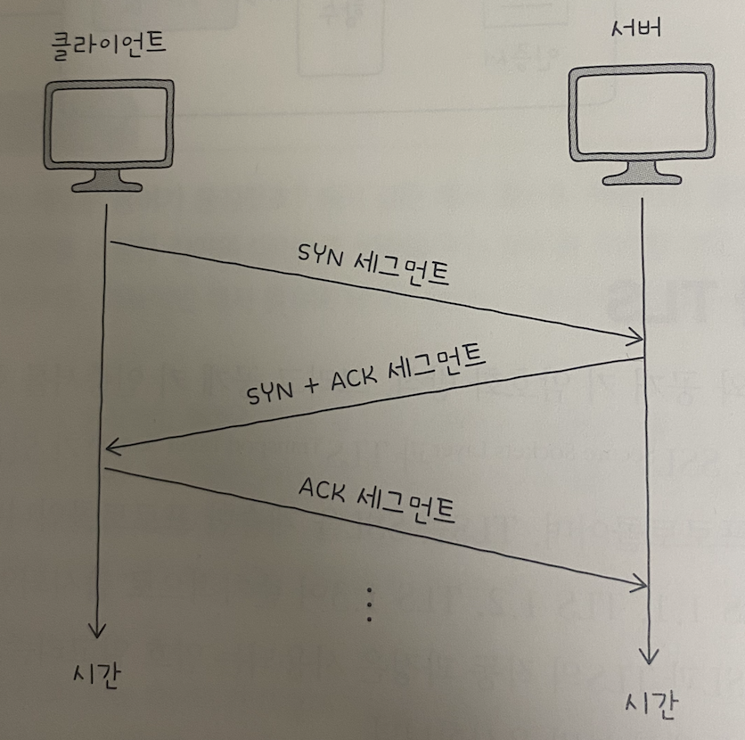

# 7장 네트워크 심화

## 7-1 안정성을 위한 기술

* 사용자가 폭증하면 서버가 불안정 해지고, 부하가 가중된다. 이를 해결하기 위해 안정성을 수치로 표현하는 가용성이라는 용어 개념 학습하고
  안정성을 높이기 위한 방법인 이중화, 다중화, 로드 밸런싱에 대해 알아보자.

### 가용성

- 안정성
  * 특정 기능을 언제든 균일한 성능으로 수행할 수 있는 특성
  * ex) 안정적인 웹서버: 언제든지 응답 메시지를 제공할 수 있는 서버
        안정적인 라우터: 언제든지 라우팅 기능을 제공할 수 있는 라우터

- 안정성의 수치화: 가용성, 고갸용성
  * 가용성(Availability): 컴퓨터 시스템이 특정 기능을 시렞로 수행할 수 있는 시간의 비율
  * 다시 말해 전체 사용 시간 중에서 정상적인 사용 시간을 의미
  * 업타입: 정상적인 사용 시간, 다운타임: 정상적인 사용이 불가능한 시간
  * 가용성 = 업타임 / 업타임 + 다운타임
  
  * 위 결과값이 크다는 것은, 전체 사용 시간 중에서 대부분을 사용 가능하다라는 의미
  * 이를 고가용성(High Availability: HA)이라 함
  * 안정적이라고 평가 받는 시스템은, 이 수식을 백분율로 표기했을때 99.999% 목표로 함
  * 9가 다섯개라 파이브 나인즈라고도 함
  * 이 수치를 달성하면, 다운타임이 대략 1년에 5.26분, 1개월에 26.3초

  * 가용성을 높이려면 다운 타임을 낮추어야함
  * 하지만 다운타임의 발생 원인을 모두 찾아 원천적으로 차단하기 힘듬
  * 문제가 발생하더라도 기능을 할 수 있는 결함 감내(Fault tolerance)가 필요
  * 다운타임을 낮추고, 가용성을 높이기 위해 결함 감내할 수 있도록 서비스나 인프라 설계하는 것이 중요

### 이중화와 다중화

  - 이중화
    * 무언가를 이중으로 두는 기술, 결함을 감내하여 가용성을 높이기 위한 대표적 방법, 예비(백업)을 마련하는 방법
    * 물리적 장비(서버 컴퓨터, 네트워크 인터페이스(NIC), 스위치) 및 데이터베이스, 웹 서버 이중화 가능
    * 이중화할 수 있는 대상들은 문제가 발생할 경우 시스템 전체가 중단될 수 있는 대상이라는 공통점 가짐

    * 이를 단일 장애점(SPoF: Single Point Of Failure)라 함
    * SPOF는 최대한 없애야 함, 가용성을 높이기 위해서 이를 이중화시켜야 함

  - 이중화 구성의 방식 
    * 액티브/스탠바이(Active-standby), 액티브/액티브(Active-active)
    * 액티브는 가동상태를 의미하며, 스탠바이는 액티브의 백업으로 대기하는 상태 의미
    * 액티브/스탠바이: 한 시스템은 가동하고, 다른 시스템은 백업 용도로 대기 상태
      - 시스템이 문제가 발생할 경우, 스탠바이 시스템이 자동으로 액티브 시스템을 대신하여 동작
      - 안정한 구성 방식이지만, 하나의 장비를 사용할 때에 비해 성능상의 큰 변화를 기대하기 어려움.
      - 페일오버(Failover): 액티브 시스템에 문제가 생겼을 경우 예비된 스탠바이 시스템으로 자동 전환되는 기능

    * 액티브/액티브: 두 시스템 모두를 가동 상태로 두는 구성 방식
      - 부하를 분산시킬 수 있고, 함꼐 가동돼서 성능상 이점 있음
      - 한 시스템에 문제 발생시, 순간적으로 다른 시스템에 부하가 급중할 수 있어 추가적인 문제가 발생 가능

  - 다중화
    * 무언가를 여러 개 두는 기술, 세 개 이상으로 장비 구성하면, 이중화에 비해 더욱 안정적인 운영 가능
    * 이중화/다중화의 사례로 티밍(teaming)과 본딩(Bonding)
    * 티밍은 윈도우 본딩은 리눅스에서 사용되는 용어
    * 이 두 기술은 여러 개의 네트워크 인터페이스(NIC)를 이중화/다중화하여 마치 더 뛰어나고 안정적인 성능을 보유한 하나의 인터페이스처럼 보이게 하는 기술
    * 1Gbps 속도를 지원하는 인터페이스 세 개를 티밍, 액티브로 구성할 경우 마치 하나의 3Gbps 인터페이스를 사용하는 것과 같은 효과

  ### 로드 밸런싱

  - 트래픽
    * 고가용성을 요구하는 호스트는 일반적으로 클라이언트가 아닌 서버, 서버 다중화를 했더라도, 트래픽 분배를 해결해야함
    * 트래픽(Traffic): 주어진 시점에 네트워크를 경유한 데이터의 양, 주어진 시점에 특정 노드를 경유한 패킷의 양
    * 과도한 트래픽은 CPU의 발열, 메모리 공간 부족, 제한된 대역폭과 병목 현상으로 응답이 느려지거나 일부 요청에 대한 응답이 누락될 수 있음, 프로그램의 일관성도 손상

  - 로드 밸런싱
    * 트래픽의 고른 분배를 위해 사용되는 기술이 로드 밸런싱(Load Balancing)
    * 로드 밸런싱은 로드 밸런서(Load Balancer)에 의해 수행됨
    * L4 스위치, L7 스위치라 불리는 네트워크 장비로도 수행할 수 있지만, 로드 밸런싱 기능을 제공하는 소프트웨어를 설치하면 일반적인 호스트도 로드 밸런서로 사용 가능
    * 대표적 소프트웨어로 HAProxy, Envoy 등 있음, 웹서버 Nginx에도 로드 밸런싱 기능 포함
    * 일반적으로 이중화나 다중화된 서버와 클라이언트 사이에 위치. 클라이언트들은 로드 밸런서에 요청을 보내고, 로드 밸런서는 해당 요청 균둥하게 분배
    
    

  - 헬스 체크
    * 헬스 체크(Health Check): 다중화된 서버 환경에서 현재 문제가 있는 서버는 없는지, 현재 요청에 올바른 응답을 할 수 있는 상태인지 주기적으로 검사
    * 서버들의 건강 상태를 주기적으로 모니터링
    * 주로 로드 밸런서에 의해 이루어지며, HTTP, ICMP 등 다양한 프로토콜을 활용할 수 있음

  - 로드 밸런싱 알고리즘
    * 로드 밸런서가 요청을 전달할 수 있는 서버가 여러 개 있을 경우, 부하가 균등하게 분산되도록 부하 대상을 선택하는 방법
    * 대표적으로 단순히 서버를 돌아가며 부하를 전달하는 라운드 로빈 알고리즘(Round Robin Algorithm)
    * 연결이 적은 서버부터 우선적으로 부하를 전달하는 최소 연결 알고리즘(Least Connection Algorithm)
    * 때로는 단순히 무작위로 고르기도 하고, 해시(Hash)라는 자료 구조를 이용하기도 하며, 응답 시간이 가장 짧은 서버를 선택하기도 함
    
    * 라운드 로빈, 최소 연결 알고리즘에서 서버마다 가중치 부여 가능
    * 알고리즘에 따라 동작하되, 가중치가 높은 서버가 더 많이 선택되어 더 많은 부하를 받도록 하는 것
    * 가중치가 부여된 알고리즘을 각각 가중치 라운드 로빈 알고리즘(Weighted Round Robin Algorithm), 가중치 최소 연결 알고리즘(Weighted Least connection Algorithm)

    * 아래와 같이 서버1에 가중치가 5, 서버2에 가중치가 1로 뷰여되면 서버 1에 다섯배 많은 부하 전달

    

  ### 포워드 프록시와 리버스 프록시

  - 오리진 서버
    * 오리진 서버(Origin Server): 자원을 생성하고 클라이언트에게 권한 있는 응답을 보낼 수 있는 HTTP 서버
    * 클라이언트와 오리진 서버 사이에는 많은 중간 서버가 있을 수 있다.
    * 인바운드 메시지(Inbound Message): 오리진 서버를 향하는 메시지
    * 아웃바운드 메시지(Outbound Message): 클라이언트를 향하는 메시지
    * 대표적인 HTTP 중간 서버 유형으로 프록시와 게이트웨이
    * 프록시 = 포워드 프록시, 게이트웨이 = 리버스 프록시

  - 프록시
    * 프록시(Proxy): 클라이언트가 선택한 메시지 전달 대리자
    * 어떤 프록시를 언제 어떻게 사용할지는 클라이언트가 선택.
    * 일반적으로 프록시는 오리진 서버보다 클라이언트와 더 가까이 위치
    * 주로 캐시 저장, 클라이언트 암호화 및 접근 제한 등의 기능 제공

  - 게이트웨이
    * 게이트웨이(Gateway): 일반적으로 네트워크 간의 통신을 가능케 하는 입구 역할을 하는 하드웨어 혹은 소프트웨어
    * 프록시에선 "아웃바운드 연결에 대해 오리진 서버 역할을 하지만, 수신된 요청을 반환하여 다른 인바운드 서버(들)로 전달하는 중개자 역할"
    * 일반적으로 오리진 서버들에 가까이 위치, 캐시를 저장 할 수 있고 로드 밸런서로 동작 가능

## 7-2 안정성을 위한 기술

* 멀리 떨어진 컴퓨터와 통신할 때, 평문으로 주고 받아선 안된다. 암호화(Encryption: 원문 데이터를 알아볼 수 없는 형태로 변경)와 복호화(Decryption: 암호화된 데이터를 원문 데이터로 되돌리는 과정) 을 통해 안전한 데이터 송수신을 해야한다.

### 암호와 인증서

#### 대칭 키 암호화 방식과 공개 키 암호화 방식

- 키(Key): 무작위해 보이는 문자열처럼 생겼으며, 키와 원문 데이터에 수학적 연산 과정을 거치면 암호문 생성, 이 수학적 알고리즘을 암호화 알고리즘이라 함

  * 암호문을 수신자 측에서 복호화하면 원문 메시지 얻을 수 있음
  * 복호화하지 않은 암호문은 제3자가 몰래 본다 해도 그 의미를 알 수 없음
  * 주고받는 데이터를 암호화하고 복호화하는 방법에는 대칭 키 암호화와 비대칭 키 암호화 두 가지 방식이 있음.
  * 비대칭 키 암호화는 공개 키 암호화라고도 부름

- 대칭 키 암호화(Symmetric Key Cryptography)

  * 암호화와 복호화에 동일한 키 사용
  * 장점: 적은 부하 덕분에 암호화 및 복호화를 빠르게 수행 가능
  * 단점: 상대방에게 안전하게 키를 전달하기 어려움, 키 유출시 큰 문제 발생
  * 상대방에게 키를 안전하게 전달할 수 있다는 방법 있다면, 그 방법으로 메시지 주고 받으면 됨

- 공개 키 암호화(Public Key Cryptography), 비대칭 키 암호화(Asymmetric Key Cryptography)

  * 암호와를 위한 키와 복호화를 위한 키가 다름
  * 이 각각을 공개 키(Public Key), 개인 키(Private Key)
  * 공개 키만으로 개인 키 유추 불가, 반대도 마찬가지
  * 공개 키로 암호화하고, 개인 키로 복호화할 수 있다면, 공개 키는 누구에게나 공개 해도 무방.
  * 암호화만을 위해 사용되어서, 공개키를 안다고 해도 원문 메시지를 유추 불가
  * 개인 키 만큼은 유출 되지 않도록 보안 유지
  * 장점: 키를 안전하게 공유 가능
  * 단점: 암호화 및 복호화에 시간과 부하가 상대적으로 많이 듦

  * 이러한 장단점  고려해 대칭 키 암호화 방식과 공개 키 암호화 방식을 함께 사용하는 경우 많음
  * 대칭 키를 상대에게 안전하게 전달하기 위해 공개 키로 대칭 키를 암호화하고 개인 키로 암호화된 대칭 키를 복호화 할 수 있음
  * 대칭 키를 안전하게 공유함과 동시에 공유한 대칭키를 이용해 빠르게 암호화/복호화 수행 가능
  * 이러한 방식으로 활용된 대칭키를 세션키(Session Key)라 함

#### 인증서와 디지털 서명

##### 인증서(Certificate): 일반적으로 공개 키 인증서를 일컫는다. 공개 키와 공개 키의 유효성을 입증하기 위한 전자 문서.

  * 우리 컴퓨터와 웹 서버가 공개 키 암호화 방식으로 통신한다 가정
  * 우리 컴퓨터는 웹 서버로부터 공개 키 전달 받음, 이때 이 공개 키가 신뢰할 수 있는지 확신할 수 없다.
  * 이러한 인증서는 인증 기관(CA: Certification Authority)이라는 제 3의 기관에서 발급
  * 인증 기관은 인증서의 발급, 검증, 저장과 같은 역할을 수행할 수 있는 공인 기관(대표적으로 IdenTrust, DigiCert등 있음)
  * CA가 발급한 인증서에는 '이 공개 키 인증서는 진짜야, 내가 보증할게' 라는 내용을 담은 서명값(Signature) 있음

  * 서명 값은 ⓵ 인증서 내용에 대한 해시 값을 ⓶ CA의 개인 키로 암호화하는 방식으로 만들어 짐.
  * CA는 이렇게 얻어낸 정보를 서명 값으로 삼아 클라이언트에게 인증서와 함께 전송

  

##### 디지털 서명(Digital Signature) 절차

  * 웹 브라우저를 통해 서버로부터 서명 값이 붙은 인증서를 받았다고 가정
  * 인증서 검증을 위해 가장 먼저 할 일은 서명 값과 인증서를 분리(그림 ⓵)
  * 서명값 = 인증서 내용에 대한 해시값을 CA의 개인 키로 암호화 한 것
  * CA의 공개 키는 공개되어 있기에, 서명 값은 CA의 공개 키로 복호화할 수 있음
  * 서명 값을 CA의 공개 키로 복호화하면 '인증서 내용에 대한 해시 값'을 얻을 수 있음(그림 ⓶)
  * 다음으로 인증서 데이터에 대한 해시 값을 직접 구한 뒤(그림 ⓷), 이를 복호화한 값과 비교(그림 ⓸)
  * 만약 값이 일치한다면 전달 받은 인증서는 확실히 CA의 개인 키로 만들어졌다고 보장.

  

### HTTPS: SSL과 TLS

  * 대칭 키 암호화와 공개 키 암호화 방식 그리고 공개 키 인증서를 기반으로 동작하는 프로토콜 SSL(Secure Sockets Layer), TLS(Transport Layer Security)가 있음
  * SSL과 TLS는 인증과 암호화를 수행하는 프로토콜이며, TLS는 SSL를 계승한 프로토콜.
  * SSL과 TLS의 작동 과정은 사용되는 암호 알고리즘과 버전에 따라 세부적인 차이가 있을 수 있으나 큰 틀에서 보면 유사

  #### HTTPS(HTTP over TLS)

    * SSL/TLS를 사용하는 대표적 프로토콜
    * HTTP의 안전한 송수신을 위해 개발된 프로토콜
    * 오늘날 주로 사용되는 TLS 1.3 기반

  #### HTTPS의 동작 과정

  1. TCP 쓰리 웨이 핸드셰이크

    - SYN 세그먼트: 클라이언트 -> 서버, 클라이언트가 연결을 시작하기 위해 서버에 SYN 플래그가 설정된 패킷 전송(연결할 준비가 되었어!)
    - SYN + ACK 세그먼트: 서버-> 클라이언트, 서버는 클라이언트의 요청을 수락하고 응답으로 SYN과 ACK 플래그가 설정된 패킷 보냄(네 확인했습니다 연결 시작해요!)
    - ACK 세그먼트: 클라이언트 -> 서버, 클라이언트는 서버의 SYN-ACK에 대한 응답으로 ACK 플래그가 설정된 패킷 전송

  

  2. TLS 핸드 셰이크와 암호화된 메시지 송수신

    - 클라이언트가 처음으로 서버에게 요청을 보내고 인증서를 응답받는 상황 가정
    - TLS 핸드 셰이크의 핵심 2가지 1. 암호화 통신을 위한 키를 교환, 2. 인증서 송수신과 검증이 이루어짐

    1) ClientHello 메세지 보냄, 이 메시지는 암호화된 통신을 위해 서로 맞춰 봐야 할 정보들을 제시하는 메시지, 지원되는 TLS 버전, 사용 가능한 암호화 방식과 해시 함수, 키를 만들기 위해 사용할 클라이언트 난수 등이 포함
    
    암호 스위트(Cipher Suite): 사용 가능한 암호화 방식과 해시 함수를 담은 정보

  
    
    2) ClientHello에 대한 응답으로 ServerHello 메시지 전송(제시된 정보들을 선택하는 메시지), 이 메세지에는 선택된 TLS 버전,
    암호 스위트 등의 정보, 키를 만들기 위해 사용할 서버의 난수 등이 포함. ClientHello메시지와 ServerHello메시지를 주고받으면 
    암호화된 통신을 통해 사전 협의 해야 할 정보들이 결정됨. 이 결정된 정보를 토대로 서버와 클라이언트는 암호화에 사용할 키 생성 가능. 
    이 단계 이후부터 클라이언트와 서버는 키로 암호화된 암호문을 주고 받을 수 있음

    3) 서버는 Certificate 메시지와 CertificateVerify 메시지 전송, 이는 각각 인증서와 검증을 위한 디지털 서명을 의미. 클라이언트는 이 메시지를 토대로 서버의 공개 키를 검증

    4) 서버와 클라이언트는 TLS 핸드셰이크의 마지막을 의미하는 Finished 메시지 주고 받음. 이제 TLS 핸드셰이크를 통해 얻어낸 키를 
    기반으로 암호화된 데이터 주고 받으면 됨. Finished 메시지와 함께, 암호화된 메시지(Application Data) 주고 받을 수 있음

## 7-3 무선 네트워크

### 전파와 주파수

- 전파(Radio Wave)

  * 약 3kHz부터 3THz 사이의 진동수를 갖는 전자기파, 눈에 보이지 않는 전자기파의 일종
  * TV, 노트북, 스마트폰 등 수많은 통신 기기가 전파를 이용하여 통신
  * 이 기기들이 주고받는 정보들은 눈에 보이지 않는 전파의 형태 띔
  * 서로 다른 전파 신호를 구분할 수 있는 방법이 필요, 통신에서 사용되는 전파에는 '주파수 대역'이 정해져 있음

#### 와이파이와 802.11

##### 무선 통신 네트워크에서 사용되는 주파수

  * LAN 환경에서 유선 통신은 IEEE 802.3으로 표준화된 것 처럼, LAN환경에서의 무선 통신은 IEEE 802.11로 표준화 되어있음
  * IEEE 802.11 표준 대부분은 2.4GHz, 5GHz 대역 사용
  * 무선 통신 규격인 IEEE 802.11 버전에 따라 사용되는 주파수뿐만 아니라 전송 속도, 대역폭, 전송 가능한 거리, 변조 방식 등 많은 것이 달라짐

  | 표준 규격 | 주파수 대역   | 전송 속도  |
  |-----------|---------------|------------|
  | IEEE 802.11a   | 5GHz          | 54Mbps     |
  | IEEE 802.11g   | 2.4GHz        | 54Mbps     |
  | IEEE 802.11n   | 2.4/5GHz      | 450Mbps    |
  | IEEE 802.11ac  | 5GHz          | 6.9Gbps    |
  | IEEE 802.11ax  | 2.4/5/6GHz    | 9.6Gbps    |
  | IEEE 802.11be  | 2.4/5/6GHz    | 46.1Gbps   |

  ##### 와이파이(Wi-Fi)

  * 와이파이: IEEE 802.11 표준을 따르는 무선 LAN 기술
  * 본래 와이파이 얼라이언스(Wi-Fi Alliance)라는 비영리단체의 트레이드마크(브랜드) 이름
  * 와이파이4, 와이이파이 5 등으로 구분할 수 있는 세대가 있고, 각 세대는 각기 다른 IEEE 802.11 표준 규격 준수
  * 이러한 이유로 와이파이는 일종의 인증 마크 역할, 특정 제품에 와이파이 인증 마크가 붙어 있으면 해당 제품이 IEEE 802.11 표준 규격 준수했다는 것 알 수 있고, 다른 제품과의 호환성도 알 수 있음

  | 세대 이름 | 표준 규격    |
  |-----------|-------------|
  | Wi-Fi 7   | IEEE 802.11be |
  | Wi-Fi 6   | IEEE 802.11ax |
  | Wi-Fi 5   | IEEE 802.11ac |
  | Wi-Fi 4   | IEEE 802.11n  |  

  ##### 채널(Channel)

  * 같은 주파수 대역(2.4GHz 혹은 5GHz)을 사용하는 네트워크라 할지라도 별개의 무선 네트워크들이 존재할 수 있음.
  * 2.4GHz 대역에서 통신하는 여러 독립적인 무선 네트워크들이 있을 수 있고, 5GHz 대역에도 여러 독립적인 무선 네트워크들이 존재할 수 있음
  * 같은 대역을 사용할지라도 별개의 무선 네트워크는 서로 신호에 간섭하면 안됨
  * 이를 해결하기 위해 채널이라 불리는 하위 주파수 대역으로 또 한번 세분화됨
  * 채널에는 번호가 할당되어 있음, 각 포물선은 주파수 대역에 따른 채널을 나타내며, 포물선 상단에 표시된 번호는 채널 번호
  * 일반적으로 채널은 자동으로 성종되지만, 수동으로도 설정 가능, 가급적 간섭을 일으키지 않는 채널 이용하는 것이 좋음
  * 1,6,11번 채널은 중첩되지 않음, 1,2,3채널 이용하면 신호가 중첩될 여지가 많아 간섭이 자주 발생하고 원할한 통신이 어려워질 수 있음

  

### AP와 서비스 셋

#### AP(Access Point)

* AP: 무선 통신 기기들을 연결하여 무선 네트워크를 구성하는 장치
* 가정에 무선 공유기가 있다면, 그것이 AP 역할
* 일반적으로 AP에는 유선 연결 매체를 연결할 수 있는 지점이 함께 제공되어 유선 네트워크와 무선 네트워크의 연결을 담당하는 역할 수행 가능
* 무선 LAN의 기기들은 AP를 경유해 인터넷에 접속하거나 서로 메시지 주고 받을 수 있음
* AP는 무선 LAN에서 통신을 중개하는 역할
* AP를 경유하여 통신이 이루어지는 무선 네트워크 통신 방식을 Infrastructure mode라 함, 오늘날 많은 무선 LAN이 이 모드로 동작

* AP를 중심으로 연결된 여러 장치가 무선 네트워크를 형성
* 무선 네트워크를 이루는 AP와 여러 장치들의 집합을 서비스 셋(Service Set)dlfk gka.
* 같은 서비스 셋에 속한 장치들은 같은 무선 네트워크에 속함
* 각기 다른 서비스 셋을 식별하기 위해 서비스 셋 식별자(SSID: Servie Set Identifier) 사용
* 와이파이 이름이 대표적 SSID
* AP는 외부에 자신의 존재를 지속해서 알려야함, 따라서 불특정 다수에게 브로드캐스트 메시지를 주기적으로 전송
* 이 브로드캐스트 메시지를 비컨 프레임(Beacon Frame) 이라함
* 비컨 프레임 안에는 SSID와 AP의 MAC 주소 등이 포함, 우리들 장치에 와이파이를 연결하고자 할 때 연결 가능한 와이파이 목록이 뜨는 것은 우리가 AP로부터 비컨 프레임 받아서 보여짐
