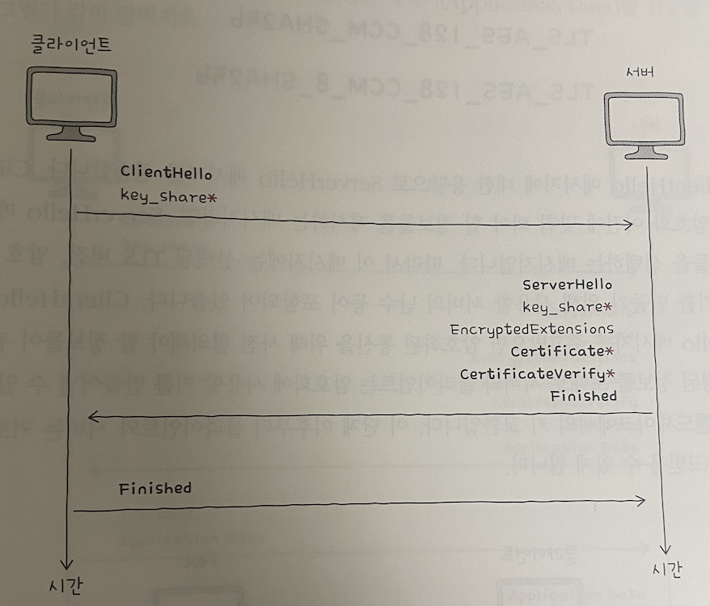

# 7장 네트워크 심화

## 7-1 안정성을 위한 기술

* 사용자가 폭증하면 서가 불안정 해지고, 부가 가중된다. 이를 해결하기 위해 안정성을 수치로 표현하는 가용성이라는 용어 개념 학습하고
  안정성을 높이기 위한 방법인 이중화, 다중화, 로드 밸런싱에 대해 알아보자.

### 가용성

- 안정성
  * 특정 기능을 언제든 균일한 성능으로 수행할 수 있는 특성
  * ex) 안정적인 웹서버: 언제든지 응답 메시지를 제공할 수 있는 서버
        안정적인 라우터: 언제든지 라우팅 기능을 제공할 수 있는 라우터

- 안정성의 수치화: 가용성, 고갸용성
  * 가용성(Availability): 컴퓨터 시스템이 특정 기능을 시렞로 수행할 수 있는 시간의 비율
  * 다시 말해 전체 사용 시간 중에서 정상적인 사용 시간을 의미
  * 업타입: 정상적인 사용 시간, 다운타임: 정상적인 사용이 불가능한 시간
  * 가용성 = 업타임 / 업타임 + 다운타임
  
  * 위 결과값이 크다는 것은, 전체 사용 시간 중에서 대부분을 사용 가능하다라는 의미
  * 이를 고가용성(High Availability: HA)이라 함
  * 안정적이라고 평가 받는 시스템은, 이 수식을 백분율로 표기했을때 99.999% 목표로 함
  * 9가 다섯개라 파이브 나인즈라고도 함
  * 이 수치를 달성하면, 다운타임이 대략 1년에 5.26분, 1개월에 26.3초

  * 가용성을 높이려면 다운 타임을 낮추어야함
  * 하지만 다운타임의 발생 원인을 모두 찾아 원천적으로 차단하기 힘듬
  * 문제가 발생하더라도 기능을할 수 있는 결함 감내(Fault tolerance)가 필요
  * 다운타임을 낮추고, 가용성을 높이기 위해 결함 감내할 수 있도록 서비스나 인프라 설계하는 것이 중요

### 이중화와 다중화

  - 이중화
    * 무언가를 이중으로 두는 기술, 결함을 감내하여 가용성을 높이기 위한 대표적 방법, 예비(백업)을 마련하는 방법
    * 물리적 장비(서버 컴퓨터, 네트워크 인터페이스(NIC), 스위치) 및 데이터베이스, 웹 서버 이중화 가능
    * 이중화할 수 있는 대상들은 문제가 발생할 경우 시스템 전체가 중단될 수 있는 대상이라는 공통점 가짐

    * 이를 단일 장애점(SPoF: Single Point Of Failure)라 함
    * SPOF는 최대한 없애야 함, 가용성을 높이기 위해서 이를 이중화시켜야 함

  - 이중화 구성의 방식 
    * 액티브/스탠바이(Active-standby), 액티브/액티브(Active-active)
    * 액티브는 가동상태를 의미하며, 스탠바이는 액티브의 백업으로 대기하는 상태 의미
    * 액티브/스탠바이: 한 시스템은 가동하고, 다른 시스템은 백업 용도로 대기 상태
      - 시스템이 문제가 발생할 경우, 스탠바이 시스템이 자동으로 액티브 시스템을 대신하여 동작
      - 안정한 구성 방식이지만, 하나의 장비를 사용할 때에 비해 성능상의 큰 변화를 기대하기 어려움.
      - 페일오버(Failover)액티브 시스템에 문제가 생겼을 경우 예비된 스탠바이 시스템으로 자동 전환되는 기능

    * 액티브/액티브: 두 시스템 모두를 가동 상태로 두는 구성 방식
      - 부하를 분산시킬 수 있고, 함꼐 가동돼서 성능상 이점 있음
      - 한 시스템에 문제 발생시, 순간적으로 다른 시스템에 부하가 급중할 수 있어 추가적인 문제가 발생 가능

  - 다중화
    * 무언가를 여러 개 두는 기술, 세 개 이상으로 장비 구성하면, 이중화에 비해 더욱 안정적인 운영 가능
    * 이중화/다중화의 사례로 티밍(teaming)과 본딩(Bonding)
    * 티밍은 윈도우 본딩은 리눅스에서 사용되는 용어
    * 이 두 기술은 여러 개의 네트워크 인터페이스(NIC)를 이중화/다중화하여 마치 더 뛰어나고 안정적인 성능을 보유한 하나의 인터페이스처럼 보이게 하는 기술
    * 1Gbps 속도를 지원하는 인터페이스 세 개를 티밍, 액티브로 구성할 경우 마치 하나의 3Gbps 인터페이스를 사용하는 것과 같은 효과

  ### 로드 밸런싱

  - 트래픽
    * 고가용성을 요구하는 호스트는 일반적으로 클라이언트가 아닌 서버, 서버 다중화를 했더라도, 트래픽 분배를 해결해야함
    * 트래픽(Traffic): 주어진 시점에 네트워크를 경유한 데이터의 양, 주어진 시점에 특정 노드를 경유한 패킷의 양
    * 과도한 트래픽은 CPU의 발열, 메모리 공간 부족, 제한된 대역폭과 병목 현상으로 응답이 느려지거나 일부 요청에 대한 응답이 누락될 수 있음, 프로그램의 일관성도 손상

  - 로드 밸런싱
    * 트래픽의 고른 분배를 위해 사용되는 기술이 로드 밸런싱(Load Balancing)
    * 로드 밸런싱은 로드 밸런서(Load Balancer)에 의해 수행됨
    * L4 스위치, L7 스위치라 불리는 네트워크 장비로도 수행할 수 있지만, 로드 밸런싱 기능을 제공하는 소프트웨어를 설치하면 일반적인 호스트도 로드 밸런서로 사용 가능
    * 대표적 소프트웨어로 HAProxy, Envoy 등 있음, 웹서버 Nginx에도 로드 밸런싱 기능 포함
    * 일반적으로 이중화나 다중화된 서버와 클라이언트 사이에 위치. 클라이언트들은 로드 밸런서에 요청을 보내고, 로드 밸런서는 해당 요청 균둥하게 분배
    

  - 헬스 체크
    * 헬스 체크(Health Check): 다중화된 서버 환경에서 현재 문제가 있는 서버는 없는지, 현재 요청에 올바른 응답을 할 수 있는 상태인지 주기적으로 검사
    * 서버들의 건강 상태를 주기적으로 모니터링
    * 주로 로드 밸런서에 의해 이루어지며, HTTP, ICMP 등 다양한 프로토콜을 활용할 수 있음

  - 로드 밸런싱 알고리즘
    * 로드 밸런서가 요청을 전달할 수 있는 서버가 여러 개 있을 경우, 부하가 균등하게 분산되도록 부하 대상을 선택하는 방법
    * 대표적으로 단순히 서버를 돌아가며 부하를 전달하는 라운드 로빈 알고리즘(Round Robin Algorithm)
    * 연결이 적은 서버부터 우선적으로 부하를 전달하는 최소 연결 알고리즘(Least Connection Algorithm)
    * 때로는 단순히 무작위로 고르기도 하고, 해시(Hash)라는 자료 구조를 이용하기도 하며, 응답 시간이 가장 짧은 서버를 선택하기도 함
    
    * 라운드 로빈, 최소 연결 알고리즘에서 서버마다 가중치 부여 가능
    * 알고리즘에 따라 동작하되, 가중치가 높은 서버가 더 많이 선택되어 더 많은 부하를 받도록 하는 것
    * 가중치가 부여된 알고리즘을 각각 가중치 라운드 로빈 알고리즘(Weighted Round Robin Algorithm), 가중치 최소 연결 알고리즘(Weighted Least connection Algorithm)

    * 아래와 같이 서버1에 가중치가 5, 서버2에 가중치가 1로 뷰여되면 서버 1에 다섯배 많은 부하 전달

    